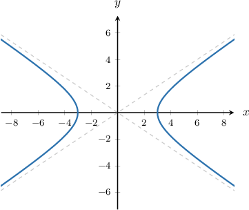
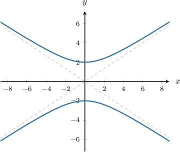
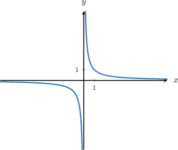
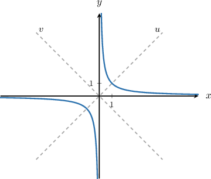

# Equations of Hyperbolas Centered at the Origin

Source: https://www.mathacademy.com/topics/871?courseId=101
Topic ID: 871

## Prerequisites

- [End Behavior of Functions](../../../traditional/lessons/algebra-i/2048-end-behavior-of-functions.md)

## Lesson

### Introduction

A **hyperbola** is a curve that takes the general form

$$

\dfrac {x^2} {a^2} - \dfrac {y^2} {b^2} = 1 \quad \textrm{or} \quad \dfrac {y^2} {a^2} - \dfrac {x^2} {b^2} = 1

$$

where $a$ and $b$ are positive constants. (They represent the lengths of the semi-major and semi-minor axes of the hyperbola, but you don't have to worry about that right now.)

For now, let's just look at an example of a graph of a hyperbola. Below, we have the graph of the hyperbola

$$

\dfrac{x^2}{3^2} - \dfrac{y^2}{2^2} = 1,

$$

which can also be written as

$$

\dfrac{x^2}{9} - \dfrac{y^2}{4} = 1,

$$

where $a=3$ and $b=2.$

Let's list some properties of the graph:

- There are two pieces in the graph. These two pieces are called **branches** of the hyperbola.

- The branches are symmetric over the $x$-axis and over the $y$-axis.

- There are two asymptotes (dashed lines in the diagram above).

- There are exactly two $x$-intercepts, but there is no $y$-intercept. The graph does not intersect the $y$-axis at all.

- The midpoint between the intercepts is the origin, $(0,0).$ In general, the midpoint between the intercepts is called the **center** of the hyperbola. In this case, we say that the hyperbola is centered at the origin.

In particular, the curve above is a **horizontal** hyperbola since the axis that intersects the graph ($x$-axis) is *horizontal*.

The **general standard equation** of a horizontal hyperbola is also known as the **Cartesian equation** and is given by

$$

\dfrac {x^2} {a^2} - \dfrac {y^2} {b^2} = 1.

$$

**Note:** When writing a hyperbola in standard form, it's not necessary to write the denominators as squares. For the hyperbola above, either of the following would be acceptable for standard form:

$$

\dfrac{x^2}{3^2} - \dfrac{y^2}{2^2} = 1 \quad \textrm{or} \quad \dfrac{x^2}{9} - \dfrac{y^2}{4} = 1.

$$

For the sake of simplicity, in this lesson we'll write the denominators without squares, as shown by the equation on the right.

### Example: Writing the Equation of a Horizontal Hyperbola in Standard Form

#### Question

Write the equation of the hyperbola $9 x^2 - 16y^2 = 144$ in standard form.

#### Explanation

The Cartesian equation of a horizontal hyperbola centered at the origin is

$$

\dfrac{x^2}{a^2} - \dfrac{y^2}{b^2}=1.

$$

Therefore, to write the equation of the hyperbola in standard form, we need to divide both sides of the equation by $144$ and then simplify, as follows:

$$

\begin{aligned}9𝑥^{2}−16𝑦^{2} & =144 \\ \frac{9𝑥^{2}}{144}−\frac{16𝑦^{2}}{144} & =\frac{144}{144} \\ \frac{𝑥^{2}}{16}−\frac{𝑦^{2}}{9} & =1\end{aligned}

$$

### Vertical Hyperbolas

Similar to horizontal hyperbolas, there are also **vertical hyperbolas.** For example,

$$

\dfrac{y^2}{4} - \dfrac{x^2}{9} = 1

$$

is a vertical hyperbola since the axis that intersects the graph ($y$-axis) is *vertical*.

The general standard equation for a vertical hyperbola is given by

$$

\dfrac {y^2} {a^2} - \dfrac {x^2} {b^2} = 1.

$$

**Note:** To remember which general standard equation corresponds to which type of hyperbola (horizontal or vertical), we can use the following mnemonics.

- A *horizontal* hyperbola intersects the $x$-axis, so the $x$ term comes first:

- A *vertical* hyperbola intersects the $y$-axis, so the $y$ term comes first:

### Example: Writing the Equation of a Vertical Hyperbola in Standard Form

#### Question

Write the equation of the hyperbola $4y^2-7x^2=84$ in standard form.

#### Explanation

The Cartesian equation of a vertical hyperbola centered at the origin is

$$

\frac{y^2}{a^2} - \frac{x^2}{b^2}=1.

$$

Therefore, to write the equation of the hyperbola in standard form, we need to divide both sides of the equation by $84$ and then simplify, as follows:

$$

\begin{aligned}4𝑦^{2}−7𝑥^{2} & =84 \\ \frac{4𝑦^{2}}{84}−\frac{7𝑥^{2}}{84} & =\frac{84}{84} \\ \frac{𝑦^{2}}{21}−\frac{𝑥^{2}}{12} & =1\end{aligned}

$$

### Rectangular Hyperbolas and the Reciprocal Function

The *reciprocal function*

$$

y=\frac{1}{x}

$$

is also known as a *rectangular hyperbola* centered at the origin.

Compared to the hyperbolas from this lesson, the branches of $y=\dfrac{1}{x}$ are rotated relative to the axes.

To see the connection more clearly, let's first rewrite the equation without fractions:

$$

y=\frac{1}{x} \qquad \Longleftrightarrow \qquad xy=1

$$

Now, define new coordinates by

$$

x=u-v \qquad \text{and} \qquad y=u+v.

$$

These correspond to a $45^\circ$ rotation *up to scaling*.

Then, we get

$$

xy=1 \qquad \Longleftrightarrow \qquad (u-v)(u+v)=1 \qquad \Longleftrightarrow \qquad u^2-v^2=1,

$$

which matches the definition of a *horizontal hyperbola*.

