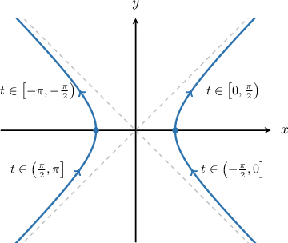
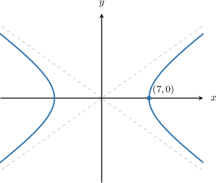
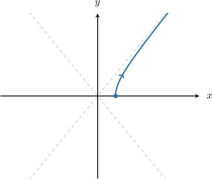
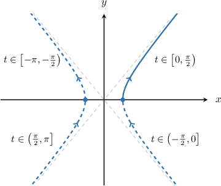

# Parametric Equations of Horizontal Hyperbolas

Source: https://www.mathacademy.com/topics/873?courseId=101
Topic ID: 873

## Prerequisites

- [Asymptotes of Hyperbolas Centered at the Origin](./872-asymptotes-of-hyperbolas-centered-at-the-origin.md)
- [Cartesian Equations of Parametric Curves](./1255-cartesian-equations-of-parametric-curves.md)

## Lesson

### Introduction

The parametric equations of a horizontal hyperbola centered at the origin with Cartesian equation

$$

\dfrac{x^2}{a^2} - \dfrac{y^2}{b^2} = 1

$$

are given by

$$

x=a\sec{t},\quad y=b\tan{t},

$$

where $a$ and $b$ are positive constants. The domain of the parameter $t$ is

$$

t\in[-\pi,\pi],\qquad t\neq \pm \frac{\pi}{2}.

$$

A summary of the branches corresponding to different values of $t$ is shown below.

This parametrization contains discontinuities at $t=\pm\dfrac{\pi}{2}.$ One consequence of this is that the curve appears to "jump" between different quadrants at the singular points.

For the most part, we won't worry too much about the domain of $t.$ However, it does become important when we're parametrizing part of a hyperbola. We'll see how to deal with this case shortly.

### Example: Finding the Parametric Equations of a Horizontal Hyperbola Given Algebraically

#### Question

What are the parametric equations of the hyperbola $\displaystyle\frac{x^2}{49} - \dfrac{y^2}{9} = 1?$

#### Explanation

The parametric equations of a horizontal hyperbola with Cartesian equation

$$

\frac{x^2}{a^2} - \frac{y^2}{b^2} = 1

$$

are given by

$$

x=a\sec{t},\quad y=b\tan{t}.

$$

In our case, $a = \sqrt{49} = 7$ and $b =\sqrt9= 3.$ Therefore, the parametric equations are

$$

x=7\sec{t},\quad y=3\tan{t}.

$$

### Example: Finding the Parametric Equations of a Horizontal Hyperbola Given Graphically

#### Question

Given that the asymptotes of the hyperbola below are $y=\pm\dfrac{5}{7}x,$ find the parametric equations of the hyperbola.

#### Explanation

The parametric equations of a horizontal hyperbola centered at the origin with Cartesian equation

$$

\dfrac{x^2}{a^2} - \dfrac{y^2}{b^2} = 1

$$

are given by

$$

x=a\sec{t},\quad y=b\tan{t},

$$

where $a$ and $b$ are positive constants.

The vertices of the hyperbola occur at $(\pm a, 0).$ From the graph, we have that $(7,0)$ is a vertex of the hyperbola, so $a=7.$

The asymptotes of a horizontal hyperbola are $y=\pm \dfrac{b}{a}x.$ In our case, the asymptotes are $y=\pm\dfrac57x,$ and so we have

$$

\begin{aligned}\frac{𝑏}{𝑎} & =\frac{5}{7} \\ \frac{𝑏}{7} & =\frac{5}{7} \\ 𝑏 & =5.\end{aligned}

$$

Therefore, the parametric equations of the hyperbola are

$$

x=7\sec{t},\quad y=5\tan{t}.

$$

### Explanation of the Parametric Equations of Hyperbolas Centered at the Origin

We've been told that the parametric equations of a horizontal hyperbola centered at the origin are

$$

x=a\sec{t},\quad y=b\tan{t}

$$

where $a$ and $b$ are positive constants. Can we be sure that these equations do indeed describe a hyperbola?

First, let's make the trigonometric functions the subject of each equation:

$$

\begin{aligned}𝑥 & =𝑎sec⁡𝑡 & ⟹ & & sec⁡𝑡 & =\frac{𝑥}{𝑎}, \\ 𝑦 & =𝑏tan⁡𝑡 & ⟹ & & tan⁡𝑡 & =\frac{𝑦}{𝑏}.\end{aligned}

$$

Now, we recall the secant-tangent identity:

$$

\tan^2{t} + 1 = \sec^2{t}.

$$

Substituting the above into the secant-tangent identity, we get

$$

\begin{aligned}tan^{2}⁡𝑡+1 & =sec^{2}⁡𝑡 \\ (\frac{𝑦}{𝑏})^{2}+1 & =(\frac{𝑥}{𝑎})^{2} \\ \frac{𝑦^{2}}{𝑏^{2}}+1 & =\frac{𝑥^{2}}{𝑎^{2}} \\ \frac{𝑥^{2}}{𝑎^{2}}−\frac{𝑦^{2}}{𝑏^{2}} & =1.\end{aligned}

$$

This is the Cartesian equation of a horizontal hyperbola centered at the origin. Therefore, the parametric equations do indeed describe a horizontal hyperbola.

### Example: Finding the Cartesian Equation of a Hyperbola Given its Parametric Equations

#### Question

Find the Cartesian equation of the hyperbola with the parametric equations $x = 6\sec{t},\, y = 4 \sqrt{2}\tan{t}.$

#### Explanation

To find the Cartesian equation of the hyperbola, we need to eliminate the parameter $t.$ We can do this using the secant-tangent identity.

- Isolating the $\sec t$ term in the $x$-equation and squaring, we get

$$

\begin{aligned}𝑥 & =6sec⁡𝑡 \\ \frac{𝑥}{6} & =sec⁡𝑡 \\ (\frac{𝑥}{6})^{2} & =(sec⁡𝑡)^{2} \\ \frac{𝑥^{2}}{6^{2}} & =sec^{2}⁡𝑡 \\ \frac{𝑥^{2}}{36} & =sec^{2}⁡𝑡.\end{aligned}

$$

- Isolating the $\tan{t}$ term in the $y$-equation and squaring, we get

$$

\begin{aligned}𝑦 & =4\sqrt{2}tan⁡𝑡 \\ \frac{𝑦}{4\sqrt{2}} & =tan⁡𝑡 \\ (\frac{𝑦}{4\sqrt{2}})^{2} & =(tan⁡𝑡)^{2} \\ \frac{𝑦^{2}}{(4\sqrt{2})^{2}} & =tan^{2}⁡𝑡 \\ \frac{𝑦^{2}}{32} & =tan^{2}⁡𝑡.\end{aligned}

$$

Substituting the two equations into the identity $\tan^2{t} + 1 = \sec^2{t}$ and rearranging, we get

$$

\begin{aligned}tan^{2}⁡𝑡+1 & =sec^{2}⁡𝑡 \\ \frac{𝑦^{2}}{32}+1 & =\frac{𝑥^{2}}{36} \\ \frac{𝑥^{2}}{36}−\frac{𝑦^{2}}{32} & =1.\end{aligned}

$$

### Example: Parametrizing Part of a Horizontal Hyperbola

#### Question

The quarter-hyperbola above is defined by the parametric equations

$$

x = \sqrt2\sec{t}, \qquad y = \sqrt3\tan{t}.

$$

What is the domain of the parameter $t?$

#### Explanation

The parametric equations of the full hyperbola are

$$

x= \sqrt2 \sec{t}, \quad y = \sqrt3 \tan{t}, \quad t \in [-\pi,\pi], \quad t \neq \pm\dfrac{\pi}2.

$$

To restrict the parameterization to a quarter-hyperbola, we refer to the diagram below.

We can see that if we restrict $t$ to $\left[0, \dfrac{\pi}2\right)$ we get the required quarter-hyperbola.

Therefore, the parametric equations that describe the required quarter-hyperbola are

$$

x= \sqrt2\sec{t}, \quad y = \sqrt3\tan{t}, \quad t \in \left[0, \dfrac{\pi}2\right).

$$
