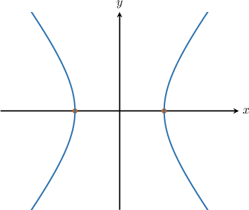
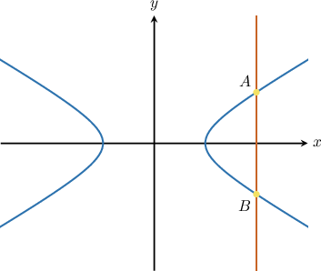
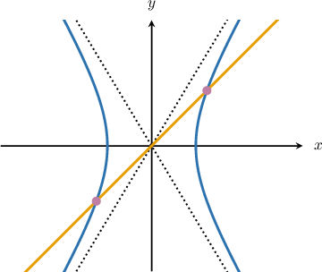

# Finding Intercepts and Intersections of Hyperbolas

Source: https://www.mathacademy.com/topics/874?courseId=101
Topic ID: 874

## Prerequisites

- [Equations of Hyperbolas Centered at a General Point](./733-equations-of-hyperbolas-centered-at-a-general-point.md)
- [Finding Intersections of Lines and Quadratic Functions](../../../traditional/lessons/algebra-i/6341-finding-intersections-of-lines-and-quadratic-functions.md)

## Lesson

### Introduction

The figure below shows the hyperbola $\dfrac{x^2}{9} - \dfrac{y^2}{25} = 1.$ We can see that this hyperbola intersects the $x$-axis at two points. How do we find the coordinates of these points?

To find the coordinates of the $x$-intercepts of a hyperbola, we substitute $y=0$ into the equation of the hyperbola and solve the resulting equation for $x{:}$

$$

\begin{aligned}\frac{𝑥^{2}}{9}−\frac{0^{2}}{25} & =1 \\ \frac{𝑥^{2}}{9} & =1 \\ 𝑥^{2} & =9 \\ 𝑥 & =±3\end{aligned}

$$

Therefore, the $x$-intercepts are $(-3,0)$ and $(3,0).$

### Example: Finding the X-Intercepts of a Hyperbola

#### Question

Calculate the $x$-intercepts of the hyperbola $\dfrac{(x+1)^2}{10} - \dfrac{y^2}{25} = 1.$

#### Explanation

To find the $x$-intercepts of the hyperbola, we substitute $y=0$ into the equation of the hyperbola and solve for $x,$ as follows:

$$

\begin{aligned}\frac{(𝑥+1)^{2}}{10}−\frac{𝑦^{2}}{25} & =1 \\ \frac{(𝑥+1)^{2}}{10}−\frac{0^{2}}{25} & =1 \\ \frac{(𝑥+1)^{2}}{10} & =1 \\ (𝑥+1)^{2} & =10 \\ 𝑥+1 & =±\sqrt{10} \\ 𝑥 & =−1±\sqrt{10}\end{aligned}

$$

Therefore, the $x$-intercepts are $\left(-1\pm \sqrt{10},0\right).$

### Example: Finding the Y-Intercepts of a Hyperbola

#### Question

Calculate the $y$-intercepts of the hyperbola $7y^2 -5x^2 = 28.$

#### Explanation

To find the $y$-intercepts of the hyperbola, we substitute $x=0$ into the equation of the hyperbola and solve for $y,$ as follows:

$$

\begin{aligned}7𝑦^{2}−5𝑥^{2} & =28 \\ 7𝑦^{2}−5(0)^{2} & =28 \\ 7𝑦^{2} & =28 \\ 𝑦^{2} & =4 \\ 𝑦 & =±2\end{aligned}

$$

Therefore, the $y$-intercepts are $(0,\pm 2).$

### Finding Intersections of Hyperbolas and Lines

Let's now consider the hyperbola $\dfrac {x^2}{9} - \dfrac {y ^2}{3} = 1$ and the line $x = 6.$ The hyperbola and the line intersect at the points $A$ and $B,$ as shown in the diagram below.

To find the points where the hyperbola intersects the line, we substitute the equation of the line, $x=6,$ into the equation of the hyperbola and solve for $y,$ as follows:

$$

\begin{aligned}\frac{𝑥^{2}}{9}−\frac{𝑦^{2}}{3} & =1 \\ \frac{6^{2}}{9}−\frac{𝑦^{2}}{3} & =1 \\ \frac{36}{9}−\frac{𝑦^{2}}{3} & =1 \\ 4−\frac{𝑦^{2}}{3} & =1 \\ \frac{𝑦^{2}}{3} & =4−1 \\ \frac{𝑦^{2}}{3} & =3 \\ 𝑦^{2} & =9 \\ 𝑦 & =±3\end{aligned}

$$

Therefore, the hyperbola intersects the line $x=6$ at the points $\left(6, \pm3\right).$

### Example: Finding the Points of Intersection of a Hyperbola and a Horizontal or Vertical Line

#### Question

Calculate the points where the hyperbola $\dfrac{x^2}{10}-\dfrac{y^2}{15}=1$ intersects the line $y=-3.$

#### Explanation

To find the points where the hyperbola intersects the line $y=-3,$ we substitute $y=-3$ into the equation of the hyperbola and solve for $x,$ as follows:

$$

\begin{aligned}\frac{𝑥^{2}}{10}−\frac{𝑦^{2}}{15} & =1 \\ \frac{𝑥^{2}}{10}−\frac{(−3)^{2}}{15} & =1 \\ \frac{𝑥^{2}}{10}−\frac{9}{15} & =1 \\ \frac{𝑥^{2}}{10}−\frac{3}{5} & =1 \\ 𝑥^{2}−6 & =10 \\ 𝑥^{2} & =16 \\ 𝑥 & =±4\end{aligned}

$$

Therefore, the hyperbola intersects the horizontal line $y=-3$ at the points $(\pm 4, -3).$

### Example: Finding the Points of Intersection of a Hyperbola and a Line

#### Question

Calculate the $x$-coordinates of the points where the hyperbola $\dfrac{x^2}{9} - \dfrac{y^2}{25}=1$ intersects the line $y = x.$

#### Explanation

To find the points where the hyperbola intersects the line $y=x,$ we first replace $y$ with $x$ in the equation of the hyperbola and solve for $x,$ as follows:

$$

\begin{aligned}\frac{𝑥^{2}}{9}−\frac{𝑦^{2}}{25} & =1 \\ \frac{𝑥^{2}}{9}−\frac{𝑥^{2}}{25} & =1 \\ \frac{16𝑥^{2}}{225} & =1 \\ 𝑥^{2} & =\frac{225}{16} \\ 𝑥 & =±\frac{15}{4}\end{aligned}

$$
