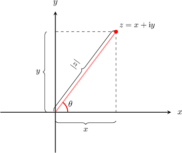

# The Polar Form of a Complex Number

Source: https://www.mathacademy.com/topics/894?courseId=101
Topic ID: 894

## Prerequisites

- [The Magnitude of a Complex Number](./34-the-magnitude-of-a-complex-number.md)
- [Dividing Complex Numbers](./227-dividing-complex-numbers.md)
- [The Argument of a Complex Number](./893-the-argument-of-a-complex-number.md)
- [Converting from Polar Coordinates to Cartesian Coordinates](./936-converting-from-polar-coordinates-to-cartesian-coordinates.md)

## Lesson

### Introduction

Let's consider the complex number $z= x+\textrm{i}y$ on the argand diagram below, where $|z|$ is the magnitude of $z$ and $\theta$ is the argument of $z.$

Using trigonometry, we see that $x=|z|\cos\theta$ and $y=|z|\sin\theta.$ Substituting these into $z=x+\textrm{i}y,$ we obtain the **polar form** of the complex number:

$$

\begin{aligned}𝑧 & =𝑥+i𝑦 \\ 𝑧 & =|𝑧|cos⁡𝜃+i|𝑧|sin⁡𝜃 \\ 𝑧 & =|𝑧|(cos⁡𝜃+isin⁡𝜃)\end{aligned}

$$

The coordinates $\left(|z|, \theta\right)$ are the polar coordinates of $z.$

To demonstrate, let's write $z=3+3\textrm{i}$ in polar form. First, we compute the magnitude of $z\mathbin{:}$

$$

\begin{aligned}|𝑧| & =\sqrt{√𝑥^{2}+𝑦^{2}} \\ & =\sqrt{√3^{2}+3^{2}} \\ & =\sqrt{√18} \\ & =3\sqrt{√2}\end{aligned}

$$

Now, since $z$ is in the first quadrant, we can find the angle $\theta$ using the arctangent:

$$

\begin{aligned}𝜃 & =arctan⁡(\frac{𝑦}{𝑥}) \\ & =arctan⁡(\frac{3}{3}) \\ & =arctan⁡(1) \\ & =\frac{𝜋}{4}\end{aligned}

$$

So, the polar form of $z$ is

$$

z = 3\sqrt{2}\left( \cos\left(\dfrac{\pi}{4}\right) +\textrm{i}\sin\left(\dfrac{\pi}{4}\right) \right).

$$

### Example: Expressing a Complex Number in Polar Form

#### Question

Express $z=-5+12\textrm{i}$ in the form $r(\cos\theta + \textrm{i}\sin\theta).$ Round $\theta$ to three decimal places.

#### Explanation

In polar form, $r$ represents the magnitude $|z|.$ For a complex number $z=x+y\textrm{i},$ the magnitude of $z$ is given by

$$

|z| = \sqrt{x^2+y^2} .

$$

So, for $z = -5+12\textrm{i},$ the magnitude is

$$

\begin{aligned}𝑟=|𝑧| & =\sqrt{√(−5)^{2}+(12)^{2}} \\ & =\sqrt{√25+144} \\ & =\sqrt{√169} \\ & =13.\end{aligned}

$$

In polar form, $\theta$ represents the argument $\arg(z).$ Since $x = -5$ is negative and $y = 12$ is positive, $z$ lies in the second quadrant. So, we can find $\theta$ as follows:

$$

\begin{aligned}𝜃=arg⁡(𝑧) & =𝜋−arctan⁡\frac{𝑦}{𝑥} \\ & =𝜋−arctan⁡\frac{12}{−5} \\ & =𝜋−arctan⁡(\frac{12}{5}) \\ & ≈1.966,\end{aligned}

$$

rounded to three decimal places.

Finally, we write the complex number $z = -5 + 12\textrm{i}$ in polar form:

$$

z = 13(\cos(1.966)+\textrm{i}\sin(1.966))

$$

### Example: Expressing a Quotient of Complex Numbers in Polar Form

#### Question

Express $z=\dfrac{3}{2-\textrm{i}}$ in the form $r(\cos\theta+\textrm{i}\sin\theta).$

#### Explanation

First, we express the given complex number in the form $z=x+y\textrm{i}.$ To do this, we remove $\textrm{i}$ from the denominator by multiplying the numerator and denominator of $z$ by the complex conjugate of the denominator, which is $2+\textrm{i}\mathbin{:}$

$$

\begin{aligned}𝑧 & =\frac{3}{2−i} \\ & =\frac{3(2+i)}{(2−i)(2+i)} \\ & =\frac{3(2+i)}{2^{2}+1^{2}} \\ & =\frac{3}{5}(2+i) \\ & =\frac{6}{5}+\frac{3}{5}i\end{aligned}

$$

In polar form, $r$ represents the magnitude $|z|.$ For a complex number $z=x+y\textrm{i},$ the magnitude of $z$ is given by

$$

|z| = \sqrt{x^2+y^2} .

$$

So, for $z= \dfrac{6}{5} +\dfrac{3}{5}\textrm{i},$ the magnitude is

$$

\begin{aligned}𝑟=|𝑧| & =\sqrt{√(\frac{6}{5})^{2}+(\frac{3}{5})^{2}} \\ & =\sqrt{√\frac{36+9}{25}} \\ & =\sqrt{√\frac{45}{25}} \\ & =\frac{3\sqrt{√5}}{5}.\end{aligned}

$$

In polar form, $\theta$ represents the argument $\arg(z).$ Since $x = \dfrac{6}{5}$ and $y = \dfrac{3}{5}$ are both positive, $z$ lies in the first quadrant. So, we can find $\theta$ as follows:

$$

\begin{aligned}arg⁡(𝑧) & =arctan⁡\frac{(\frac{3}{5})}{5} \\ & =arctan⁡(\frac{1}{2}) \\ & =0.464,\end{aligned}

$$

rounded to three decimal places.

Finally, we write the complex number $z$ in polar form:

$$

z = \dfrac{3\sqrt{5}}{5} \left (\cos(0.464)+ \textrm{i} \sin(0.464) \right)

$$

### Converting from Polar Form to Standard Form

Previously, we wrote the complex number $z=3+3\textrm{i}$ using polar coordinates:

$$

z = 3\sqrt{2}\left( \cos\left(\dfrac{\pi}{4}\right) +\textrm{i}\sin\left(\dfrac{\pi}{4}\right) \right)

$$

To check that this result is correct, we can convert it back to Cartesian form by simplifying the right-hand side.

Since $\cos\left(\dfrac{\pi}{4}\right) = \dfrac{\sqrt{2}}{2}$ and $\sin\left(\dfrac{\pi}{4}\right) = \dfrac{\sqrt{2}}{2},$ we have

$$

\begin{aligned}𝑧 & =3\sqrt{√2}(cos⁡(\frac{𝜋}{4})+isin⁡(\frac{𝜋}{4})) \\ & =3\sqrt{√2}(\frac{\sqrt{√2}}{2}+i\frac{\sqrt{√2}}{2}) \\ & =3+3i.\end{aligned}

$$

This matches up with our original complex number, so we can be sure that we have the correct polar form.

### Example: Converting From Polar Form to Cartesian Form

#### Question

Express $z=4\left(\cos\left(\dfrac{5\pi}{6}\right)+\textrm{i}\sin\left(\dfrac{5\pi}{6}\right)\right)$ in the form $z=x+\textrm{i}y.$

#### Explanation

We will simplify the right-hand side. Since $\cos\left(\dfrac{5\pi}{6}\right) = -\dfrac{\sqrt{3}}{2}$ and $\sin\left(\dfrac{5\pi}{6}\right) = \dfrac{1}{2},$ we have

$$

\begin{aligned}𝑧 & =4(cos⁡(\frac{5𝜋}{6})+isin⁡(\frac{5𝜋}{6})) \\ & =4(−\frac{\sqrt{√3}}{2}+i\frac{1}{2}) \\ & =−2\sqrt{√3}+2i.\end{aligned}

$$
