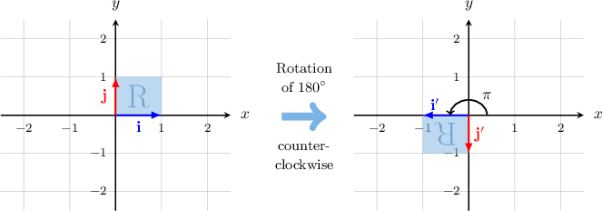
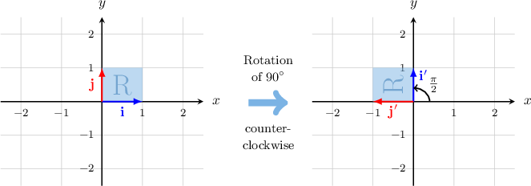
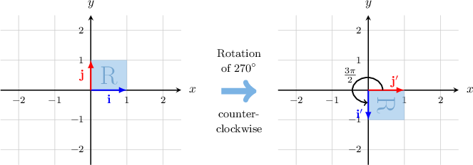
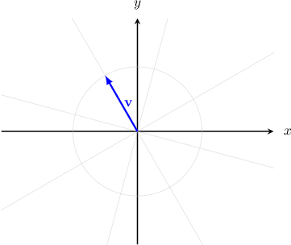
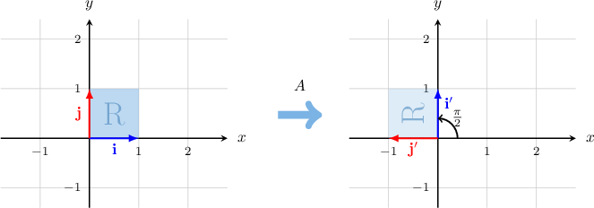
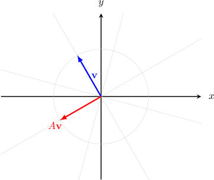

# Right-Angle Rotations as Linear Transformations

Source: https://www.mathacademy.com/topics/931?courseId=101
Topic ID: 931

## Prerequisites

- [Linear Transformations of Objects in the Plane](./866-linear-transformations-of-objects-in-the-plane.md)
- [Rotating Objects in the Coordinate Plane Using Functions](../../../traditional/lessons/geometry/3823-rotating-objects-in-the-coordinate-plane-using-functions.md)

## Lesson

### Introduction

Consider the standard basis $\big\{\mathbf{i},\mathbf{j} \big\}$ of the Euclidean plane $\mathbb{R}^2$ and the unit square spanned by these two vectors.

Let's define a linear transformation $\mathbf R$ by its standard matrix $R,$ given by

$$

[\begin{aligned}−1 & 0 \\ 0 & −1\end{aligned}]

$$

We can find the images of $\{\mathbf{i},\mathbf{j} \}$ under $\mathbf{R}$ by computing the matrix products, as follows:

$$

\begin{aligned}𝐢^{′} & =𝐑(𝐢)=[\begin{matrix}−1 & 0 \\ 0 & −1\end{matrix}][\begin{matrix}1 \\ 0\end{matrix}]=[\begin{matrix}−1 \\ 0\end{matrix}]=−𝐢 \\ 𝐣^{′} & =𝐑(𝐣)=[\begin{matrix}−1 & 0 \\ 0 & −1\end{matrix}][\begin{matrix}0 \\ 1\end{matrix}]=[\begin{matrix}0 \\ −1\end{matrix}]=−𝐣\end{aligned}

$$

Plotting the vectors $\mathbf i$ and $\mathbf j$ and their images $\mathbf i'$ and $\mathbf j',$ we obtain the following:

We see that the transformation $\mathbf R$ represented by the matrix $R$ defines a **counterclockwise rotation of $180^\circ$ (or $\pi$ radians) about the origin.**

Note that we typically refer to rotations in the counterclockwise sense. However, in this case, the transformation $\mathbf R$ can also be considered a rotation of $180^\circ$ (or $\pi$ radians) *clockwise* about the origin.

### Example: Using a Matrix That Represents a Rotation of 180 Degrees

#### Question

A triangle $S$ has vertices at $(2,-1), (-3,5),$ and $(4,-3).$ Which of the following are coordinates of the vertices of $S',$ the image of $S$ under the counterclockwise rotation $\mathbf{R}_{\pi}$ by an angle of $\pi$ radians about the origin?

1. $(-2,1)$

2. $(-4,3)$

3. $(-5,3)$

#### Explanation

The counterclockwise rotation $\mathbf{R}_{\pi}$ by an angle of $\pi$ radians is given by the matrix

$$

[\begin{aligned}−1 & 0 \\ 0 & −1\end{aligned}]

$$

To find the image of $S$ under the action of $\mathbf{R}_{\pi},$ we first create a matrix $X$ containing all of the vertices of $S$ as columns:

$$

\begin{aligned}𝑋 & =[\begin{matrix}2 & −3 & 4 \\ −1 & 5 & −3\end{matrix}]\end{aligned}

$$

Now, we compute the image of $X$ under $\mathbf{R}_{\pi}$ by calculating the matrix product $RX\mathbin{:}$

$$

\begin{aligned}𝑅𝑋 & =[\begin{matrix}−1 & 0 \\ 0 & −1\end{matrix}][\begin{matrix}2 & −3 & 4 \\ −1 & 5 & −3\end{matrix}] \\ & =[\begin{matrix}−2 & 3 & −4 \\ 1 & −5 & 3\end{matrix}]\end{aligned}

$$

Therefore, the coordinates of the respective vertices of $S'$ are $(-2,1), (3,-5), (-4,3).$

So, the correct answer is "I and II only."

### Rotations of 90 Degrees

Consider once again the standard basis $\big\{\mathbf{i},\mathbf{j} \big\}$ of the Euclidean plane $\mathbb{R}^2$ and the unit square that is spanned by these vectors.

Let's define a linear transformation $\mathbf R$ by its standard matrix $R,$ given by

$$

[\begin{aligned}0 & −1 \\ 1 & 0\end{aligned}]

$$

As before, we can find the images of $\{\mathbf{i},\mathbf{j} \}$ under $\mathbf{R}$ as follows:

$$

\begin{aligned}𝐢^{′} & =𝐑(𝐢)=[\begin{matrix}0 & −1 \\ 1 & 0\end{matrix}][\begin{matrix}1 \\ 0\end{matrix}]=[\begin{matrix}0 \\ 1\end{matrix}]=𝐣 \\ 𝐣^{′} & =𝐑(𝐣)=[\begin{matrix}0 & −1 \\ 1 & 0\end{matrix}][\begin{matrix}0 \\ 1\end{matrix}]=[\begin{matrix}−1 \\ 0\end{matrix}]=−𝐢\end{aligned}

$$

Plotting the vectors $\mathbf i$ and $\mathbf j$ and their images $\mathbf i'$ and $\mathbf j',$ we obtain the following:

We see that the transformation $\mathbf R$ represented by the matrix $R$ defines a **counterclockwise rotation of $90^\circ,$ or $\dfrac \pi 2$ radians, about the origin.**

The transformation $\mathbf R$ can also be considered a rotation of $270^\circ,$ or $\dfrac{3\pi}{2}$ radians, *clockwise* about the origin.

### Rotations of 270 Degrees

Finally, let

$$

[\begin{aligned}0 & 1 \\ −1 & 0\end{aligned}]

$$

be a matrix of a linear transformation $\mathbf R.$ As usual, we can find the images of $\{\mathbf{i},\mathbf{j} \}$ under $\mathbf{R}$ as follows:

$$

\begin{aligned}𝐢^{′} & =𝐑(𝐢)=[\begin{matrix}0 & 1 \\ −1 & 0\end{matrix}][\begin{matrix}1 \\ 0\end{matrix}]=[\begin{matrix}0 \\ −1\end{matrix}]=−𝐣 \\ 𝐣^{′} & =𝐑(𝐣)=[\begin{matrix}0 & 1 \\ −1 & 0\end{matrix}][\begin{matrix}0 \\ 1\end{matrix}]=[\begin{matrix}1 \\ 0\end{matrix}]=𝐢\end{aligned}

$$

Plotting the vectors $\mathbf i$ and $\mathbf j$ and their images $\mathbf i'$ and $\mathbf j',$ we obtain the following:

We see that the transformation $\mathbf R$ represented by the matrix $R$ defines a **counterclockwise rotation of $270^\circ,$ or $\dfrac{3\pi}{2}$ radians, about the origin.**

The transformation $\mathbf R$ can also be considered a rotation of $90^\circ,$ or $\dfrac \pi 2$ radians *clockwise* about the origin.

### Example: Identifying Rotation Matrices

#### Question

Consider the vector $\mathbf{v}$ shown above. Find the vector $A\mathbf{v}$ given that

$$

[\begin{aligned}0 & −1 \\ 1 & 0\end{aligned}]

$$

#### Explanation

Consider the standard basis $\{\mathbf{i},\mathbf{j} \}$ of the Euclidean plane $\mathbb{R}^2$ and the unit square spanned by the vectors. Computing the images of $\{\mathbf{i},\mathbf{j} \}$ under $A,$ we get the following:

$$

\begin{aligned}𝐢^{′} & =𝐴𝐢=[\begin{matrix}0 & −1 \\ 1 & 0\end{matrix}][\begin{matrix}1 \\ 0\end{matrix}]=[\begin{matrix}0 \\ 1\end{matrix}]=𝐣 \\ 𝐣^{′} & =𝐴𝐣=[\begin{matrix}0 & −1 \\ 1 & 0\end{matrix}][\begin{matrix}0 \\ 1\end{matrix}]=[\begin{matrix}−1 \\ 0\end{matrix}]=−𝐢\end{aligned}

$$

As a result, we obtain the following diagram:

So, the matrix represents a rotation of $\dfrac{\pi}{2}$ radians counterclockwise about the origin.

Therefore, in order to find $A\mathbf{v},$ we need to rotate $\mathbf{v}$ counterclockwise by an angle of $\dfrac{\pi}{2}$ radians, as shown below.

### Example: Using a Matrix That Represents a Rotation of 90 Degrees

#### Question

A triangle $S$ has vertices at $(-5,-1), (1,4), (3,-5).$ Which of the following are coordinates of the vertices of $S',$ the image of $S$ under the **** rotation $\mathbf{R}_{-90^\circ}$ by an angle of $90^\circ$ about the origin?

1. $(1,-5)$

2. $(4,-1)$

3. $(-5,-3)$

#### Explanation

The clockwise rotation $\mathbf{R}_{-90^\circ}$ by an angle of $90^\circ$ is the same as counterclockwise rotation by an angle of $270^\circ.$ It's given by the matrix

$$

[\begin{aligned}0 & 1 \\ −1 & 0\end{aligned}]

$$

To find the image of $S$ under the action of $\mathbf{R}_{-90^\circ},$ we first create a matrix $X$ containing all of the vertices of $S$ as columns:

$$

\begin{aligned}𝑋 & =[\begin{matrix}−5 & 1 & 3 \\ −1 & 4 & −5\end{matrix}]\end{aligned}

$$

Now, we compute the image of $X$ under $\mathbf{R}_{-90^\circ}$ by calculating the matrix product $RX\mathbin{:}$

$$

\begin{aligned}𝑅𝑋 & =[\begin{matrix}0 & 1 \\ −1 & 0\end{matrix}][\begin{matrix}−5 & 1 & 3 \\ −1 & 4 & −5\end{matrix}] \\ & =[\begin{matrix}−1 & 4 & −5 \\ 5 & −1 & −3\end{matrix}]\end{aligned}

$$

Therefore, the coordinates of the respective vertices of $S'$ are $(-1,5), (4,-1), (-5,-3).$

So, the correct answer is "II and III only."
