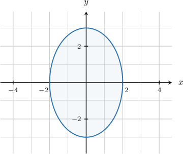
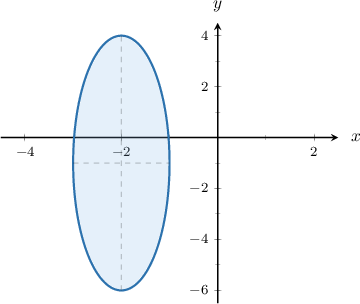

# The Area of an Ellipse

Source: https://www.mathacademy.com/topics/973?courseId=101
Topic ID: 973

## Prerequisites

- [Finding the Center and Axes of Ellipses by Completing the Square](./852-finding-the-center-and-axes-of-ellipses-by-completing-the-square.md)
- [Areas of Circles](../../../traditional/lessons/geometry/1745-areas-of-circles.md)

## Lesson

### Introduction

If an ellipse has horizontal radius $a$ and vertical radius $b,$ then the area $A$ of the ellipse is given by the formula

$$

A = \pi ab.

$$

For example, suppose that we want to calculate the area of the ellipse shown below.

This ellipse is centered at $O$ and has horizontal and vertical radii $a=2$ and $b=3,$ respectively. So the area of the ellipse is

$$

\begin{aligned}𝐴 & =𝜋(2)(3) \\ & =6𝜋.\end{aligned}

$$

**Note:** In the case that $a=b,$ the ellipse is actually a circle, and the area formula for the ellipse gives us the area formula for a circle with radius $a{:}$

$$

A = \pi a^2

$$

### Example: Calculating the Area of an Ellipse Given Graphically

#### Question

What is the area of the ellipse shown below?

#### Explanation

The area of an ellipse with horizontal radius $a$ and vertical radius $b$ is given by the formula

$$

A = \pi ab.

$$

In our case, the ellipse has a horizontal radius of length $a=1$ and a vertical radius of length $b=5.$ Therefore, the area of the ellipse is

$$

A = \pi(1)(5) = 5\pi.

$$

### Example: Calculating the Area of an Ellipse Given Its Equation in Standard Form

#### Question

Calculate the area of the ellipse $\dfrac{x^2}{2}+\dfrac{y^2}{8} = 1.$

#### Explanation

The area of an ellipse with horizontal radius $a$ and vertical radius $b$ is given by the formula

$$

A = \pi ab.

$$

The general equation of an ellipse centered at $(h,k)$ with horizontal radius $a$ and vertical radius $b$ is given by

$$

\dfrac{(x-h)^2}{a^2} + \dfrac{(y-k)^2}{b^2} = 1.

$$

In the given equation, we have $a = \sqrt{2}$ and $b = \sqrt{8} = 2 \sqrt{2}.$

Therefore, the area of the ellipse is

$$

A = \pi ( \sqrt{2})(2 \sqrt{2}) = 4\pi.

$$

### Example: Calculating the Area of an Ellipse Given Its Equation in Expanded Form

#### Question

Calculate the area of the ellipse $x^2 + 4y^2 + 8y = 8.$

#### Explanation

The area of an ellipse with horizontal radius $a$ and vertical radius $b$ is given by the formula

$$

A = \pi ab.

$$

The general equation of an ellipse centered at $(h,k)$ with horizontal radius $a$ and vertical radius $b$ is given by

$$

\dfrac{(x-h)^2}{a^2} + \dfrac{(y-k)^2}{b^2} = 1.

$$

To write the equation of the ellipse in this form, we must complete the square for the $y$ terms and rearrange, as follows:

$$

\begin{aligned}𝑥^{2}+4𝑦^{2}+8𝑦 & =8 \\ 𝑥^{2}+4[𝑦^{2}+2𝑦] & =8 \\ 𝑥^{2}+4[(𝑦+1)^{2}−1] & =8 \\ 𝑥^{2}+4(𝑦+1)^{2}−4 & =8 \\ 𝑥^{2}+4(𝑦+1)^{2} & =8+4 \\ 𝑥^{2}+4(𝑦+1)^{2} & =12 \\ \frac{𝑥^{2}}{12}+\frac{(𝑦+1)^{2}}{3} & =1\end{aligned}

$$

So, in this case, we have $a = \sqrt{12} =2\sqrt{3}$ and $b = \sqrt{3}.$

Therefore, the area of the ellipse is

$$

A = \pi(2\sqrt{3})(\sqrt{3}) = 6\pi.

$$
