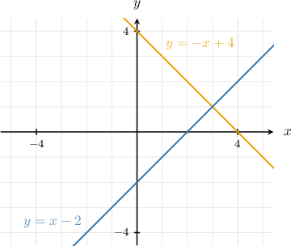
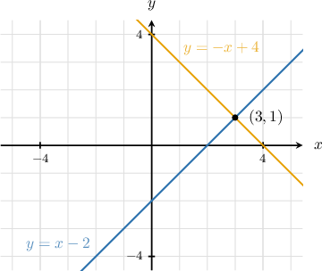
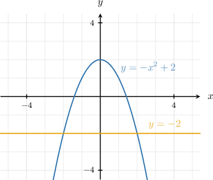
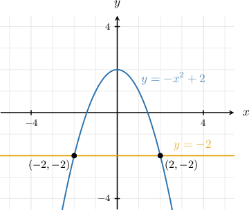
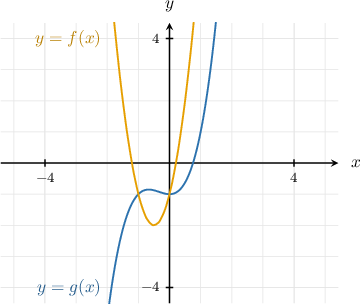
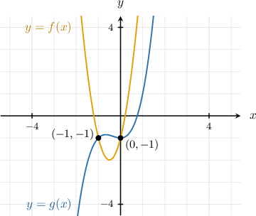

# Solving Systems of Nonlinear Equations Using Graphs

Source: https://www.mathacademy.com/topics/101?courseId=132
Topic ID: 101

## Prerequisites

- [Introduction to Systems of Linear Equations](../../../../middle-school/lessons/grade-7/2225-introduction-to-systems-of-linear-equations.md)
- [Graphs of Functions](../../../traditional/lessons/algebra-i/3821-graphs-of-functions.md)

## Lesson

### Introduction

Suppose we want to solve the following system of equations:

To solve systems of equations *graphically*, we first draw each of the equations in the same coordinate system. Then, the solution of the system is given by the common points where the curves intersect.

Let's see how this method works for the system above. To plot the functions given by the equations, we first rewrite them by making the subject in each equation.

Then, we draw the curves in the same coordinate system:

The lines intersect at the point, which is the solution to our system.

We can also use the graphical method to solve systems of equations where the corresponding functions are not straight lines. These types of systems are called **nonlinear systems**. Let's consider such an example.

### Example: Solving Systems of Equations Containing Quadratic Functions

#### Question

Using the graphical method, find the solution(s) of the following systems of equations:

$$

\begin{aligned}𝑦=−𝑥^{2}+2 \\ 𝑦=−2\end{aligned}

$$

#### Explanation

The solutions $(x,y)$ of the system correspond to the intersection points of the two curves.

From the graph, the curves intersect at

$\qquad$ $(-2,-2)\quad$ and $\quad(2,-2).$

Therefore, these are the solutions of the corresponding system.

### Example: Solving System of Equations Graphically

#### Question

Using the graphical method, find the solutions $(x,y)$ of the following system of equations:

$$

\begin{aligned}𝑦=𝑓(𝑥) \\ 𝑦=𝑔(𝑥)\end{aligned}

$$

#### Explanation

The solutions $(x,y)$ of the system correspond to the intersection points of the two curves.

From the graph, the curves intersect at

$\qquad$ $(-1,-1)\quad$ and $\quad(0,-1).$

Therefore, these are the solutions of the corresponding system.
