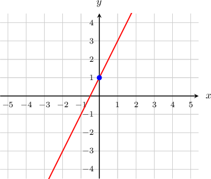
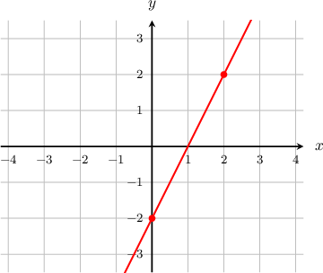
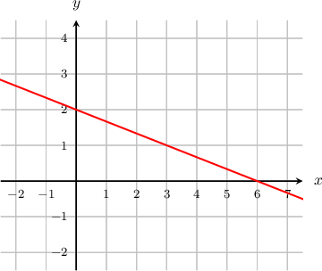

# Equations of Lines in Slope-Intercept Form

Source: https://www.mathacademy.com/topics/1240?courseId=132
Topic ID: 1240

## Prerequisites

- [Solving Two-Variable Equations](../../../../middle-school/lessons/grade-7/356-solving-two-variable-equations.md)
- [Calculating Slopes of Straight Lines](../../../../middle-school/lessons/grade-8/396-calculating-slopes-of-straight-lines.md)

## Lesson

### Introduction

The **slope-intercept** form of the equation of a line is

$$

y = {\color{red}{m}}x+{\color{blue}{b}},

$$

where ${\color{red}{m}}$ is the **slope** of the line and ${\color{blue}{b}}$ is the **$y$-intercept.**

To illustrate, consider the line $y={\color{red}{2}}x+{\color{blue}{1}},$ shown below.

Looking at the line, we notice that:

- The *slope* of the line is $m={\color{red}{2}},$ because a change of $1$ in the $x$-direction results in a change of $2$ in the $y$-direction.

- The $y$*-intercept* of the line, denoted $b$, is $b={\color{blue}{1}},$ because the line hits the $y$-axis at the point $(0,{\color{blue}{1}}).$

**Note**: The coordinates of the $y$-intercept are always $(0,{\color{blue}{b}}).$

Finally, if the slope $m = 0$ (i.e., we have a horizontal line), the slope-intercept form must be $y=0x+{\color{blue}b},$ which reduces to $y={\color{blue}b}.$

### Example: Identifying the Slope and Y-Intercept From the Equation of a Line

#### Question

What are the slope and $y$-intercept of the line $y=2x-9?$

#### Explanation

The equation is in slope-intercept form $y={\color{red}{m}}x+{\color{blue}{b}},$ where $\color{red}{m}$ is the slope and $\color{blue}{b}$ is the $y$-intercept.

For the equation $y=2x-9,$ we see that the slope is ${\color{red}{m=2}}$ and the $y$-intercept is ${\color{blue}{b=-9}}.$

### Example: Finding the Equation of a Graphed Line (Positive Slope)

#### Question

The line shown above passes through the points $(0,-2)$ and $(2,2).$

#### Explanation

We will write the equation of the line in the slope-intercept form $y=mx+b.$ So, we need to work out the slope $m$ and the $y$-intercept $b.$

From the graph, we see that the line intercepts the $y$-axis at $(0,-2).$ So, the $y$-intercept is $b = -2.$

We can calculate the slope of the line by choosing two points on the line and applying the slope formula. The line passes through the points $(0,-2)$ and $(2,2),$ so we calculate its slope as follows:

$$

\begin{aligned}𝑚 & =\frac{𝑦_{2}−𝑦_{1}}{𝑥_{2}−𝑥_{1}} \\ & =\frac{2−(−2)}{2−0} \\ & =\frac{4}{2} \\ & =2\end{aligned}

$$

Substituting the slope $m = 2$ and the $y$-intercept $b = -2$ into the slope-intercept form $y = mx + b,$ we obtain the equation of the line:

$$

y = 2x - 2.

$$

### Example: Finding the Equation of a Graphed Line (Negative Slope)

#### Question

Find the equation of the line shown below.

#### Explanation

We will write the equation of the line in the slope-intercept form $y=mx+b.$ So, we need to work out the slope $m$ and the $y$-intercept $b.$

From the graph, we see that the line intercepts the $y$-axis at $(0,2).$ So, the $y$-intercept is $b=2.$

We can calculate the slope of the line by choosing two points on the line and applying the slope formula. The line passes through the points $(0,2)$ and $(6,0),$ so we calculate its slope as follows:

$$

\begin{aligned}𝑚 & =\frac{𝑦_{2}−𝑦_{1}}{𝑥_{2}−𝑥_{1}} \\ & =\frac{0−2}{6−0} \\ & =\frac{−2}{6} \\ & =−\frac{1}{3}\end{aligned}

$$

Substituting the slope $m=-\dfrac{1}{3}$ and the $y$-intercept $b=2$ into the slope-intercept form $y=mx+b,$ we obtain the equation of the line:

$$

y=-\dfrac{1}{3}x+2

$$

### Example: Finding the Equation of a Line That Passes Through Two Points: Y-Intercept Given

#### Question

Calculate the equation of the straight line that passes through the points $(0,8)$ and $(3,2).$

#### Explanation

We will write the equation of the line in the slope-intercept form $y=mx+b.$ So, we need to work out the slope $m$ and the $y$-intercept $b.$

First, we calculate the slope $m$ using the given points:

$$

\begin{aligned}𝑚 & =\frac{𝑦_{2}−𝑦_{1}}{𝑥_{2}−𝑥_{1}} \\ & =\frac{2−8}{3−0} \\ & =\frac{−6}{3} \\ & =−2\end{aligned}

$$

The coordinates of the $y$-intercept are always $(0,{\color{blue}{b}}).$ We know that the line passes through the point $(0,{\color{blue}{8}}),$ so the $y$-intercept is $b={\color{blue}{8}}.$

Substituting the slope $m=-2$ and the $y$-intercept $b=8$ into the slope-intercept formula $y=mx+b,$ we reach

$$

y=-2x+8.

$$
