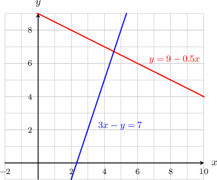
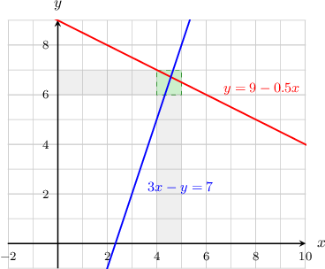
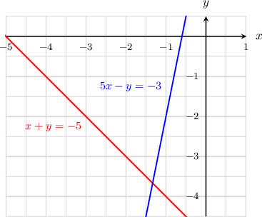
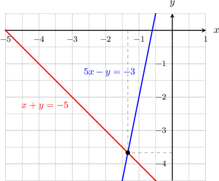
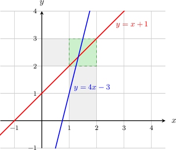
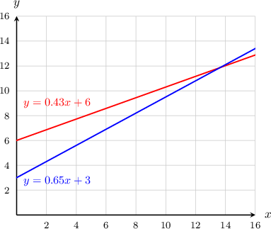

# Approximating Solutions to Systems of Linear Equations

Source: https://www.mathacademy.com/topics/136?courseId=132
Topic ID: 136

## Prerequisites

- [Absolute Value Expressions](../../../traditional/lessons/algebra-i/96-absolute-value-expressions.md)
- [Introduction to Systems of Linear Equations](../../../../middle-school/lessons/grade-7/2225-introduction-to-systems-of-linear-equations.md)

## Lesson

### Introduction

Let's consider the system of linear equations given by

$$

\begin{aligned}𝑦=9−0.5𝑥 \\ 3𝑥−𝑦=7.\end{aligned}

$$

The straight lines corresponding to the two equations are given below.

The solution of the system corresponds to the point of intersection of the lines. We cannot tell the exact intersection point from the graph, but we can *approximate* it.

Notice that:

- The $x$-coordinate of the solution lies between $x=4$ and $x=5,$ and is slightly closer to $5.$ So, $x \approx 4.6.$

- The $y$-coordinate of the solution lies between $y=6$ and $y=7,$ and is closer to $7.$ So, $y \approx 6.7.$

Therefore, the approximate solution to our original system of equations is $(4.6, 6.7).$

### Example: Finding an Approximate Solution Using a Graph

#### Question

Using the graph above, find an approximate solution of the system

$$

\begin{aligned}𝑥+𝑦=−5 \\ 5𝑥−𝑦=−3\end{aligned}

$$

#### Explanation

The solution of the system corresponds to the point of intersection of the lines.

We can approximate the solution as follows:

- The $x$-coordinate of the solution lies between $x=-2$ and $x=-1,$ and is closer to $-1.$ So, we can approximate $x \approx -1.3.$

- The $y$-coordinate of the solution lies between $y=-3$ and $y=-4,$ and is closer to $-4.$ So, we can approximate $y \approx -3.7.$

Therefore, the approximate solution to our original system of equations is $(-1.3,-3.7).$

### Finding an Approximate Solution Using a Table

Let's consider the following system of equations.

$$

\begin{aligned}𝑦=𝑥+1 \\ 𝑦=4𝑥−3\end{aligned}

$$

The graph corresponding to the system is shown below:

We can see from the graph that the $x$-value that satisfies the system lies somewhere between $1.0$ and $1.5.$

We can get a better approximation by setting up a table of values, like the one shown below.

.equal-width td {width: 10px; text-align: center;}

Now, we fill in the table as follows:

- First, we calculate the $y$-values on both lines for our different values of $x.$

- Then, we calculate $|y_2 - y_1|$ for each value of $x.$ We call this the **error.**

For example, consider the first column of the table, which corresponds to $x=1.0.$ Substituting $x=1.0$ into the expressions for $y_1$ and $y_2,$ we get the following:

$$

\begin{aligned}𝑦_{1} & =𝑥+1 \\ & =1.0+1 \\ & =2.0 \\ 𝑦_{2} & =4𝑥−3 \\ & =4(1.0)−3 \\ & =1.0\end{aligned}

$$

Then, we find the corresponding error:

$$

\begin{aligned}|𝑦_{1}−𝑦_{2}| & =|2.0−1.0| \\ & =|1.0| \\ & =1.0\end{aligned}

$$

We fill this information into the first column:

.equal-width td {width: 10px; text-align: center;}

Repeating this procedure for each column in the table, we arrive at the following result.

.equal-width td {width: 10px; text-align: center;}

Finally, we look for the smallest error. In the bottom row of the table, we see that $0.1$ is the smallest error. This corresponds to $x=1.3.$

Therefore, $x\approx1.3$ is our approximate solution.

### Example: Finding an Approximate Solution Using a Table

#### Question

Fill in the table below, and use this to find a value of $x$ that corresponds to an approximate solution of the system

$$

\begin{aligned}𝑦=−4𝑥+2 \\ 𝑦=2𝑥−5.\end{aligned}

$$

.equal-width td {width: 10px; text-align: center;}

#### Explanation

We fill in the table as follows:

- First, we calculate the $y$-values on both lines for our different values of $x.$

- Then, we calculate the error $|y_2 - y_1|$ for each value of $x.$

For example, consider the third column of the table, which corresponds to $x=1.2.$ Substituting $x=1.2$ into the expressions for $y_1$ and $y_2,$ we get the following:

$$

\begin{aligned}𝑦_{1} & =−4𝑥+2 \\ & =−4(1.2)+2 \\ & =−2.8 \\ 𝑦_{2} & =2𝑥−5 \\ & =2(1.2)−5 \\ & =−2.6\end{aligned}

$$

Then, we find the corresponding error:

$$

\begin{aligned}|𝑦_{1}−𝑦_{2}| & =|−2.8−(−2.6)| \\ & =|−0.2| \\ & =0.2\end{aligned}

$$

We fill this information into the corresponding column:

.equal-width td {width: 10px; text-align: center;}

Repeating this procedure for each column in the table, we arrive at the following result.

.equal-width td {width: 10px; text-align: center;}

The smallest error is $0.2,$ which corresponds to $x=1.2.$ Therefore, $x\approx 1.2$ is our approximate solution.

### Example: Approximating the Solution to a Word Problem

#### Question

The temperature, in ${}^{\circ}\text{C},$ of object $A$ and object $B$ are given by the equations $y=0.43x+6$ and $y=0.65x+3$, respectively, where $x$ is the time, in hours, since the beginning of the day. Using the graph above and the table below, find a value for $x$ that corresponds to an approximation of when both objects have the same temperature.

.equal-width td {width: 10px; text-align: center;}

#### Explanation

We need to find the point of intersection of the two lines.

From the graph, we can see that the solution should lie between $x=13$ and $x=14.$ So, we can disregard all values of $x$ that are not between $13$ and $14.$

Now, we evaluate the table entries for $x=13.2$ and $x=13.6,$ as follows:

- Substituting $x=13.2$ into the expressions for $y_1$ and $y_2,$ we get the following: Then, we find the corresponding error:

- Substituting $x=13.6$ into the expressions for $y_1$ and $y_2,$ we get the following: Then, we find the corresponding error:

We fill this information into the table:

.equal-width td {width: 10px; text-align: center;}

The smallest error is $0.008,$ which corresponds to $x=13.6.$ Therefore, $x\approx 13.6$ is our approximate solution.
