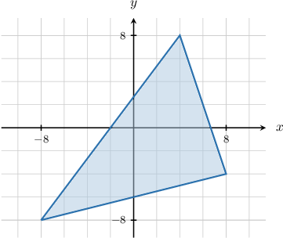
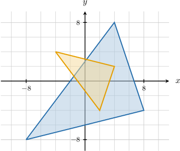
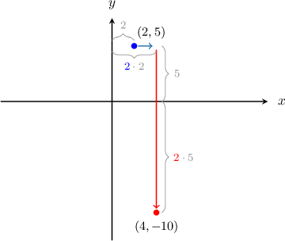
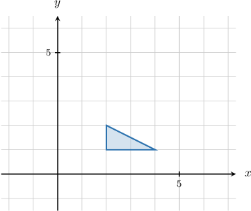
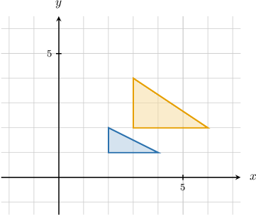

# Combining Stretches of Geometric Figures

Source: https://www.mathacademy.com/topics/1363?courseId=132
Topic ID: 1363

## Prerequisites

- [Stretches of Geometric Figures](../../../traditional/lessons/geometry/2217-stretches-of-geometric-figures.md)

## Lesson

### Introduction

We can combine stretches in the $x$-direction (with invariant $y$-axis) and stretches in the $y$-direction (with invariant $x$-axis).

For example, let's consider a combined stretch transformation that performs stretches in the following sequence:

- a stretch in the $x$-direction with stretch factor $\dfrac{1}{2},$ followed by

- a stretch in the $y$-direction with stretch factor $-\dfrac{1}{2}.$

The functional representation of the combined stretch is given by

$$

(x,y) \mapsto \left(\dfrac{1}{2}x, -\dfrac{1}{2}y\right).

$$

As it turns out, it does not matter which stretch we perform first. But it's often helpful to think of the stretches being applied one at a time.

Let's apply our combined stretch transformation to the polygon below.

To stretch a polygon, we

- find the images of the vertices, and then

- draw segments connecting the image vertices.

So, our three vertices $(4,8)$, $(8,-4)$, $(-8,-8)$ are mapped to the following points by the stretch:

$$

\begin{aligned}(4,8) & ↦(\frac{1}{2}⋅4,\,−\frac{1}{2}⋅8)=(2,−4) \\ (8,−4) & ↦(\frac{1}{2}⋅8,\,−\frac{1}{2}⋅(−4))=(4,2) \\ (−8,−8) & ↦(\frac{1}{2}⋅(−8),\,−\frac{1}{2}⋅(−8))=(−4,4)\end{aligned}

$$

Therefore, we obtain the following result:

### Example: Representing Combined Stretches Using Functions

#### Question

What function represents the combined stretch of factor $4$ in the $x$-direction and factor $\dfrac 1 4$ in the $y$-direction?

#### Explanation

- A stretch in the $x$-direction of factor $4$ can be represented by the function

- A stretch in the $y$-direction of factor $\dfrac 1 4$ can be represented by the function

Therefore, the combination of the stretches is given by

$$

(x,y)\mapsto \left(4x,\dfrac 1 4y\right).

$$

### Example: Applying a Combined Stretch to a Point

#### Question

The point $(2,5)$ is stretched with invariant $y$-axis and stretch factor $2,$ and then stretched with invariant $x$-axis and stretch factor $-2.$ What is the resulting point?

#### Explanation

Let's apply the given transformation.

- A stretch of factor $2$ and invariant $y$-axis can be represented by the function

- A stretch of factor $-2$ and invariant $x$-axis can be represented by the function

Therefore, the combination of the stretches is given by

$$

(x,y) \mapsto \left({\color{blue}2}x,{\color{red}-2}y\right).

$$

Applying the combined stretch to our point, we obtain

$$

(2,5) \mapsto \left(2\cdot 2, \, -2\cdot5 \right) = (4,-10).

$$

### Example: Applying a Combined Stretch to a Polygon

#### Question

The stretch $S(x,y) = \left(\dfrac{3}{2}x,2y\right)$ is applied to the polygon shown below. Find the resulting polygon.

#### Explanation

To stretch a polygon, we

- find the images of the vertices, and then

- draw segments connecting the image vertices.

So, our three vertices $(2,1)$, $(4,1)$, $(2,2)$ are mapped to the following points by the stretch:

$$

\begin{aligned}(2,1) & ↦(\frac{3}{2}⋅2,\,2⋅1)=(3,2) \\ (4,1) & ↦(\frac{3}{2}⋅4,\,2⋅1)=(6,2) \\ (2,2) & ↦(\frac{3}{2}⋅2,\,2⋅2)=(3,4)\end{aligned}

$$

Therefore, we obtain the following result:

