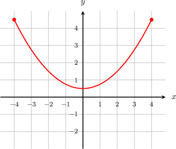
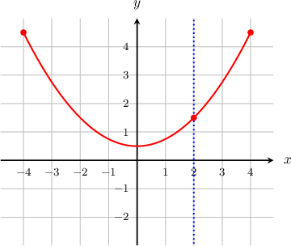
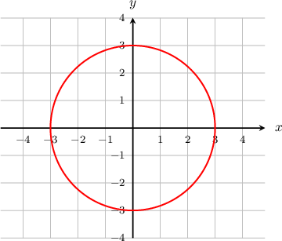
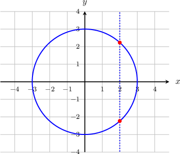
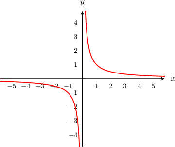
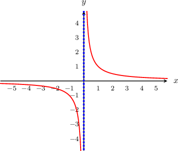
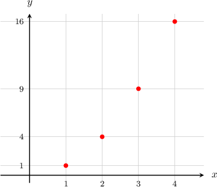
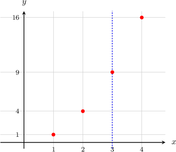
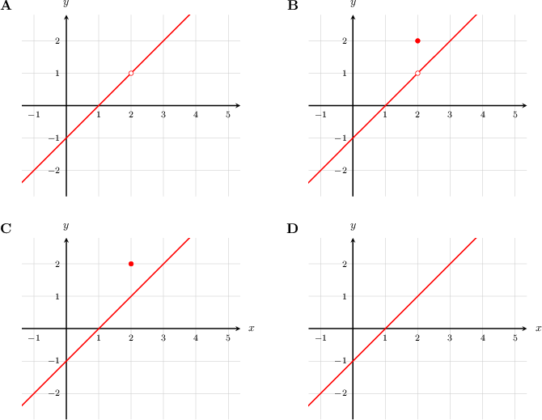
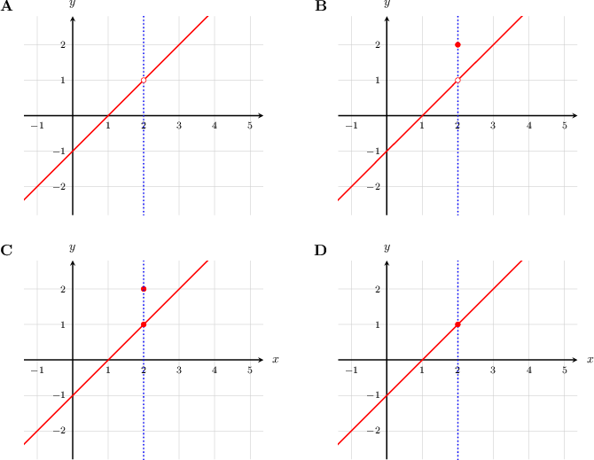

# The Vertical Line Test

Source: https://www.mathacademy.com/topics/1887?courseId=132
Topic ID: 1887

## Prerequisites

- [The Domain of a Function](../../../traditional/lessons/algebra-i/802-the-domain-of-a-function.md)

## Lesson

### Introduction

When a relation is presented as a graph, we can use the **vertical line test** to determine whether it's a function.

To perform the vertical line test, we first imagine drawing a vertical line on the graph and moving it left and right across the entire domain. One of two outcomes occurs:

- If every vertical line hits the graph *exactly* once, then the relation is a function.

- Otherwise, if some vertical line hits the graph more than once or not at all, then the relation is *not* a function.

For example, let's apply the vertical line test to the relation below, on the domain $-4 \leq x \leq 4.$

This relation is a function because no matter where in the domain we draw a vertical line, the line hits the graph exactly once.

Now consider a different relation on the domain $-3 \leq x \leq 3$, pictured below.

This relation is *not* a function because we can draw a vertical line that intersects the graph at two points.

### Example: Using the Vertical Line Test on the Domain of Real Numbers

#### Question

Does the relation with domain $x\in (-\infty, \infty)$ shown below represent a function?

#### Explanation

This graph does not represent a function because it fails the vertical line test. If we draw a vertical line at $x=0$, the line never intersects the curve.

### Example: Using the Vertical Line Test on an Integer Domain

#### Question

Is the relation given by the rule $f(x)=x^2$, where $x \in \{1,2,3, 4, \ldots \},$ a function?

#### Explanation

The relation is a function because it passes the vertical line test. If we draw a vertical line $x=n$, where $n$ is some natural number, the line intersects the graph exactly once, no matter where we draw the line.

### Example: Identifying Functions Using the Vertical Line Test

#### Question

Which of the following graphs are functions if the domain is $x\in (-\infty, \infty)?$

#### Explanation

- Graph $\textbf{A}$ does not represent a function because it fails the vertical line test. If we draw a vertical line at $x=2,$ it does not intersect the graph at all.

- Graph $\textbf{C}$ does not represent a function because it fails the vertical line test. If we draw a vertical line at $x=2,$ it intersects the graph more than once.

- Graphs $\textbf{B}$ and $\textbf{D}$ are functions because they pass the vertical line test. If we draw a vertical line, the line intersects the graph exactly once, no matter where we draw the line.

