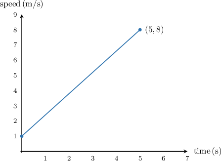
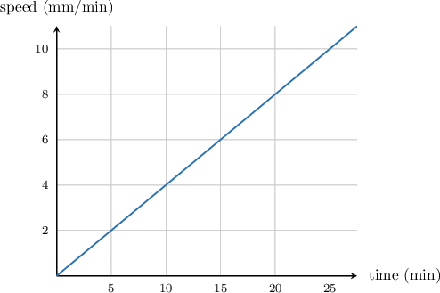
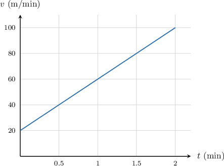
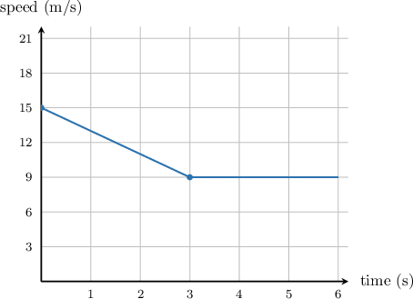
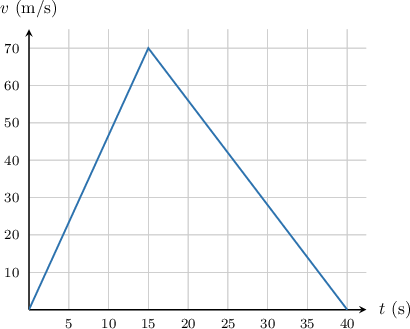
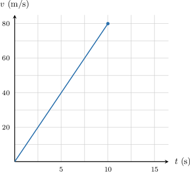
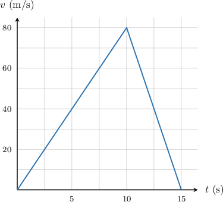

# Speed-Time Graphs

Source: https://www.mathacademy.com/topics/2327?courseId=132
Topic ID: 2327

## Prerequisites

- [Equations of Lines in Point-Slope Form](../../../traditional/lessons/algebra-i/418-equations-of-lines-in-point-slope-form.md)
- [Analyzing and Interpreting Graphs of Linear Equations](../../../traditional/lessons/algebra-i/1588-analyzing-and-interpreting-graphs-of-linear-equations.md)
- [Speed as a Unit Rate](../../../../middle-school/lessons/grade-6/3593-speed-as-a-unit-rate.md)

## Lesson

### Introduction

Suppose that Katie took her dog to the park, and they entered the park walking at a speed of meter per second. However, the dog then saw a squirrel across the field and began sprinting toward it. After seconds, the dog had reached a speed of meters per second.

We can represent this information visually using a **speed-time** graph, where speed is plotted as a function of time. To construct the speed-time graph, we use the given information to find two points on the graph.

- At time the dog was walking at a speed of meter per second. So, our graph will start at the point

- We also know that it took the dog seconds to reach a speed of meters per second. So, our graph will pass through the point

Now, we plot these two points and connect them to form a line.

This is our speed-time graph! Its slope represents the **acceleration** of the dog, in other words, the rate of change of the speed of the dog. Using the slope formula, we compute:

So, the acceleration of the dog is

**Note:** At first sight, the units of acceleration might look a bit weird. In this case, the units were or, "meters per square second." However, remember that this is just the simplified form of or "meters per second per second," which is the rate of change of speed.

### Example: Finding the Units of Acceleration

#### Question

If the speed of an object is measured in $\text{mm/min},$ what are the units of its acceleration?

#### Explanation

We can find the acceleration of an object by computing the slope of its speed-time graph. So, let's draw an example of a speed-time graph where the speed is measured in $\text{mm/min}$ and the time is measured in $\text{min}.$

In this case, the slope is computed as

$$

m=\dfrac{\text{change in speed}}{\text{change in time}},

$$

and so the units of the slope are as follows:

$$

\dfrac{\text{units of speed}}{\text{units of time}} = \dfrac{\text{mm/min}}{\text{min}} = \dfrac{\text{mm}}{\text{min}} \cdot \dfrac{1}{\text{min}} = \dfrac{\text{mm}}{\text{min}^2}

$$

Therefore, the units of acceleration are $\dfrac{\text{mm}}{\text{min}^2}.$

### Example: Computing Acceleration

#### Question

A fly accelerates with constant acceleration from $20\, \text{m/min}$ to $100\, \text{m/min}$ in $2$ minutes. Find its acceleration.

#### Explanation

We can find the acceleration of an object by computing the slope of its speed-time graph. To plot a speed-time graph, we need two points.

- The fly starts at a speed of $20 \, \text{m/min}.$ This corresponds to the point $(0,20).$

- In $2$ minutes, the fly has reached a speed of $100 \, \text{m/min}.$ This corresponds to the point $(2,100).$

We plot the two points and draw a line through them as follows:

The slope of the fly's speed-time graph gives its acceleration. The slope of this line is

$$

\begin{aligned}𝑚 & =\frac{100 m/min−20 m/min}{2 min−0 min} \\ & =\frac{80 m/min}{2 min} \\ & =40\,\frac{m}{min^{2}}.\end{aligned}

$$

Therefore, the acceleration of the fly is $40 \, \text{m/min}^2.$

### Deceleration and Constant Speed

When an object has negative acceleration, we say that it is **decelerating.** Likewise, when an object has zero acceleration, we say that it is **traveling at constant speed.**

For example, suppose a car traveling at brakes and slows to a speed of in a duration of seconds. Then, it continues traveling at the same speed. The speed-time graph is as follows:

The acceleration of the car is given by the slope of the speed-time graph.

- In the first seconds, between the points and the slope of the line is: Because the acceleration of the car is negative, we say that the car is **decelerating** at a rate of In other words, it is slowing down.

- In the next seconds, between the points and the slope of the line is: Because the acceleration of the car is zero, we say that the car is **traveling at constant speed.** In other words, it is neither speeding up nor slowing down.

### Example: Identifying Acceleration on a Speed-Time Graph

#### Question

The speed-time graph shown below represents the motion of a train. At what times is the train decelerating?

#### Explanation

The train is decelerating when its acceleration is negative. In a speed-time graph, the acceleration is given by the slope of the line. So, we need to find the times for which the slope is negative.

We see from the graph that the slope is negative from $t = 15\,\text{s}$ to $t = 40\,\text{s}.$ Therefore, the train is decelerating in this time interval.

### Example: Constructing the Speed-Time Graph for a Real-Life Scenario

#### Question

A car accelerates from rest with a constant acceleration of $8 \, \text{m/s}^2$ for the first $10$ seconds of its motion. Then the car decelerates with a constant deceleration of $16 \, \text{m/s}^2$ until it stops. What graph represents the described motion?

#### Explanation

We start the first line from the point $(0,0),$ since the car is starting from rest. Then, because the acceleration is $8 \, \text{m/s}^2,$ we draw a line with slope $8.$

However, because the car is only accelerating for the first $10$ seconds, we stop the line at $t=10.$ At this time, the car's speed has increased by $8 \cdot 10 = 80 \text{m/s}.$ So, the first line segment goes from $(0,0)$ to $(10,80).$

After $t=10$, the car has a deceleration of $16 \, \text{m/s}^2,$ so the slope of the second line segment is $-16.$ The second line segment stops when the car's speed returns to $0.$ In order to figure out when this is, we need to find the equation for the second line segment.

Since the second line segment passes through the point $(10, 80)$ and has a slope of $-16,$ we can use point-slope form to write the equation of the line:

$$

\begin{aligned}𝑣−𝑣_{1} & =𝑚(𝑡−𝑡_{1}) \\ 𝑣−80 & =−16(𝑡−10) \\ 𝑣−80 & =−16𝑡+160 \\ 𝑣 & =−16𝑡+240\end{aligned}

$$

We solve for $t$ when the speed of the car is zero:

$$

\begin{aligned}𝑣 & =−16𝑡+240 \\ 0 & =−16𝑡+240 \\ 16𝑡 & =240 \\ 𝑡 & =\frac{240}{16} \\ 𝑡 & =15\end{aligned}

$$

So, the second line segment stops at the point $(15,0).$ The final graph is

