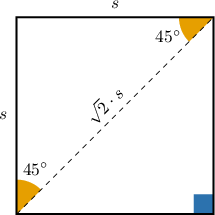
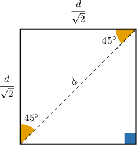
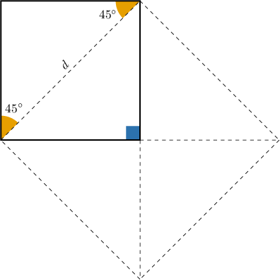

# Diagonals of Squares

Source: https://www.mathacademy.com/topics/2887?courseId=132
Topic ID: 2887

## Prerequisites

- [Isosceles Right Triangles](../../../traditional/lessons/geometry/263-isosceles-right-triangles.md)
- [Areas of Rectangles and Squares](../../../../middle-school/lessons/grade-7/1352-areas-of-rectangles-and-squares.md)

## Lesson

### Introduction

A **diagonal** of a square is a line segment from one corner of the square to the opposite corner. Whenever we draw a diagonal in a square, such as that shown below, we divide the square into two $45^\circ$-$45^\circ$-$90^\circ$ triangles.

Remember that in a $45^\circ$-$45^\circ$-$90^\circ$ triangle, the length of the hypotenuse is always $\sqrt{2}$ times the length of each leg. So, if the sides of the square have length $s,$ then the diagonal of the square has length $\sqrt{2} \cdot s.$

### Example: Determining the Diagonal of a Square Given its Side Length

#### Question

If a square has sides of length $8,$ what is the length of the diagonal?

#### Explanation

If a square has sides of length $s,$ then the diagonal has length $\sqrt{2} \cdot s.$

So, if a square has sides of length $8,$ then the diagonal has length $8\sqrt{2}.$

### Example: Determining the Side Length of a Square Given its Diagonal

#### Question

If the diagonal of a square has a length $6 \sqrt 2,$ what is the length of a side of the square?

#### Explanation

If a square has sides of length $s,$ then the diagonal has length $\sqrt{2} \cdot s.$

In our case, the diagonal has length $6 \sqrt 2,$ so we can solve for the side length as follows:

$$

\begin{aligned}\sqrt{2}⋅𝑠 & =6\sqrt{2} \\ 𝑠 & =6\end{aligned}

$$

### The Area of a Square in Terms of its Diagonal

We can also find the area of a square if we're given the length of the diagonal.

First, notice that since the length of the diagonal is $\sqrt{2}$ times the length of a side, the length of a side is the length of the diagonal *divided* by $\sqrt{2}.$

So, if the diagonal has length $d,$ then the sides have length $\dfrac{d}{\sqrt 2}.$

So, the area of the square shown above is given by

$$

\begin{aligned}𝐴 & =(\frac{𝑑}{\sqrt{2}})^{2}=\frac{1}{2}𝑑^{2}.\end{aligned}

$$

There is some nice intuition behind the above formula: as shown below, a square with side length $d$ consists of four $45^\circ$-$45^\circ$-$90^\circ$ triangles that are the same size as half of our original square. So our original square covers two fourths (or one half) the area of a square with side length $d.$

### Example: Determining the Area of a Square Given its Diagonal

#### Question

If the diagonal of a square has a length of $2,$ then what is the area of the square?

#### Explanation

The area of a square with diagonal $d$ is given by

$$

A = \dfrac{1}{2} d^2.

$$

In our case, the diagonal has length $d=2,$ so the area is given by

$$

\begin{aligned}𝐴 & =\frac{1}{2}⋅2^{2} \\ & =\frac{1}{2}⋅4 \\ & =2.\end{aligned}

$$

### Example: Determining the Diagonal of a Square Given its Area

#### Question

If the area of a square is $18,$ then what is the length of its diagonal?

#### Explanation

The area of a square with diagonal $d$ is given by

$$

A = \dfrac{1}{2} d^2.

$$

We can solve for $d$ in terms of $A$ as follows:

$$

\begin{aligned}\frac{1}{2}𝑑^{2} & =𝐴 \\ 𝑑^{2} & =2𝐴 \\ 𝑑 & =\sqrt{2𝐴}\end{aligned}

$$

In our case, the area is $A=18,$ so the length of the diagonal is given by

$$

\begin{aligned}𝑑 & =\sqrt{2⋅18} \\ & =\sqrt{36} \\ & =6.\end{aligned}

$$
