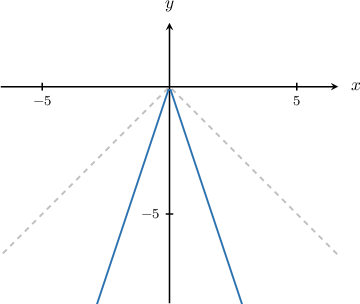
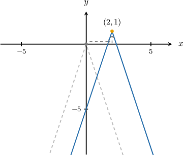
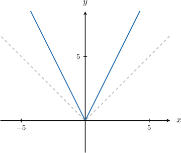
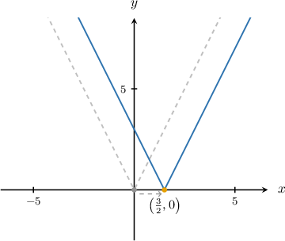
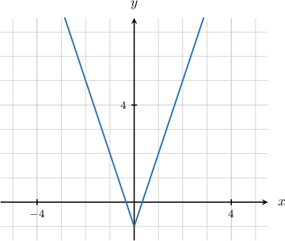

# Combining Transformations of Absolute Value Graphs

Source: https://www.mathacademy.com/topics/3559?courseId=132
Topic ID: 3559

## Prerequisites

- [Stretches of Absolute Value Graphs](../../../traditional/lessons/algebra-i/1244-stretches-of-absolute-value-graphs.md)

## Lesson

### Introduction

Consider an absolute value graph that has undergone the following transformations:

- vertical stretch with scale factor

- translation of units right and units up

In general, we can express the equation of this graph as

Note that if is negative, the graph is reflected in the -axis.

For example, to plot the graph of we proceed as follows:

- Take the graph of

- Stretch it vertically by a scale factor of to get the graph of

- Translate the result by units to the *right* and unit *up* to get the graph of

### Example: Graphing a Scaled Absolute Value Function With a Translation

#### Question

Sketch the graph of $y = |2x-3|.$

#### Explanation

First, let's re-write the equation using the properties of the absolute value function:

$$

\begin{aligned}𝑦 & =|2𝑥−3| \\ & =2(𝑥−\frac{3}{2}) \\ & =|2|⋅𝑥−\frac{3}{2} \\ & =2𝑥−\frac{3}{2}\end{aligned}

$$

Now, to get the graph of $y=2\left|x-\dfrac 3 2\right|,$ we proceed as follows:

- Take the graph of $y=|x|.$

- Stretch it vertically by a scale factor of $2$ to get the graph of $y=2|x|.$

- Translate the result by $\dfrac 3 2$ units to the right to get the graph of $y=2\left|x-\dfrac 3 2\right|.$

### Example: Finding the Equation of a Scaled Absolute Value Function With a Translation

#### Question

Given the graph of $y=a |x|+b$ below, find the value of $a+b.$

#### Explanation

Remember that $y= a|x|+b$ is a scaled absolute value graph $y=a|x|$ that is translated $b$ units up.

Here, the graph is moved down by $1$ unit. This corresponds to $b = -1.$ So, we have

$$

y=a|x|-1.

$$

To find the value of $a,$ we can pick a point on the curve and substitute it into the equation. Notice that the curve passes through the point $(1,2),$ so we can substitute $x=1$ and $y=2$ into the equation:

$$

\begin{aligned}𝑦 & =𝑎|𝑥|−1 \\ 2 & =𝑎⋅|1|−1 \\ 2 & =𝑎⋅1−1 \\ 2 & =𝑎−1 \\ 𝑎 & =3\end{aligned}

$$

Therefore, the equation of the curve is $y=3|x|-1.$

Finally, we have $a + b = 3 + (-1) = 2.$
