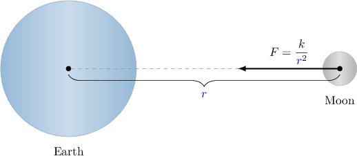

# Modeling With Inverse Variation

Source: https://www.mathacademy.com/topics/3664?courseId=132
Topic ID: 3664

## Prerequisites

- [Selecting Units for Rates of Change](../../../traditional/lessons/algebra-i/2231-selecting-units-for-rates-of-change.md)
- [Inverse Variation](../../../traditional/lessons/algebra-i/2273-inverse-variation.md)

## Lesson

### Introduction

When an object moves at a constant speed $v,$ the distance $d$ that it travels and the time $t$ are related by the equation

$$

d = vt.

$$

Suppose that we want to know how long it takes for an object to travel a *fixed* distance. We start by rewriting the above equation for $t\mathbin:$

$$

\begin{aligned}𝑡 & =\frac{𝑑}{𝑣}\end{aligned}

$$

Since $d$ is fixed (i.e. constant), it follows that the time $t$ varies inversely with the velocity $v,$ and $d$ is the constant of variation.

Intuitively, the fact that this is an inverse variation makes sense. The larger the speed of our object, the smaller the time it takes to cover a fixed distance, and vice-versa.

Suppose we're told that an object takes $t=10$ seconds to cover a particular distance when traveling with a speed of $v=5$ meters per second. Then, we can solve for $d$ as follows:

$$

\begin{aligned}𝑡 & =\frac{𝑑}{𝑣} \\ 10 & =\frac{𝑑}{5} \\ 10⋅5 & =𝑑 \\ 50 & =𝑑\end{aligned}

$$

Therefore, we have the inverse variation equation

$$

t = \dfrac{50}{v}.

$$

We can now use this equation to find the amount of time the object takes to cover the same fixed distance for different speeds.

### Example: Calculating a Constant of Variation

#### Question

The frequency $f$, in hertz $(\mathrm{Hz}),$ of the vibration of a violin string varies inversely with its length $L$, in meters $(\textrm m).$ A violin string of length $0.65\,\mathrm{m}$ vibrates at a frequency of $f=320\,\text{Hz}.$ What is the constant of variation?

#### Explanation

The frequency $f$ is inversely proportional to the string length $L,$ so we have

$$

f = \dfrac{k}{L},

$$

where $k$ is the constant of variation.

We are told that when the string length is $L = 0.65\,\text{m},$ the frequency of the string is $f = 320\,\text{Hz}.$ We can use this information to solve for $k$ as follows:

$$

\begin{aligned}320 & =\frac{𝑘}{0.65} \\ 320⋅0.65 & =𝑘 \\ 208 & =𝑘\end{aligned}

$$

Finally, since $k = fL,$ we have that the units of $k$ are $\text{Hz} \cdot \text{m}.$

Therefore, our final answer is $k = 208\,\text{Hz} \cdot \text{m}.$

### Example: Modeling With Inverse Variation

#### Question

The concentration of a solution, measured in moles per liter $(\text{mol}/\text{L}),$ varies inversely with the volume of the solution, measured in liters $(\text{L}).$ When the volume of the solution is $0.25\,\text{L}$, the concentration is $2 \,\text{mol}/\text{L}.$ Find the concentration when the volume of the solution is $8\,\text{L}.$

#### Explanation

The concentration $c$ is inversely proportional to the volume $V,$ so we have

$$

c = \dfrac{k}{V},

$$

where $k$ is the constant of variation.

We are told that when the volume $V = 0.25\,\textrm L,$ the concentration $c=2\,\text{mol}/\text{L}.$ We can use this information to solve for $k$ as follows:

$$

\begin{aligned}2 & =\frac{𝑘}{0.25} \\ 2⋅(0.25) & =𝑘 \\ 0.5 & =𝑘\end{aligned}

$$

We now have the equation

$$

c = \dfrac{0.5}{V}.

$$

We can use this equation to find the concentration when the volume $V=8\,\textrm L,$ as follows:

$$

c = \dfrac{0.5}{8} = 0.0625

$$

Therefore, the concentration when $V=8\,\text{L}$ is $c=0.0625 \,\text{mol}/\text{L}.$

### Inverse Square Laws

It is known that the gravitational force $F,$ measured in newtons, that the earth exerts on the moon varies inversely with the **square** of the distance $r,$ in kilometers, between their centers.

According to this information, the equation that relates $F$ and $r$ is

$$

F = \dfrac{k}{r^2},

$$

where $k$ is a constant of variation. This type of relationship is called an **inverse square law**.

As it turns out, many important physical laws take the form of an inverse square law. Let's see another example.

### Example: Modeling with Inverse Square Laws

#### Question

The irradiance $I,$ in $\mathrm{W}/m^2,$ of a lamp placed at the center of a spherical chamber varies inversely with the **** of the radius $r$ of the chamber, measured in meters. It is known that $I = 0.75\,\mathrm{W}/m^2$ when $r = 1.2\,\mathrm{m}.$ What equation gives the relationship between $I$ and $r?$

#### Explanation

Since the irradiance $I$ is inversely proportional to the square of the radius $r$ of the chamber, we must have

$$

I= \dfrac {k}{r^2},

$$

where $k$ is the constant of variation.

We are told that $I=0.75\,\mathrm{W}/m^2$ when $r=1.2\,\text{m}.$ We can use this information to solve for $k,$ as follows:

$$

\begin{aligned}0.75 & =\frac{𝑘}{1.2^{2}} \\ 0.75 & =\frac{𝑘}{1.44} \\ 0.75⋅1.44 & =𝑘 \\ 1.08 & =𝑘\end{aligned}

$$

Therefore, our inverse variation equation is

$$

I= \dfrac{1.08}{r^2}.

$$
