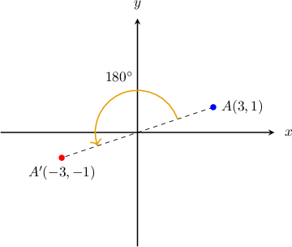
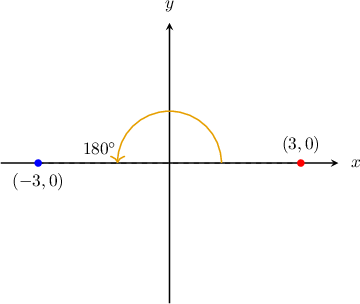
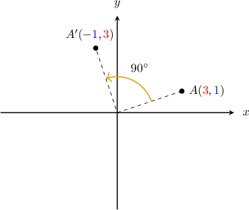
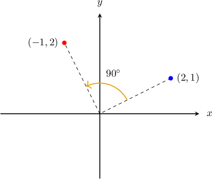
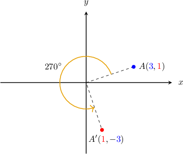
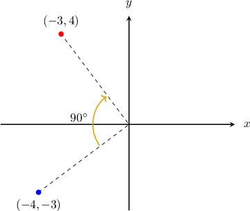
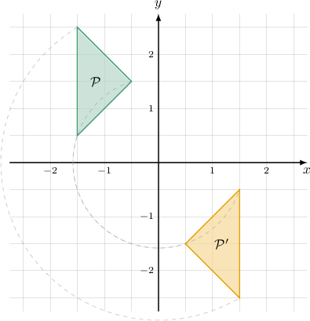

# Rotating Objects in the Coordinate Plane Using Functions

Source: https://www.mathacademy.com/topics/3823?courseId=132
Topic ID: 3823

## Prerequisites

- [Rotations of Geometric Figures](../../../traditional/lessons/geometry/1517-rotations-of-geometric-figures.md)

## Lesson

### Introduction

We can use functions to represent rotations of points and objects in the coordinate plane.

The simplest is a rotation of $180^\circ$ about the origin, which can be represented using the following function:

$$

(x,y) \mapsto (-x,-y).

$$

For example, by rotating the point $A(3,1)$ by $180^\circ$ using our function, we obtain

$$

(3,1) \mapsto (-3,-1),

$$

which gives us the image $A'(-3,-1)\mathbin{:}$

**Note:** A rotation of $180^\circ$ gives the same result clockwise and counterclockwise. Therefore, we can use the same function to rotate a point by $180^\circ$ clockwise.

### Example: Rotating a Point 180 Degrees Using a Function

#### Question

The point $(3,0)$ is rotated by $180^\circ$ about the origin. What is the image of this point under the transformation?

#### Explanation

Rotation of a point by $180^\circ$ (clockwise or counterclockwise) about the origin can be represented by the function

$$

(x,y) \mapsto (-x,-y).

$$

As a result, we have

$$

(3,0) \mapsto (-3,0).

$$

Therefore, the resulting point is $(-3,0).$

### Rotations 90 Degrees Counterclockwise

A rotation of $90^\circ$ **counterclockwise** about the origin can be represented by the function

$$

({\color{red}{x}},{\color{blue}{y}}) \mapsto (-{\color{blue}{y}},{\color{red}{x}}).

$$

For example, by rotating the point $A(3,1)$ by $90^\circ$ counterclockwise using our function, we obtain

$$

({\color{red}{3}},{\color{blue}{1}}) \mapsto (-{\color{blue}{1}},{\color{red}{3}}).

$$

which gives us the image $A'(-{\color{blue}{1}},{\color{red}{3}})\mathbin{:}$

Note the following:

- The function $(x,y) \mapsto (-y,x)$ can be difficult to remember. One way is to picture the example above and reconstruct the function from there.

- A rotation of $270^\circ$ *clockwise* is the same as a rotation of $90^\circ$ *counterclockwise*.

### Example: Rotating a Point 90 Degrees Counterclockwise Using a Function

#### Question

The point $(2,1)$ is rotated by $90^\circ$ **** about the origin. What is the image of this point under the transformation?

#### Explanation

Rotation of a point by $90^\circ$ ** about the origin can be represented by the function

$$

(x,y) \mapsto (-y,x).

$$

As a result, we have

$$

(2,1) \mapsto (-1,2).

$$

Therefore, the resulting point is $(-1,2).$

### Rotations 270 Degrees Counterclockwise

A rotation of $270^\circ$ counterclockwise about the origin can be represented by the function

$$

({\color{blue}{x}},{\color{red}{y}}) \mapsto ({\color{red}{y}},-{\color{blue}{x}}).

$$

For example, by rotating the point $A(3,1)$ by $270^\circ$ counterclockwise using our function, we obtain

$$

({\color{blue}{3}},{\color{red}{1}}) \mapsto ({\color{red}{1}},-{\color{blue}{3}}).

$$

which gives us the image $A'({\color{red}{1}},-{\color{blue}{3}})\mathbin{:}$

Note the following:

- The function $(x,y) \mapsto (y,-x)$ can be difficult to remember. One way is to picture the example above and reconstruct the function from there.

- A rotation of $270^\circ$ *counterclockwise* is the same as a rotation of $90^\circ$ *clockwise*. Therefore, we can use the same function to rotate a point by $90^\circ$ clockwise.

### Example: Rotating a Point 270 Degrees Counterclockwise Using a Function

#### Question

The point $(-4,-3)$ is rotated by $90^\circ$ **** about the origin. What is the image of this point under the transformation?

#### Explanation

First, recall that rotation by $90^\circ$ ** is the same as rotation by $270^\circ$ **.

Rotation of a point by $270^\circ$ ** about the origin can be represented by the function

$$

(x,y) \mapsto (y,-x).

$$

As a result, we have

$$

(-4,-3) \mapsto (-3,4).

$$

Therefore, the resulting point is $(-3,4).$

### Example: Rotating a Polygon in the Coordinate Plane Using a Function

#### Question

The function rotates the polygon about the origin by an angle of degrees counterclockwise. The image of under the rotation is as shown below. Find the values of and

#### Explanation

From the picture, we can see that if we rotate the polygon about the origin by counterclockwise, we get the polygon Therefore,

Recall that the transformation defines a rotation by the angle of counterclockwise about the origin, so

Indeed, this transformation maps vertices of to vertices of

So, the answer is
