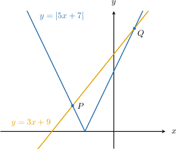
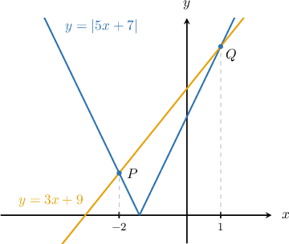
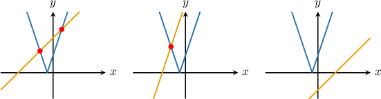
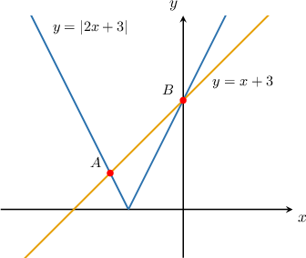

# Equations Connecting Absolute Value and Linear Functions

Source: https://www.mathacademy.com/topics/385?courseId=132
Topic ID: 385

## Prerequisites

- [Absolute Value Graphs](../../../traditional/lessons/algebra-i/790-absolute-value-graphs.md)
- [Further Absolute Value Equations](../../../traditional/lessons/algebra-i/4029-further-absolute-value-equations.md)

## Lesson

### Introduction

Sometimes, we must solve an absolute value equation containing variables on both sides. For example,

$$

\left\vert 5x +7\right\vert = 3x +9.

$$

Geometrically, these solutions correspond to the $x$-coordinates of the intersection points of the curves $y=|5x+7|$ and $y=3x+9,$ shown as the points $P$ and $Q$ below.

**Note:** *Image not drawn to scale.*

Let's now discuss how to find these intersection points algebraically.

### A Worked Example

We wish to find the solution to the equation

$$

\vert 5x + 7 \vert = 3x +9.

$$

For this equation to be true, either the positive or negative of the expression inside the absolute value must be equal to the right-hand side of the equation.

Therefore, we have the following two cases:

$$

|5x+7| = 5x+7 \qquad \textrm{and}\qquad |5x+7| = -(5x+7)

$$

We now consider these two cases separately:

- If $|5x +7|=5x +7,$ we obtain the following equation: We now solve this equation using the usual methods: This *potential* solution is valid only if it solves the original equation. So, let's plug it back in: Since $x=1$ satisfies the original equation, it's a valid solution.

- If $|5x +7|=-(5x +7),$ we obtain the following equation: We now solve this equation using the usual methods: This *potential* solution is valid only if it solves the original equation. So, let's plug it back in: Since $x=-2$ satisfies the original equation, it's a valid solution.

Therefore, the solutions of our equation are $x=-2, \, 1.$

### The Number of Solutions

The intersection points between the absolute value graph $y=|ax+b|$ and the line $y=cx+d$ correspond to the solutions of the equation

$$

|ax+b|=cx+d.

$$

Depending on the positions of the respective graphs, there are typically two, one, or no solutions to this equation.

For the remainder of this lesson, we'll consider only the cases where two intersection points exist between the absolute value function and the line. Cases with only one or no intersection points will be dealt with in a future lesson.

### Example: Solving Absolute Value Equations With Two Solutions

#### Question

Solve the equation $|5x+1|=-x+7.$

#### Explanation

We have the following two cases:

- If $|5x+1|=5x+1,$ we obtain This ** solution is valid only if it solves the original equation. So, let's plug it back in: Since $x=1$ satisfies the original equation, it's a valid solution.

- If $|5x+1|=-(5x+1),$ we obtain This ** solution is valid only if it solves the original equation. So, let's plug it back in: Since $x=-2$ satisfies the original equation, it's a valid solution.

Therefore, the solutions of our equation are $x=-2, \, 1.$

### Example: Isolating an Absolute Value

#### Question

Solve the equation $\vert 2 -6q \vert + 2q = 6.$

#### Explanation

We start by isolating the absolute value on the left side:

$$

\begin{aligned}|2−6𝑞|+2𝑞 & =6 \\ |2−6𝑞| & =−2𝑞+6\end{aligned}

$$

Now, we have the following two cases:

- If $|2-6q|=2-6q,$ we obtain This ** solution is valid only if it solves the original equation. So, let's plug it back in: Since $q=-1$ satisfies the original equation, it's a valid solution.

- If $|2-6q|=-(2-6q),$ we obtain This ** solution is valid only if it actually solves the original equation. So, let's plug it back in: Since $q=1$ satisfies the original equation, it's a valid solution.

Therefore, our equation has two solutions $q=-1$ and $q=1.$

### Example: Finding Points of Intersection

#### Question

Find the $x$-coordinates of the points $A$ and $B$ above.

#### Explanation

To find the $x$-coordinates of the intersections of $y=|2x+3|$ and $y=x+3,$ we need to solve the following equation for $x{:}$

$$

|2x+3| = x+3

$$

The absolute value graph $y=|2x+3|$ has two branches:

- where $|2x+3| = -(2x+3),$ which has a negative slope, and

- where $|2x+3| = 2x+3,$ which has a positive slope.

Now, let's consider each branch in turn:

- The point $A$ lies on the branch with a negative slope. So, if $|2x+3| = -(2x+3),$ we obtain: This ** solution is valid only if it solves the original equation. So, let's plug it back in: Since $x=-2$ satisfies the original equation, the $x$-coordinate of $A$ is $x=-2.$

- The point $B$ lies on the branch with a positive slope. So, if $|2x+3| = 2x+3,$ we obtain: This ** solution is valid only if it solves the original equation. So, let's plug it back in: Since $x=0$ satisfies the original equation, the $x$-coordinate of $B$ is $x=0.$

Therefore, the $x$-coordinates of $A$ and $B$, respectively, are $-2$ and $0.$
