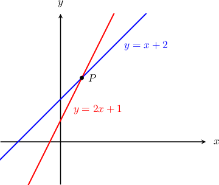
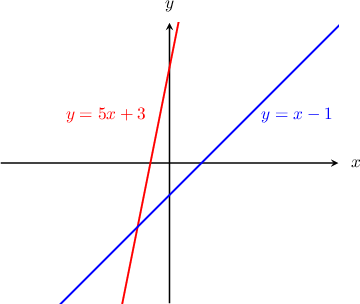

# Calculating the Intersection of Two Lines

Source: https://www.mathacademy.com/topics/408?courseId=132
Topic ID: 408

## Prerequisites

- [Solving Systems of Equations by Substitution](../../../../middle-school/lessons/grade-7/487-solving-systems-of-equations-by-substitution.md)
- [Equations of Lines in Standard Form](../../../traditional/lessons/algebra-i/839-equations-of-lines-in-standard-form.md)
- [Solving Systems of Linear Equations Using Elimination: Two Transformations](../../../traditional/lessons/algebra-i/4236-solving-systems-of-linear-equations-using-elimination-two-transformations.md)

## Lesson

### Introduction

Suppose we want to find the point of intersection between the two lines $y = x + 2$ and $y = 2x + 1.$ A sketch of both lines and the point of intersection $P$ is shown below.

The point $P$ consists of the coordinates $(x,y)$ that satisfy both equations $y=x+2$ and $y=2x+1.$ So, to find the coordinates of $P$ we need to solve the system of equations consisting of the two lines:

$$

\begin{aligned}𝑦=𝑥+2 \\ 𝑦=2𝑥+1\end{aligned}

$$

We can solve this system by substitution. Substituting the first equation $y=x+2$ into the second equation $y=2x+1$ gives an equation that we can solve for $x\mathbin{:}$

$$

\begin{aligned}𝑥+2 & =2𝑥+1 \\ 𝑥+1 & =2𝑥 \\ 1 & =𝑥\end{aligned}

$$

This is the $x$-coordinate of the point of intersection. To find the $y$-coordinate, we substitute $x = 1$ back into one of the equations, say $y=x+2,$ as follows:

$$

\begin{aligned}𝑦 & =𝑥+2 \\ & =1+2 \\ & =3\end{aligned}

$$

Therefore, the solution to the system is $x=1, \, y=3.$ So, the point of intersection has the coordinates $(1,3).$

### Example: Finding the Intersection of Two Lines Given in Slope-Intercept Form

#### Question

Find the point of intersection of the lines $y=5x+3$ and $y=x-1$ sketched below.

#### Explanation

The point of intersection consists of the coordinates $(x,y)$ that satisfy both equations $y=5x+3$ and $y=x-1.$ So, we need to solve the system of equations consisting of the two lines:

$$

\begin{aligned}𝑦=5𝑥+3 \\ 𝑦=𝑥−1\end{aligned}

$$

We will use the substitution method to solve the system. Substituting the first equation $y=5x+3$ into the second equation $y=x-1$ gives an equation that we can solve for $x\mathbin{:}$

$$

\begin{aligned}5𝑥+3 & =𝑥−1 \\ 5𝑥 & =𝑥−4 \\ 4𝑥 & =−4 \\ 𝑥 & =−1\end{aligned}

$$

This is the $x$-coordinate of the point of intersection. To find the $y$-coordinate, we substitute $x = -1$ back into one of the equations, say $y=x-1,$ as follows:

$$

\begin{aligned}𝑦 & =𝑥−1 \\ & =−1−1 \\ & =−2\end{aligned}

$$

Therefore, the solution to the system is $x=-1, \, y=-2.$ So, the coordinates of the intersection point are $(-1,-2).$

### Lines Given in Standard Form

When two lines are given in the *standard form*, you may find it easier to use the *elimination method* to find the point of intersection.

Let's see an example.

### Example: Finding the Intersection of Two Lines Given in Standard Form

#### Question

Find the point of intersection of the lines $x + 2 y = 1$ and $2 x - y = 7.$

#### Explanation

We need to solve the system of equations consisting of the two lines:

$$

\begin{aligned}𝑥+2𝑦=1 \\ 2𝑥−𝑦=7\end{aligned}

$$

We will use the elimination method to solve the system. Notice that if we multiply the second equation by $2,$ then we will get a $-2y$ term that can cancel with the $2y$ term in the first equation:

$$

\begin{aligned}𝑥+2𝑦=1 & \\ 2𝑥−𝑦=7 & \,×2\end{aligned}

$$

Adding the two equations eliminates the $y$-variable and allows us to solve for $x\mathbin{:}$

$$

\begin{aligned}𝑥+2𝑦 & =1 \\ 4𝑥−2𝑦 & =14 \\ (𝑥+4𝑥) & =(1+14) \\ 5𝑥 & =15 \\ 𝑥 & =3\end{aligned}

$$

Finally, we can substitute $x=3$ into the equation $x+2y=1$ to solve for $y\mathbin{:}$

$$

\begin{aligned}𝑥+2𝑦 & =1 \\ 3+2𝑦 & =1 \\ 2𝑦 & =−2 \\ 𝑦 & =−1\end{aligned}

$$

Therefore, the solution to the system is $x=3, \, y=-1.$ So the coordinates of the point of intersection are $(3,-1).$

### Example: Calculating Unknown Parameters Given a Point of Intersection

#### Question

The lines $y = -3 x + a$ and $y = x - 1$ intersect at the point $C$ with coordinates $(b, -4).$ Find the parameters $a$ and $b.$

#### Explanation

Since $(b,-4)$ is the point of intersection of the two lines, the values $x=b, \, y=-4$ must solve the following system:

$$

\begin{aligned}𝑦=−3𝑥+𝑎 \\ 𝑦=𝑥−1\end{aligned}

$$

We substitute $x=b, \, y=-4$ to obtain a new system:

$$

\begin{aligned}−4=−3𝑏+𝑎 \\ −4=𝑏−1\end{aligned}

$$

In the second equation, we can solve for $b\mathbin{:}$

$$

\begin{aligned}−4 & =𝑏−1 \\ −3 & =𝑏\end{aligned}

$$

Then, we can substitute $b=-3$ into the first equation and solve for $a\mathbin{:}$

$$

\begin{aligned}−4 & =−3𝑏+𝑎 \\ −4 & =−3(−3)+𝑎 \\ −4 & =9+𝑎 \\ −13 & =𝑎\end{aligned}

$$

Therefore, $a = -13$ and $b = -3.$
