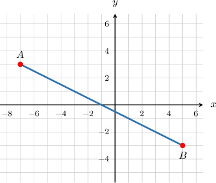
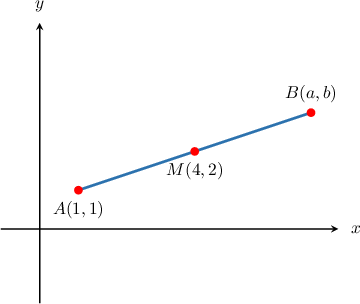
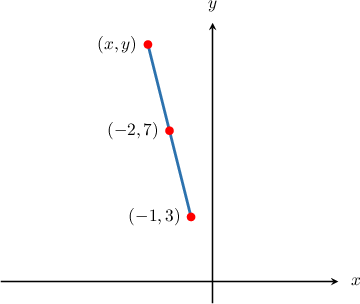

# Midpoints in the Coordinate Plane

Source: https://www.mathacademy.com/topics/485?courseId=132
Topic ID: 485

## Prerequisites

- [The Cartesian Coordinate System](../../../../middle-school/lessons/grade-6/92-the-cartesian-coordinate-system.md)
- [Midpoints](../../../../middle-school/lessons/grade-7/1463-midpoints.md)

## Lesson

### Introduction

In the coordinate plane, the **midpoint** of a line segment with endpoints $(x_1,y_1)$ and $(x_2,y_2)$ lies halfway between the $x$-coordinates $x_1$ and $x_2,$ and halfway between the $y$-coordinates $y_1$ and $y_2.$

The coordinates of the midpoint can be computed using the formula

$$

(x_m,y_m) = \left(\dfrac{x_1 +x_2}2,\dfrac{y_1+y_2}2\right).

$$

For example, the coordinates of the midpoint of a line segment with endpoints $(2,1)$ and $(6,13)$ can be found as follows:

$$

\begin{aligned}(𝑥_{𝑚},𝑦_{𝑚}) & =(\frac{𝑥_{1}+𝑥_{2}}{2},\frac{𝑦_{1}+𝑦_{2}}{2}) \\ & =(\frac{2+6}{2},\frac{1+13}{2}) \\ & =(\frac{8}{2},\frac{14}{2}) \\ & =(4,7).\end{aligned}

$$

### Example: Finding the Midpoint of a Segment

#### Question

Find the midpoint of the line segment shown below.

#### Explanation

Let $(x_m,y_m)$ be the midpoint between the given points $𝑥_{1},\,𝑦_{1})$ and $𝑥_{2},\,𝑦_{2})$

We use the midpoint formula as follows:

$$

\begin{aligned}(𝑥_{𝑚},𝑦_{𝑚}) & =(\frac{𝑥_{1}+𝑥_{2}}{2},\frac{𝑦_{1}+𝑦_{2}}{2}) \\ & =(\frac{−7+5}{2},\frac{3+(−3)}{2}) \\ & =(\frac{−2}{2},\frac{0}{2}) \\ & =(−1,0).\end{aligned}

$$

### Example: Finding the Midpoint of a Segment With Variable Coordinates

#### Question

Find the midpoint of the line segment with endpoints $(5a,0)$ and $(-a,8b).$

#### Explanation

Let $(x_m,y_m)$ be the midpoint between the given points $𝑥_{1},\,𝑦_{1})$ and $𝑥_{2},\,𝑦_{2})$

We use the midpoint formula as follows:

$$

\begin{aligned}(𝑥_{𝑚},𝑦_{𝑚}) & =(\frac{𝑥_{1}+𝑥_{2}}{2},\frac{𝑦_{1}+𝑦_{2}}{2}) \\ & =(\frac{5𝑎+(−𝑎)}{2},\frac{0+8𝑏}{2}) \\ & =(\frac{4𝑎}{2},\frac{8𝑏}{2}) \\ & =(2𝑎,4𝑏).\end{aligned}

$$

### Finding the Coordinates of Endpoints

Suppose $M(4,2)$ is the midpoint between $A(1,1)$ and $B(a,b).$ What are the values of $a$ and $b?$

Again, we use the midpoint formula:

$$

\begin{aligned}(𝑥_{𝑚},𝑦_{𝑚}) & =(\frac{𝑥_{1}+𝑥_{2}}{2},\frac{𝑦_{1}+𝑦_{2}}{2}).\end{aligned}

$$

We have

$$

\begin{aligned}𝑥_{1} & =1, & 𝑦_{1} & =1, \\ 𝑥_{2} & =𝑎, & 𝑦_{2} & =𝑏, \\ 𝑥_{𝑚} & =4, & 𝑦_{𝑚} & =2.\end{aligned}

$$

Substituting the known values in the formula, we obtain

$$

\begin{aligned}(4,2) & =(\frac{1+𝑎}{2},\frac{1+𝑏}{2}).\end{aligned}

$$

Setting the $x$-coordinates equal to each other and the $y$-coordinates equal to each other, we have the following two equations:

$$

\begin{aligned}\begin{aligned}4=\frac{1+𝑎}{2} \\ 2=\frac{1+𝑏}{2}\end{aligned}\end{aligned}

$$

Multiplying both sides of the equations by $2,$ we have:

$$

\begin{aligned}\begin{aligned}8=1+𝑎 \\ 4=1+𝑏\end{aligned}\end{aligned}

$$

Finally, we solve both equations independently:

$$

\begin{aligned}\begin{aligned}𝑎=8−1=7 \\ 𝑏=4−1=3.\end{aligned}\end{aligned}

$$

Therefore, $a=7$ and $b=3.$

### Example: Finding the Coordinates of an Endpoint Given the Midpoint

#### Question

Find $x+y$ if the midpoint of the line segment with endpoints $(-1,3)$ and $(x,y)$ is $(-2,7).$

#### Explanation

The given points are $𝑥_{1},\,𝑦_{1})$ $𝑥_{2},\,𝑦_{2})$ and $𝑥_{𝑚},\,𝑦_{𝑚})$

According to the midpoint formula, we have

$$

\begin{aligned}(𝑥_{𝑚},𝑦_{𝑚}) & =(\frac{𝑥_{1}+𝑥_{2}}{2},\frac{𝑦_{1}+𝑦_{2}}{2}) \\ (−2,7) & =(\frac{−1+𝑥}{2},\frac{3+𝑦}{2}).\end{aligned}

$$

Equating the corresponding $x$- and $y$-coordinates in the equation above gives us

$$

\begin{aligned}\begin{aligned}−2=\frac{−1+𝑥}{2} \\ 7=\frac{3+𝑦}{2}\end{aligned}\,⇒\,\begin{aligned}𝑥=−3 \\ 𝑦=11.\end{aligned}\end{aligned}

$$

Therefore, the second endpoint is $(x,y)=(-3,11).$ Consequently, $x+y=8.$
