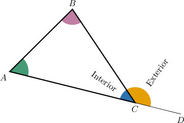
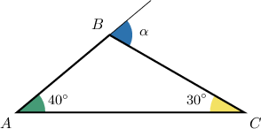
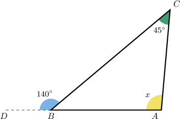
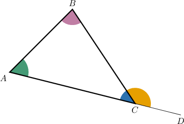

# The Exterior Angle Theorem

Source: https://www.mathacademy.com/topics/5157?courseId=132
Topic ID: 5157

## Prerequisites

- [Exterior Angles of Triangles](../../../../middle-school/lessons/grade-8/1458-exterior-angles-of-triangles.md)

## Lesson

### Introduction

Consider the triangle $\triangle ABC,$ shown above. Recall that by extending the side $\overline{AC}$ beyond the vertex $C,$ we obtain an exterior angle of the triangle corresponding to the vertex $C.$

The relationship between the measures of the interior and exterior angles is given by the **exterior angle theorem**:

*An exterior angle in a triangle equals the sum of the measures of the two non-adjacent interior angles.*

For example, in the context of the above diagram, the theorem states that

$$

\underbrace{m\angle BCD}_{\text{Exterior angle at }C} = \underbrace{m\angle{A} + m\angle{B}}_{\text{Non-adjacent interior angles}}.

$$

We'll prove the exterior angle theorem at the end of the lesson. But first, let's get some practice using it.

### Example: Finding an Exterior Angle

#### Question

Given the diagram above, find $m\angle{\alpha}.$

#### Explanation

The exterior angle theorem states that the measure of an exterior angle in a triangle equals the sum of the measures of the two non-adjacent interior angles.

Here, $\angle{\alpha}$ is an exterior angle of $\triangle ABC$ corresponding to $\angle B,$ and the two non-adjacent interior angles are $\angle{A}$ and $\angle{C}.$

Therefore, we have

$$

\begin{aligned}𝑚∠𝛼 & =𝑚∠𝐴+𝑚∠𝐶 \\ & =40^{∘}+30^{∘} \\ & =70^{∘}.\end{aligned}

$$

### Example: Finding an Interior Angle

#### Question

Find the value of $x.$

#### Explanation

The exterior angle theorem states that the measure of an exterior angle in a triangle equals the sum of the measures of the two non-adjacent interior angles.

Here, $\angle{CBD}$ is an exterior angle of $\triangle ABC$ corresponding to $\angle B,$ and the two non-adjacent interior angles are $\angle{A}$ and $\angle{C}.$

Therefore, we have

$$

m\angle{CBD} = m\angle{A} + m\angle{C}.

$$

Substituting the given values and solving for $x,$ we obtain the following:

$$

\begin{aligned}140^{∘} & =𝑥+45^{∘} \\ 95^{∘} & =𝑥 \\ 𝑥 & =95^{∘}\end{aligned}

$$

### Proof of the Theorem

Consider the diagram above. Let's prove that

$$

m\angle BCD = m\angle{A} + m\angle{B}.

$$

First, notice that $\angle{ACB}$ and $m\angle{BCD}$ are supplementary. Thus,

$$

m\angle{BCD} = 180^\circ - m\angle{ACB}.

$$

The sum of internal angles in any triangle equals $180^\circ.$ Therefore:

$$

\begin{aligned}𝑚∠𝐴+𝑚∠𝐵+𝑚∠𝐴𝐶𝐵 & =180^{∘} \\ 𝑚∠𝐴+𝑚∠𝐵 & =180^{∘}−𝑚∠𝐴𝐶𝐵 \\ 𝑚∠𝐴+𝑚∠𝐵 & =𝑚∠𝐵𝐶𝐷 \\ 𝑚∠𝐵𝐶𝐷 & =𝑚∠𝐴+𝑚∠𝐵\end{aligned}

$$
