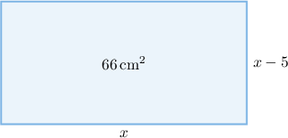

# Modeling With Quadratic Equations

Source: https://www.mathacademy.com/topics/114?courseId=133
Topic ID: 114

## Prerequisites

- [Solving Quadratic Equations by Factoring](../../../traditional/lessons/algebra-i/375-solving-quadratic-equations-by-factoring.md)
- [The Quadratic Formula](../../../traditional/lessons/algebra-i/422-the-quadratic-formula.md)
- [Consecutive Integer Problems](../../../traditional/lessons/algebra-i/908-consecutive-integer-problems.md)
- [Units of Area and Volume](../../../../elementary-school/lessons/grade-5/3872-units-of-area-and-volume.md)

## Lesson

### Introduction

Suppose the product of two integers is $24,$ and the second number exceeds the first one by $2.$ How do we construct a quadratic equation that allows us to find the two numbers?

First, let $n$ be the smaller of the two numbers and $m$ the larger of the two numbers.

We are told that the second number exceeds the first by $2.$ So, we have

$$

m=n+2.

$$

Second, we are told that their product is $24.$ So, we have the equation

$$

mn = 24.

$$

Substituting $m=n+2$ into the above, we get

$$

\begin{aligned}𝑛(𝑛+2) & =24 \\ 𝑛^{2}+2𝑛 & =24 \\ 𝑛^{2}+2𝑛−24 & =0,\end{aligned}

$$

which is a quadratic equation in the variable $n.$

Factoring this equation, we get

$$

(n+6)(n-4) = 0,

$$

which gives the solutions $n=-6$ and $n=4.$ Now,

- when $n=-6,$ we have $m = -6+2 = -4,$

- when $n=4,$ we have $m = 4+2 = 6.$

Therefore, the pairs $(n,m)$ that differ by two and whose product equals $24$ are $(-6, -4)$ and $(4,6).$

### Example: Constructing Quadratic Equations

#### Question

Alice is $a$ years old, and Bob is $b$ years old. The sum of their ages is $25,$ and the product of their ages is $144.$ What quadratic equation defines all possible values of $a?$

#### Explanation

First, we are told that the sum of their ages is $25.$ So, we have

$$

\begin{aligned}𝑎+𝑏 & =25 \\ 𝑏 & =25−𝑎.\end{aligned}

$$

Second, we are told that the product of their ages is $144.$ So, we have

$$

\begin{aligned}𝑎𝑏 & =144.\end{aligned}

$$

Substituting $b=25-a$ into the above, we get

$$

\begin{aligned}(25−𝑎)𝑎 & =144 \\ 25𝑎−𝑎^{2} & =144 \\ 𝑎^{2}−25𝑎+144 & =0.\end{aligned}

$$

### Example: Solving Number Problems

#### Question

The sum of two positive numbers is $18,$ and their product is $72.$ Find the larger of the two numbers.

#### Explanation

Let $a$ and $b$ be the two numbers.

Since the sum of the numbers is $18,$ we have the equation

$$

\begin{aligned}𝑎+𝑏 & =18 \\ 𝑏 & =18−𝑎.\end{aligned}

$$

Since the product of the numbers is $72,$ we have the equation

$$

ab=72.

$$

Substituting $b=18-a$ into the above equation, we get

$$

\begin{aligned}𝑎(18−𝑎) & =72 \\ 18𝑎−𝑎^{2} & =72 \\ 𝑎^{2}−18𝑎+72 & =0.\end{aligned}

$$

Factoring the left-hand side, we obtain

$$

\begin{aligned}(𝑎−6)(𝑎−12) & =0.\end{aligned}

$$

Now, applying the zero product rule, we have

$$

a = 6, \, 12.

$$

Therefore, the larger of the two numbers is $a=12.$

### Example: Solving Area Problems

#### Question

Given that the area of the above rectangle is $66\,\textrm{cm}^2,$ find the value of $x.$

#### Explanation

The area of the rectangle is the product of its base and height, which can be expressed as

$$

x(x-5).

$$

We are told that the area is $66\:\textrm{cm}^2.$ So, we have the following quadratic equation:

$$

x(x-5) = 66

$$

Writing this equation in standard form, we get

$$

\begin{aligned}𝑥^{2}−5𝑥 & =66 \\ 𝑥^{2}−5𝑥−66 & =0.\end{aligned}

$$

We solve this equation using the quadratic formula:

$$

x = \dfrac{-b \pm \sqrt{b^2 - 4ac}}{2a}

$$

Applying the quadratic formula with $a=1, b=-5,$ and $c=-66$ we get

$$

\begin{aligned}𝑥 & =\frac{−(−5)±\sqrt{√(−5)^{2}−4(1)(−66)}}{2(1)} \\ & =\frac{5±\sqrt{√25+264}}{2} \\ & =\frac{5±\sqrt{√289}}{2} \\ & =\frac{5±17}{2}.\end{aligned}

$$

Simplifying the two solutions, we have

$$

x = 11, \quad x=-6.

$$

We disregard the negative solution since the side lengths must be positive. Therefore, $x=11\:\textrm{cm}.$
