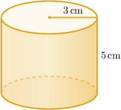
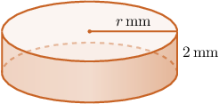
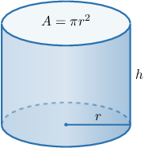

# Volumes of Cylinders

Source: https://www.mathacademy.com/topics/1144?courseId=133
Topic ID: 1144

## Prerequisites

- [The Circumference of a Circle](../../../traditional/lessons/geometry/460-the-circumference-of-a-circle.md)
- [Writing Ratios Using Fractions](../../../../middle-school/lessons/grade-6/552-writing-ratios-using-fractions.md)
- [Solving Rational Equations Using Cross-Multiplication](../../../traditional/lessons/algebra-i/698-solving-rational-equations-using-cross-multiplication.md)
- [Areas of Circles](../../../traditional/lessons/geometry/1745-areas-of-circles.md)
- [Identifying Three-Dimensional Shapes](../../../traditional/lessons/geometry/2467-identifying-three-dimensional-shapes.md)
- [Solving Equations With Odd Exponents Using the Nth Root Method](../../../traditional/lessons/algebra-i/3748-solving-equations-with-odd-exponents-using-the-nth-root-method.md)

## Lesson

### Introduction

The volume of a cylinder with radius $r$ and height $h$ is given by the formula

$$

V = \pi r^2h.

$$

Let's use this formula to calculate the volume of the cylinder below:

For this cylinder, the radius $r = 3\,\textrm{cm}$ and the height $h = 5\,\textrm{cm}.$ Substituting these values into the formula for $V,$ we get

$$

V = \pi (3)^2 (5) = 45\pi\,\textrm{cm}^3.

$$

We often express the volume of a cylinder as a multiple of $\pi.$ However, we can also use a calculator to get a numerical approximation for the volume. This gives

$$

V\approx 141.37\,\textrm{cm}^3,

$$

rounded to two decimal places.

### Example: Finding the Volume of a Cylinder

#### Question

Calculate the volume of a cylinder given that the circumference of the base is $10\pi \,\textrm{m}$ and the ratio of its height to its radius is $\dfrac{4}{5}.$

#### Explanation

First, we find the radius $r$ using the formula $C=2\pi r,$ where $C$ is the circumference, as follows:

$$

\begin{aligned}𝐶 & =2𝜋𝑟 \\ 10𝜋 & =2𝜋𝑟 \\ 𝑟 & =5\,m\end{aligned}

$$

To find the height $h,$ we use the fact that the ratio of the height to the radius is $\dfrac{4}{5} \mathbin{:}$

$$

\begin{aligned}\frac{ℎ}{𝑟} & =\frac{4}{5} \\ \frac{ℎ}{5} & =\frac{4}{5} \\ ℎ & =4\,m\end{aligned}

$$

The volume of a cylinder with radius $r$ and height $h$ is given by

$$

V = \pi r^2h .

$$

Substituting $r = 5\,\textrm{m}$ and $h = 4\,\textrm{m}$ into the formula, we get

$$

V = \pi(5)^2(4) = 100\pi\,\textrm{m}^3 .

$$

### Example: Finding a Dimension of a Cylinder Given Its Volume

#### Question

Calculate the radius $r$ of the cylinder below given that its volume is $200\pi \,\textrm{mm}^3$ and its height is $2\,\textrm{mm}.$

#### Explanation

The volume of a cylinder with radius $r$ and height $h$ is given by

$$

V = \pi r^2h.

$$

Substituting $V = 200\pi \,\textrm{mm}^3$ and $h = 2\,\textrm{mm}$ into the formula and solving for $r,$ we get

$$

\begin{aligned}𝑉 & =𝜋𝑟^{2}ℎ \\ 200𝜋 & =𝜋𝑟^{2}(2) \\ 2𝜋𝑟^{2} & =200𝜋 \\ 𝑟^{2} & =100 \\ 𝑟 & =10\,mm.\end{aligned}

$$

### Example: Finding an Expression for a Dimension of a Cylinder Given a Proportion

#### Question

Find an expression for the height $h$ of a cylinder in terms of its volume $V$ given that the ratio of the radius of the base to the height of the cylinder is $4.$

#### Explanation

Using the fact that the ratio of the radius $r$ of the base to the height $h$ is $4,$ we have that

$$

\begin{aligned}\frac{𝑟}{ℎ} & =4.\end{aligned}

$$

Our goal is to express $h$ in terms of $V.$ Therefore, we need to isolate $r$ in the above equation:

$$

\begin{aligned}\frac{𝑟}{ℎ} & =4 \\ 𝑟 & =4ℎ\end{aligned}

$$

The volume of a cylinder with radius $r$ and height $h$ is given by

$$

V = \pi r^2 h.

$$

Therefore, substituting $r = 4h$ into the formula and solving for $h,$ we get

$$

\begin{aligned}𝑉 & =𝜋𝑟^{2}ℎ \\ 𝑉 & =𝜋(4ℎ)^{2}ℎ \\ 𝑉 & =16𝜋ℎ^{3} \\ ℎ^{3} & =\frac{𝑉}{16𝜋} \\ ℎ & =\sqrt[√\frac{𝑉}{16𝜋}]{3}.\end{aligned}

$$

### Intuition Behind the Formula

Recall that the volume $V$ of a cylinder of radius $r$ and height $h$ is given by

$$

V = \pi r^2 h.

$$

This formula is very intuitive, which makes it easier to remember.

Notice that the base of the cylinder is a circle of radius $r.$ Therefore, the area of a circular base is given by

$$

A = \pi r^2.

$$

Let's label this area on a diagram.

Therefore, to compute the volume of the cylinder, we simply multiply the area of the base by the height:

$$

\begin{aligned}𝑉 & =𝐴⋅ℎ \\ & =𝜋𝑟^{2}⋅ℎ \\ & =𝜋𝑟^{2}ℎ\end{aligned}

$$
