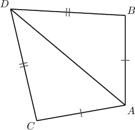
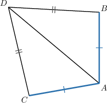
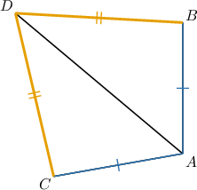
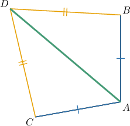
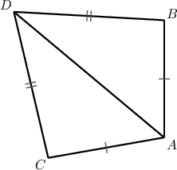
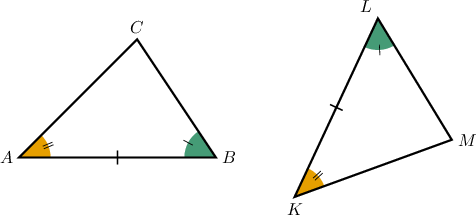
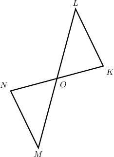
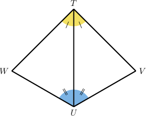
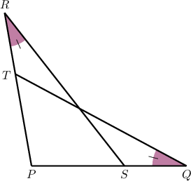

# Proving Congruence Statements

Source: https://www.mathacademy.com/topics/1357?courseId=133
Topic ID: 1357

## Prerequisites

- [Combining Congruence Criteria for Triangles](../../../traditional/lessons/geometry/966-combining-congruence-criteria-for-triangles.md)
- [Angle Bisectors](../../../../middle-school/lessons/grade-7/1508-angle-bisectors.md)
- [Medians and Centroids of Triangles](../../../traditional/lessons/geometry/1524-medians-and-centroids-of-triangles.md)
- [Heights of Triangles](../../../../middle-school/lessons/grade-7/1644-heights-of-triangles.md)
- [Proving Alternate Angle Theorems](../../../traditional/lessons/geometry/5488-proving-alternate-angle-theorems.md)

## Lesson

### Introduction

In this lesson, we'll learn how to prove statements concerning congruent triangles.

Before we start, let's remind ourselves of some definitions. These will be useful for the proofs that follow:

- Congruent segments: *Two segments are congruent if they have the same length.*

- Angle bisector: *An angle bisector is a line that divides an angle into two congruent angles.*

- Midpoint: *The midpoint of a line segment is the point that splits it into two segments of equal length.*

- Equilateral triangle: *A triangle is equilateral if all three sides are congruent.*

- Isosceles triangle: *A triangle is isosceles if two (and only two) sides are congruent.*

- Right triangle: *A triangle is right if one of its internal angles is a right angle.*

- Median: *A median of a triangle is a line segment joining a vertex to the midpoint of the opposite side.*

- Altitude (or Height): *An altitude (height) of a triangle is a line segment drawn from one vertex of the triangle perpendicular to the opposite side (or the extension of the opposite side).*

- Perpendicular lines: *Two lines are perpendicular if they form a right angle at their intersection point.*

We'll also make use of the following:

- The right angle postulate: *All right angles are congruent.*

- The SSS, SAS, AAS, ASA, and HL congruence criteria for triangles.

- The reflexive, symmetric, and transitive properties of equality and congruence.

### Proving Congruence Statements

Consider the following diagram.

Suppose we wish to formally prove the following congruence statement:

*$\triangle{ABD} \cong \triangle{ACD}$*

In this instance, we can prove this statement using the SSS congruence criterion.

We proceed as follows:

- **Step 1**: We're given that the segments $\overline{AB}$ and $\overline{AC}$ are congruent. Let's highlight this on our diagram.

- **Step 2**: We are also given that the segments $\overline{BD}$ and $\overline{CD}$ are congruent.

- **Step 3**: By the *reflexive* property of congruence, $\overline{AD}$ is congruent to itself.

- **Step 4**: From steps 1 and 2, we have Also, the segment $\overline{AD}$ is a common side of both triangles and $\overline{AD}\cong \overline{AD}$ from step 3. So, we have three pairs of congruent sides. Therefore, by the SSS criterion, we conclude that as required.

### Stating the Full Proof Using the Two-Column Format

The following table shows the proof that $\triangle{ABD} \cong \triangle{ACD}$ in a two-column format.

### CPCTC

Before we proceed, we first need to state a theorem that's often abbreviated to **CPCTC**:

*Corresponding parts of congruent triangles are congruent.*

When two triangles are shown to be congruent using a congruence criterion, CPCTC allows us to conclude that all corresponding angles and sides of those triangles are congruent. This theorem is often used in the final step of a geometric proof after establishing triangle congruence.

To demonstrate, consider the following congruent triangles.

We won't prove this formally, but it's easy to see that since

$$

\angle A\cong \angle K, \qquad \overline{AB}\cong\overline{KL},\qquad \angle B\cong \angle L

$$

then $\triangle ABC\cong \triangle KLM$ by the ASA criterion.

Now that triangle congruence has been established, we can use CPCTC to list *all* congruent sides and angles:

For example:

- According to CPCTC, the following statements about segment congruence must be true: While ${\color{black}{\overline{AB}\cong\overline{KL}}}$ is also true, this was given, and so we don't need to use CPCTC to establish it.

- Also, according to CPCTC, we have Again, since $\angle A\cong \angle K$ and $\angle B\cong \angle L$ were *given*, CPCTC wasn't needed to establish these.

Let's now look at a formal proof that uses CPCTC.

### Example: Proving Congruence Using the SSS and SAS Criteria

#### Question

In the diagram above, $O$ is the midpoint of the segments $\overline{LM}$ and $\overline{NK}.$

Consider the following statement:

**

The table below gives the proof of the statement. Fill in the missing reasons and thus complete the proof.

#### Explanation

The correct proof is shown below.

Let's examine the rows of the table with missing parts in turn.

- Consider row 3. We're given that $O$ is a midpoint of the segment $\overline{LM}.$ Therefore, by the definition of a midpoint, we have that $MO = OL.$

- Consider row 5. Notice that the angles $\angle{NOM}$ and $\angle{KOL}$ are vertical angles. Therefore, these angles are congruent by the vertical angles theorem.

- Consider row 6. From rows 2 and 4, we know that $\overline{NO} \cong \overline{OK}$ and $\overline{MO} \cong \overline{OL}.$ Also, from row 5, we know that the angles between these sides are congruent. Therefore, $\triangle{NOM} \cong \triangle{KOL}$ by the SAS congruence criterion.

- Consider row 7. From row 6, we have that $\triangle{NOM} \cong \triangle{KOL}.$ Therefore, by CPCTC, we can conclude that $\overline{NM} \cong \overline{LK}.$

### Example: Proving Congruence Using the ASA, AAS, and HL Criteria

#### Question

In the diagram below, $\overline{TU}$ bisects both $\angle{VUW}$ and $\angle{VTW}.$

Consider the following statement:

**

The table below provides proof of the statement. Fill in the blanks to complete the proof.

#### Explanation

The correct proof is shown below.

Let's examine the rows of the table with missing parts in turn.

- Consider row 5. We have that $\overline{TU}$ is congruent to itself by the reflexive property of congruence.

- Consider row 6. From rows 2 and 4, we know that $\angle{TUV} \cong \angle{TUW}$ and $\angle{UTV} \cong \angle{UTW}.$ Also, $\overline{TU}$ is a common side of $\triangle{TUV}$ and $\triangle{TUW}.$ Therefore, $\triangle{TUV} \cong \triangle{TUW}$ by the ASA congruence criterion.

- Consider row 7. From row 6, $\triangle{TUV} \cong \triangle{TUW}.$ Therefore, $\overline{TW} \cong \overline{TV}$ by CPCTC.

### Example: Constructing Complete Proofs of Congruence Statements

#### Question

In the diagram above, $m\angle{Q} = m\angle{R}$ and $QT = RS.$

Consider the following statement:

**

The table below provides proof of the statement. Complete the proof by filling in the empty boxes.

#### Explanation

The correct proof is shown below.

Let's examine each row in turn.

1. We have that $\angle{P}$ is congruent to itself by the reflexive property of congruence.

2. We're given that $m\angle{Q} = m\angle{R}.$

3. From row 2, $m\angle{Q} = m\angle{R}.$ Therefore, $\angle{Q} \cong \angle{R}$ by the definition of congruent angles.

4. We're given that $QT = RS.$

5. From row 4, $QT = RS.$ Therefore, $\overline{QT} \cong \overline{RS}$ by the definition of congruent segments.

6. From rows 1 and 3, $\angle{P} \cong \angle{P}$ and $\angle{Q} \cong \angle{R}.$ Also, from row 5, $\overline{QT} \cong \overline{RS}.$ Therefore, $\triangle{PQT} \cong \triangle{PRS}$ by the AAS congruence criterion.
