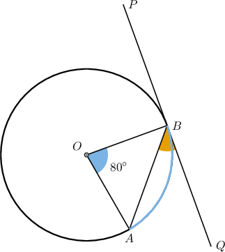
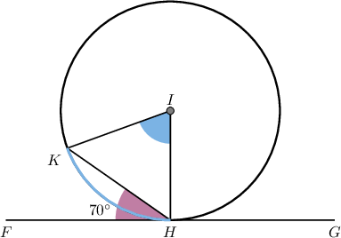
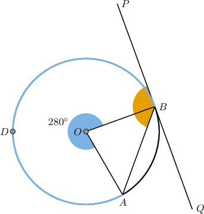
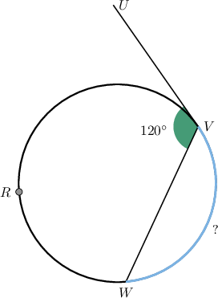
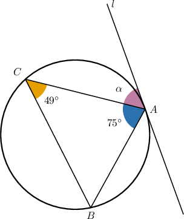
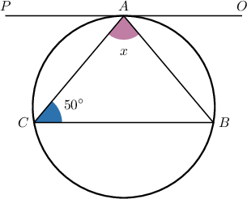
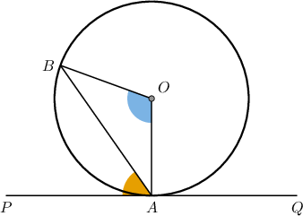

# The Tangent-Chord Theorem

Source: https://www.mathacademy.com/topics/1406?courseId=133
Topic ID: 1406

## Prerequisites

- [Inscribed Angles](../../../traditional/lessons/geometry/497-inscribed-angles.md)
- [Tangent Lines to Circles](../../../traditional/lessons/geometry/578-tangent-lines-to-circles.md)
- [Alternate Angles](../../../../middle-school/lessons/grade-8/4019-alternate-angles.md)

## Lesson

### Introduction

In the diagram below, $\overline{AB}$ is a chord, the line $\overset{\longleftrightarrow}{PQ}$ is the tangent to the circle at $B,$ and $m\angle AOB = 80^\circ.$

The tangent and chord form the *acute* angle $\angle ABQ.$ The relationship between this angle and the *minor* arc $\overset{\frown}{AB}$ is given by the **tangent-chord theorem.**

*The measure of the angle formed by a chord and a tangent passing through one of the chord's endpoints equals half the measure of the intercepted arc.*

We'll prove this theorem at the end of the lesson.

In this case, the tangent-chord theorem tell us that

$$

m\angle{ABQ} = \dfrac{1}{2}m\overset{\frown}{AB}.

$$

The measure of the arc $\overset{\frown}{AB}$ equals the measure of its central angle $\angle{AOB}.$ Therefore, we have

$$

\begin{aligned}𝑚∠𝐴𝐵𝑄 & =\frac{1}{2}𝑚\overset{𝐴𝐵}{⌢} \\ & =\frac{1}{2}𝑚∠𝐴𝑂𝐵 \\ & =\frac{1}{2}⋅80^{∘} \\ & =40^{∘}.\end{aligned}

$$

Note the following:

- In the example above, the tangent-chord theorem related the *acute* angle formed by the tangent and chord and the *minor* intercepted arc.

- We can also use the tangent-chord theorem to relate the *obtuse* angle formed by the tangent and chord and the *major* intercepted arc. We'll study this case later in the lesson.

Let's get some more practice at applying the tangent-chord theorem.

### Example: Applying the Tangent-Chord Theorem

#### Question

In the figure above, the line $\overset{\longleftrightarrow}{FG}$ touches the circle at the point $H$ and $m\angle FHK = 70^\circ.$ What is the measure of the arc $\overset{\frown}{KH}?$

#### Explanation

First, notice that the tangent $\overset{\longleftrightarrow}{FG}$ passes through the endpoint $H$ of the chord $\overline{KH}.$ Thus, by the tangent-chord theorem,

$$

m\angle{KHF} = \dfrac{1}{2}m\overset{\frown}{KH}.

$$

Solving for $m\overset{\frown}{KH},$ we get

$$

\begin{aligned}𝑚\overset{𝐾𝐻}{⌢} & =2𝑚∠𝐾𝐻𝐹 \\ & =2⋅70^{∘} \\ & =140^{∘}.\end{aligned}

$$

### Major Arcs

Consider the following diagram.

Note that the tangent $\overleftrightarrow{PQ}$ at $B$ and the chord $\overline{AB}$ form two angles:

- The *acute* angle $\angle ABQ.$

- The *obtuse* angle $\angle ABP.$

According to the tangent-chord theorem, the measure of the *obtuse* angle $\angle ABP$ equals half the measure of the *major* intercepted arc $\overset{\frown}{ADB}{:}$

$$

m\angle ABP = \dfrac12 m\overset{\frown}{ADB}

$$

Therefore, we have

$$

\begin{aligned}𝑚∠𝐴𝐵𝑃 & =\frac{1}{2}𝑚\overset{𝐴𝐷𝐵}{⌢} \\ & =\frac{1}{2}⋅280^{∘} \\ & =140^{∘}.\end{aligned}

$$

Let's consider another example.

### Example: Applying the Tangent-Chord Theorem to Major Arcs

#### Question

In the figure above, the line $\overset{\longleftrightarrow}{UV}$ touches the circle at the point $V.$ What is the measure of the arc $\overset{\frown}{VW}?$

#### Explanation

First, notice that the tangent $\overset{\longleftrightarrow}{UV}$ passes through the endpoint $V$ of the chord $\overline{VW}.$ Thus, by the tangent-chord theorem,

$$

m\angle{UVW} = \dfrac{1}{2}m\overset{\frown}{VRW}.

$$

Solving for $m\overset{\frown}{VRW},$ we get

$$

\begin{aligned}𝑚\overset{𝑉𝑅𝑊}{⌢} & =2𝑚∠𝑈𝑉𝑊 \\ & =2⋅120^{∘} \\ & =240^{∘}.\end{aligned}

$$

Finally,

$$

\begin{aligned}𝑚\overset{𝑉𝑊}{⌢} & =360^{∘}−𝑚\overset{𝑉𝑅𝑊}{⌢} \\ & =360^{∘}−240^{∘} \\ & =120^{∘}.\end{aligned}

$$

### Example: Applying the Tangent-Chord Theorem to Inscribed Triangles

#### Question

In the figure above, the line $l$ touches the circle at the point $A.$ What is the value of $\alpha?$

#### Explanation

Since the sum of the interior angles of the triangle $\triangle ABC$ is $180^{\circ}$, we have

$$

\begin{aligned}𝑚∠𝐵 & =180^{∘}−𝑚∠𝐶−𝑚∠𝐶𝐴𝐵 \\ & =180^{∘}−49^{∘}−75^{∘} \\ & =56^{∘}.\end{aligned}

$$

First, notice that the tangent $l$ passes through the endpoint $A$ of the chord $\overline{AC}.$ Thus, by the tangent-chord theorem,

$$

\alpha = \dfrac{1}{2}m\overset{\frown}{AC}.

$$

Now, according to the inscribed angle theorem, the measure of an inscribed angle $\angle B$ is half the measure of its central arc $\overset{\frown}{AC}.$ Therefore,

$$

\alpha = \dfrac{1}{2}m\overset{\frown}{AC} = m\angle{B} = 56^{\circ}.

$$

### Example: Applying the Tangent-Chord Theorem to Parallel Lines

#### Question

In the above figure, $\overset{\longleftrightarrow}{CB} \parallel \overset{\longleftrightarrow}{PO}$ and the line $\overset{\longleftrightarrow}{PO}$ touches the circle at the point $A.$ What is the measure of $x?$

#### Explanation

First, since $\overset{\longleftrightarrow}{CB} \parallel \overset{\longleftrightarrow}{PO},$ then

$$

\angle{CAP} \cong \angle{C},

$$

as they are alternate interior angles. Thus, $m\angle{CAP} = 50^{\circ}.$

Notice that tangent $\overset{\longleftrightarrow}{PO}$ passes through the end-point $A$ of the chord $\overline{AB}.$ Thus, by the tangent-chord theorem,

$$

\angle{BAO} = \dfrac{1}{2}m\overset{\frown}{AB}.

$$

Now, according to the inscribed angle theorem, the measure of an inscribed angle $\angle C$ is half the measure of its central arc $\overset{\frown}{AB}.$ Therefore,

$$

m\angle{BAO} = \dfrac{1}{2}m\overset{\frown}{AB} = \angle{C} = 50^{\circ}.

$$

Finally, we have the following:

$$

\begin{aligned}𝑚∠𝐵𝐴𝑂+𝑚∠𝐵𝐴𝐶+𝑚∠𝐶𝐴𝑃 & =180^{∘} \\ 50^{∘}+𝑥+50^{∘} & =180^{∘} \\ 𝑥 & =180^{∘}−50^{∘}−50^{∘} \\ & =80^{∘}\end{aligned}

$$

### Proving the Tangent-Chord Theorem

Let's now prove the tangent-chord theorem. Consider the diagram below.

Our goal is to show that

$$

m\angle{PAB} = \dfrac12 m\overset{\frown}{AB}.

$$

Since $\overline{OA}$ and $\overline{OB}$ are radii, they are congruent. Hence, the triangle $\triangle AOB$ is an isosceles triangle. Therefore,

$$

\begin{aligned}𝑚∠𝐵𝐴𝑂=𝑚∠𝐴𝐵𝑂 & =\frac{1}{2}(180^{∘}−𝑚∠𝐴𝑂𝐵) \\ & =90^{∘}−\frac{1}{2}𝑚∠𝐴𝑂𝐵.\end{aligned}

$$

Since the tangent at $A$ is perpendicular to the radius $\overline{OA},$ the angles $\angle{PAB}$ and $\angle{BAO}$ are complementary. Therefore,

$$

\begin{aligned}𝑚∠𝑃𝐴𝐵 & =90^{∘}−𝑚∠𝐵𝐴𝑂 \\ & =90^{∘}−(90^{∘}−\frac{1}{2}𝑚∠𝐴𝑂𝐵) \\ & =\frac{1}{2}𝑚∠𝐴𝑂𝐵\end{aligned}

$$

Finally, since the measure of the central angle $\angle AOB$ equals the measure of the intercepted arc $\overset{\frown}{AB},$ we conclude that

$$

m\angle{PAB} = \dfrac12 m\overset{\frown}{AB}.

$$
