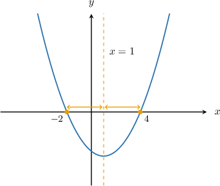
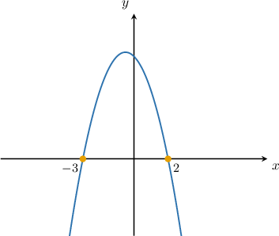
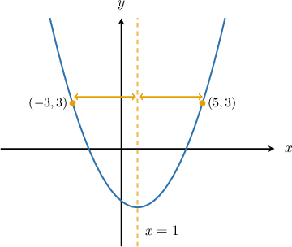

# The Average of the Roots Formula

Source: https://www.mathacademy.com/topics/1451?courseId=133
Topic ID: 1451

## Prerequisites

- [Fractions of Fractions](../../../../middle-school/lessons/grade-7/323-fractions-of-fractions.md)
- [Roots of Quadratic Functions](../../../traditional/lessons/algebra-i/661-roots-of-quadratic-functions.md)
- [The Axis of Symmetry of a Parabola](../../../traditional/lessons/algebra-i/704-the-axis-of-symmetry-of-a-parabola.md)
- [Midpoints](../../../../middle-school/lessons/grade-7/1463-midpoints.md)

## Lesson

### Introduction

If a parabola has two roots, the axis of symmetry occurs precisely halfway between the roots of the parabola. Therefore, we can find the axis of symmetry of a parabola by finding the roots and then taking their average value.

So, if the roots are $x_1$ and $x_2,$ the **average of the roots formula** tells us that the axis of symmetry of the parabola is

$$

x = \dfrac{x_1+x_2}{2}.

$$

For example, let's consider the parabola

$$

y=(x+2)(x-4).

$$

We have the roots $x_1=-2$ and $x_2=4.$ Therefore, the equation of the axis of symmetry is

$$

\begin{aligned}𝑥=\frac{−2+4}{2}=1\end{aligned}

$$

So, the axis of symmetry of the parabola $y=(x+2)(x-4)$ is $x=1,$ as shown below.

### Example: Finding the Axis of Symmetry From the X-Intercepts

#### Question

Find the axis of symmetry for the parabola sketched below.

#### Explanation

From the graph, we deduce that the roots are $x_1=-3$ and $x_2=2.$

To find the axis of symmetry, we take the average of the roots, as follows:

$$

\begin{aligned}𝑥 & =\frac{𝑥_{1}+𝑥_{2}}{2}=\frac{−3+2}{2}=−\frac{1}{2}\end{aligned}

$$

Therefore, the axis of symmetry is $x=-\dfrac{1}{2}.$

### Example: Finding the Axis of Symmetry From the Parabola’s Equation in Factored Form

#### Question

Find the axis of symmetry of the parabola $y=-(x-1)(x-5).$

#### Explanation

From the equation $y=-(x-1)(x-5),$ we find that the roots of the parabola are $x_1=1$ and $x_2=5.$

To find the axis of symmetry, we take the average of the roots, as follows:

$$

x = \dfrac{x_1+x_2}{2} = \dfrac{1+5}{2} = 3

$$

Therefore, the axis of symmetry is $x=3.$

### Example: Finding an Unknown Value Given the Axis of Symmetry

#### Question

The axis of symmetry of the parabola $y=\dfrac14(x-k)(x+2)$ is $x=6.$ Find the value of $k.$

#### Explanation

First, we will calculate the axis of symmetry in terms of $k.$ Then, since we know that the axis of symmetry is $x=6,$ we will set our result equal to $6.$

From the equation $y=\dfrac14(x-k)(x+2),$ we find that the roots of the parabola are $x_1=k$ and $x_2=-2.$

To find the axis of symmetry, we take the average of the roots, as follows:

$$

\begin{aligned}𝑥 & =\frac{𝑥_{1}+𝑥_{2}}{2} \\ & =\frac{𝑘−2}{2}\end{aligned}

$$

We know that the axis of symmetry is $x=6.$ Therefore, we have

$$

\begin{aligned}\frac{𝑘−2}{2} & =6 \\ 𝑘−2 & =12 \\ 𝑘 & =14.\end{aligned}

$$

### Extending the Formula

If we know two points on a parabola with *identical* $y$-values, we can find the $x$-coordinate of the vertex by taking an average of the two $x$-values.

For example, consider the parabola $y=f(x)$ above. Notice that the values of $f(x)$ at the points $x=-3$ and $x=5$ are equal.

$$

f(-3) = f(5) = 3

$$

Therefore, the parabola's axis of symmetry must be equidistant from the lines $x=-3$ and $x=5.$ We can find this by taking the average of these two values.

If the parabola's vertex is $(h,k),$ then we must have

$$

\begin{aligned}ℎ & =\frac{−3+5}{2} \\ & =\frac{2}{2} \\ & =1.\end{aligned}

$$

Therefore, $h=1$ is the $x$-coordinate of the vertex, and the axis of symmetry of the parabola is $x=1.$

### Example: Calculating the Vertex of a Parabola From Table Data

#### Question

The graph of a parabola $y = f(x)$ passes through the points given by their $(x,y)$-coordinates in the table above. What is the $x$-coordinate of the parabola's vertex?

#### Explanation

Notice that the values of $f(x)$ at the points $x=4$ and $x=20$ are equal.

$$

f(4) = f(20) = 9

$$

Therefore, the parabola's axis of symmetry must be equidistant from the lines $x=4$ and $x=20.$ We can find this by taking the average of these two values.

If the parabolas vertex is $(h,k),$ then we must have

$$

\begin{aligned}ℎ & =\frac{4+20}{2} \\ & =\frac{24}{2} \\ & =12.\end{aligned}

$$
