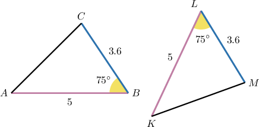
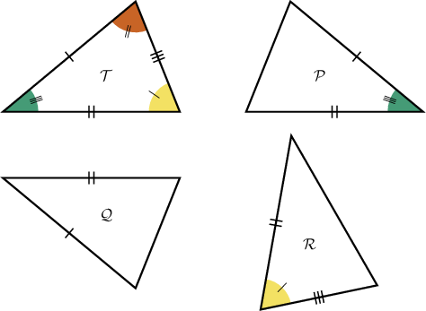
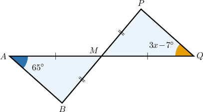
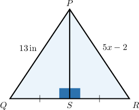
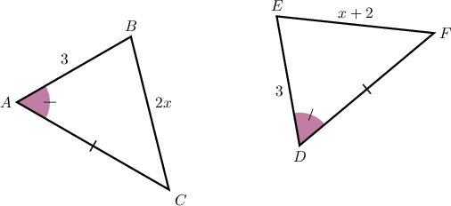

# The SAS Congruence Criterion

Source: https://www.mathacademy.com/topics/1520?courseId=133
Topic ID: 1520

## Prerequisites

- [Congruent Polygons](../../../../middle-school/lessons/grade-7/1515-congruent-polygons.md)

## Lesson

### Introduction

The **side-angle-side (SAS) congruence criterion** can be used as a shortcut to prove that two triangles are congruent. It states the following.

Two triangles are congruent if and only if **two sides and the included angle** of one triangle are congruent to two sides and the included angle of the other triangle.

To demonstrate, consider the triangles below.

We can see that two sides of $\triangle ABC$ are congruent to two sides of $\triangle KLM\mathbin{:}$

$$

\overline{AB}\cong \overline{KL}, \quad \overline{BC}\cong \overline{LM}.

$$

Also, we see that the included angles are congruent:

$$

\angle{B}\cong \angle{L}.

$$

Therefore, the SAS congruence criterion guarantees that these two triangles are congruent, and we can write

$$

\triangle ABC \cong \triangle KLM.

$$

**Caution:** When using the SAS criterion, it's vital to make sure that the angles you compare are the *included* angles between the two pairs of congruent sides. The SAS criterion only works if the included angles are congruent.

### Example: Identifying Congruent Triangles Using the SAS Criterion

#### Question

According to the SAS criterion only, which of the following triangles are congruent to $\mathcal{T}?$

#### Explanation

The SAS (side-angle-side) congruence criterion states the following:

Two triangles are congruent if and only if two sides and the included angle of one triangle are congruent to two sides and the included angle of the other triangle.

With that in mind, let's examine each of the given triangles.

- $\mathcal{P} \cong \mathcal{T}$ by SAS since two sides and the included angle of one triangle are congruent to two sides and the included angle of the other triangle.

- $\mathcal{Q}$ is ** congruent to $\mathcal{T}$ by SAS since we don't have a pair of congruent angles.

- $\mathcal{R} \cong \mathcal{T}$ by SAS too, since two sides and the included angle of one triangle are congruent to two sides and the included angle of the other triangle.

Therefore, the correct answer is "$\mathcal{P}$ and $\mathcal{R}$ only."

### Example: Finding the Measure of an Angle Using the SAS Criterion

#### Question

Find the value of $x.$

#### Explanation

First, notice that $\angle AMB$ and $\angle QMP$ are vertical angles.

Now, $\triangle AMB$ and $\triangle QMP$ are congruent by the SAS criterion since we have the following pairs of congruent sides and included angles:

$$

\begin{aligned}\overset{𝐴𝑀}{} & ≅\overset{𝑀𝑄}{} \\ \overset{𝐵𝑀}{} & ≅\overset{𝑀𝑃}{} \\ ∠𝐴𝑀𝐵 & ≅∠𝑄𝑀𝑃\end{aligned}

$$

Therefore, all the corresponding angles of the triangles must be congruent. In particular, $\angle A \cong \angle Q.$ Hence,

$$

\begin{aligned}𝑚∠𝑄 & =𝑚∠𝐴 \\ 3𝑥−7^{∘} & =65^{∘} \\ 3𝑥 & =72^{∘} \\ 𝑥 & =24^{∘}.\end{aligned}

$$

### Example: Calculating the Length of a Line Segment Using the SAS Criterion

#### Question

Given the figure below, find the value of $x.$

#### Explanation

Notice that $\triangle PSQ$ and $\triangle PSR$ are congruent by SAS (side-angle-side) since $\overline{PS}$ is their common side and we have the following pairs of congruent sides and included angles:

$$

\begin{aligned}\overset{𝑆𝑄}{} & ≅\overset{𝑆𝑅}{} \\ ∠𝑃𝑆𝑄 & ≅∠𝑃𝑆𝑅\end{aligned}

$$

Therefore, the corresponding sides of the triangles must be congruent. In particular, $\overline{PQ} \cong \overline{PR}.$ Hence,

$$

\begin{aligned}𝑃𝑅 & =𝑃𝑄 \\ 5𝑥−2 & =13 \\ 5𝑥 & =15 \\ 𝑥 & =3\,in.\end{aligned}

$$

### Example: Identifying True Statements Using the SAS Criterion

#### Question

Given the diagram below, which of the following statements are true?

1. $\triangle ABC \cong \triangle DEF$ by SAS

2. $\angle{B} \cong \angle{F}$

3. $x=2$

#### Explanation

Let's examine each of the statements in turn.

- Statement I is true. Notice that $\triangle ABC$ and $\triangle DEF$ are congruent by the SAS criterion since we have the following pairs of congruent sides and included angles:

- Statement II is false. Since the two triangles are congruent, the corresponding angles must be congruent too. Therefore, we obtain

- Statement III is true. Since the two triangles are congruent, the corresponding sides must be congruent too. Hence, we obtain

Therefore, the correct answer is "I and III only."
