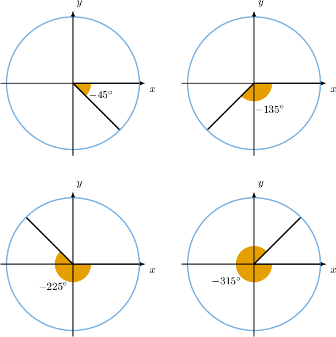
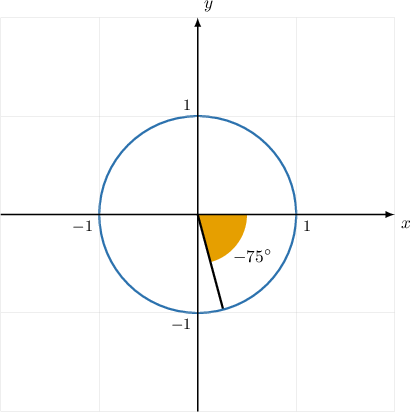
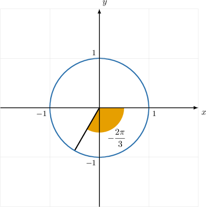
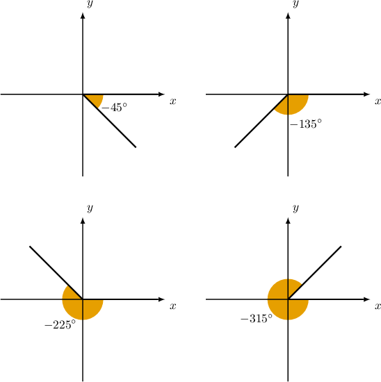
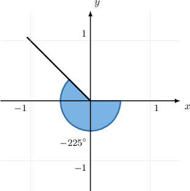

# Negative Angles in the Coordinate Plane

Source: https://www.mathacademy.com/topics/167?courseId=133
Topic ID: 167

## Prerequisites

- [Angles in the Coordinate Plane](../../../traditional/lessons/algebra-ii/1848-angles-in-the-coordinate-plane.md)

## Lesson

### Introduction

Recall that, in the coordinate plane, an angle $\theta$ in the standard position has its vertex at the origin, its initial side lies along the positive $x$-axis, and it rotates such that a positive angle is measured counter-clockwise.

Since a positive angle is always measured counter-clockwise, this means that a negative angle is measured *clockwise*.

For example, we can represent the angles $\theta = -45^\circ, -135^\circ, -225^\circ,$ and $-315^\circ$ as central angles of the unit circle (in the standard way) as follows:

### Example: Representing Negative Angles in the Coordinate Plane With the Unit Circle

#### Question

Construct a unit circle in the coordinate plane that shows a central angle of $-75^\circ$ in the standard position.

#### Explanation

Recall that:

- A unit circle has a radius of $1$ and is centered at the origin in the coordinate plane.

- An angle in the standard position has its initial side on the positive $x$-axis, and its vertex is at the origin.

- It rotates such that a positive angle is measured counter-clockwise, and a negative angle is measured clockwise.

Therefore, the correct diagram is as follows:

### Example: Representing Negative Angles in Radians in the Coordinate Plane With the Unit Circle

#### Question

Construct a unit circle in the coordinate plane with a central angle of $-\dfrac{2\pi}{3}$ in the standard position.

#### Explanation

To help us to visualize the angle, we first convert the measure of the angle into degrees.

To convert the measure of an angle in radians to an equivalent measure in degrees, we multiply the measure in radians by $\dfrac{180^\circ}{\pi}.$ This gives

$$

\left(-\dfrac{2\pi} 3 \right) \cdot \left(\dfrac {180^\circ} {\pi}\right) = -120^\circ.

$$

Therefore, $-\dfrac{2\pi}{3}$ is equivalent to $-120^\circ.$

Then, recall that:

- A unit circle has a radius of $1$ and is centered at the origin in the coordinate plane.

- An angle in the standard position has its initial side on the positive $x$-axis and its vertex is at the origin.

- A positive angle has a rotation that is measured counter-clockwise, and a negative angle is measured clockwise.

Therefore, the correct diagram is as follows:

### Representing Negative Angles in the Coordinate Plane

Sometimes, we wish to represent negative angles in the coordinate plane without reference to the unit circle.

As with positive angles, the convention for representing negative angles is the same as without the unit circle.

For example, we can represent the angles $\theta = -45^\circ, -135^\circ, -225^\circ,$ and $-315^\circ$ in the coordinate plane in the standard way as follows:

### Example: Representing Negative Angles in the Coordinate Plane

#### Question

Construct the angle $-225^\circ$ in the coordinate plane in the usual way.

#### Explanation

First, we recall that:

- An angle in the standard position has its initial side on the positive $x$-axis, and its vertex lies at the origin.

- It rotates such that a positive angle is measured counter-clockwise, and a negative angle is measured clockwise.

Therefore, the correct diagram is as follows:

