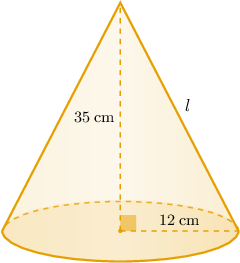
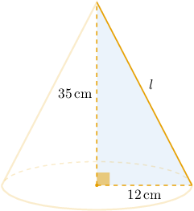
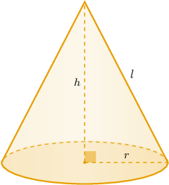
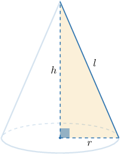
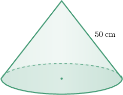
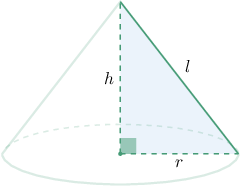
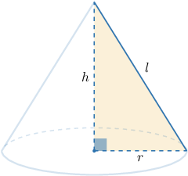

# Slant Heights of Right Cones

Source: https://www.mathacademy.com/topics/1778?courseId=133
Topic ID: 1778

## Prerequisites

- [The Pythagorean Theorem](../../../traditional/lessons/geometry/433-the-pythagorean-theorem.md)
- [The Circumference of a Circle](../../../traditional/lessons/geometry/460-the-circumference-of-a-circle.md)
- [Volumes of Right Cones](../../../traditional/lessons/geometry/1145-volumes-of-right-cones.md)

## Lesson

### Introduction

Suppose we are given the right cone shown below.

How do we calculate the slant height $l$ of this cone?

First, notice that the base radius, height, and slant height form a right triangle, as shown below.

Therefore, we can find the slant height using the Pythagorean theorem, as follows:

$$

\begin{aligned}𝑙 & =\sqrt{(35)^{2}+(12)^{2}} \\ & =\sqrt{1225+144} \\ & =\sqrt{1369} \\ & =37\,cm\end{aligned}

$$

### The General Formula

In general, if $r,h,$ and $l$ denote the base radius, height, and slant height of a right cone, respectively, then by the Pythagorean theorem,

$$

l^2 = h^2+r^2.

$$

### Example: Finding the Slant Height of a Right Cone

#### Question

Calculate the slant height of a right cone whose base radius and height are $8 \: \text{in}$ and $15 \: \text{in},$ respectively.

#### Explanation

Let $r,$ $h,$ and $l$ denote the cone's base radius, height, and slant height, respectively.

In our case, $r=8\,\text{in}, h = 15\,\text{in},$ and $l$ is to be found.

We can find the slant height $l$ of the cone using the Pythagorean theorem on the right triangle shown above, as follows:

$$

\begin{aligned}𝑙 & =\sqrt{ℎ^{2}+𝑟^{2}} \\ & =\sqrt{(15)^{2}+(8)^{2}} \\ & =\sqrt{225+64} \\ & =\sqrt{289} \\ & =17\,in\end{aligned}

$$

### Example: Finding a Dimension of a Right Cone Using the Base Circumference and Slant Height Formula

#### Question

The circumference of the base of the right cone shown below is $28 \pi \text{cm}.$ What is the height of the cone?

#### Explanation

Let $r,$ $h,$ and $l$ denote the cone's base radius, height, and slant height, respectively.

In our case, $l = 50\,\text{cm},$ and $r$ and $h$ are to be found. Additionally, we're given that $C=28 \pi\, \text{cm},$ where $C$ is the circumference of the base.

The circumference of the base is given by the formula

$$

C = 2 \pi r.

$$

Substitutuing $C = 28 \pi \: \text{cm}$ into the above formula, we can solve for $r,$ as follows:

$$

\begin{aligned}2𝜋𝑟 & =28𝜋 \\ 𝑟 & =\frac{28𝜋}{2𝜋} \\ 𝑟 & =14\,cm\end{aligned}

$$

Now, we can find the height $h$ of the cone using the Pythagorean theorem in the right triangle shown in the diagram, as follows:

$$

\begin{aligned}ℎ & =\sqrt{𝑙^{2}−𝑟^{2}} \\ & =\sqrt{(50)^{2}−(14)^{2}} \\ & =\sqrt{2500−196} \\ & =\sqrt{2304} \\ & =48\,cm\end{aligned}

$$

### Example: Relating the Dimensions of a Right Cone to Its Volume

#### Question

The height of a particular right cone is $\dfrac 43$ times the radius of its base. If the volume of the cone is $12 \pi \: \text{in}^3,$ what is the slant height of the cone?

#### Explanation

First, we are given that

$$

h=\dfrac 43r,

$$

where $r$ is the cone's base radius, and $h$ is its height.

We can find the volume of the cone using the formula

$$

V = \dfrac{1}{3} \pi r^2 h.

$$

Substituting $V = 12 \pi \: \text{in}^3$ and $h=\dfrac 43 r$ into the formula, we can solve for $r,$ as follows:

$$

\begin{aligned}𝑉 & =\frac{1}{3}𝜋𝑟^{2}ℎ \\ 12𝜋 & =\frac{1}{3}𝜋𝑟^{2}(\frac{4}{3}𝑟) \\ 12𝜋 & =\frac{4}{9}𝜋𝑟^{3} \\ 𝑟^{3} & =\frac{12𝜋⋅9}{4𝜋} \\ 𝑟^{3} & =27 \\ 𝑟 & =3\,in\end{aligned}

$$

Hence,

$$

h = \dfrac 43r = \dfrac 43 \cdot 3 = 4 \: \text{in}.

$$

Now, we can find the slant height $l$ of the cone using the Pythagorean theorem in the right triangle shown above, as follows:

$$

\begin{aligned}𝑙 & =\sqrt{ℎ^{2}+𝑟^{2}} \\ & =\sqrt{4^{2}+3^{2}} \\ & =\sqrt{16+9} \\ & =\sqrt{25} \\ & =5\,in\end{aligned}

$$
