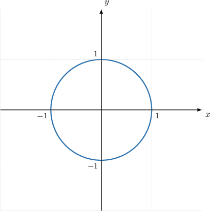
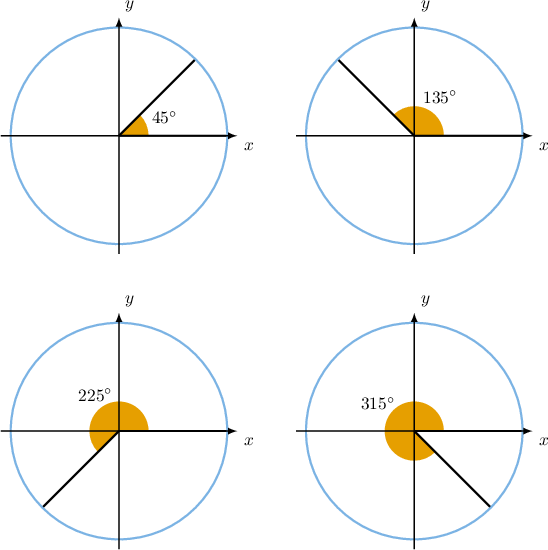
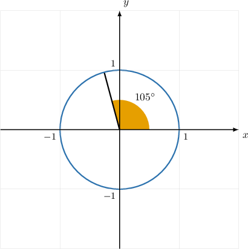
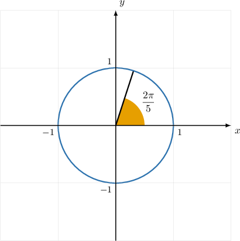
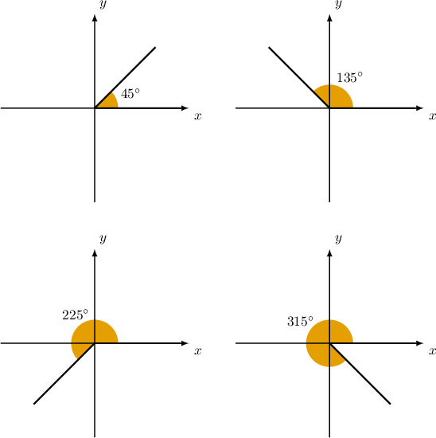
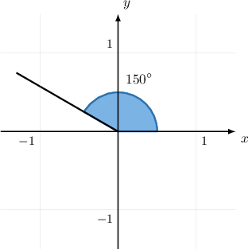
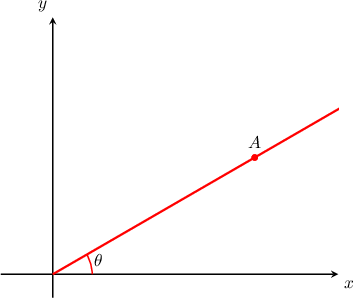
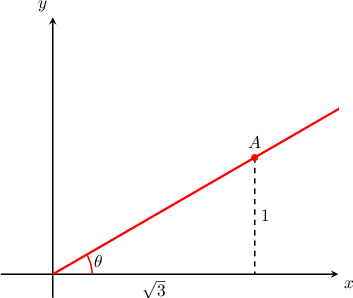

# Angles in the Coordinate Plane

Source: https://www.mathacademy.com/topics/1848?courseId=133
Topic ID: 1848

## Prerequisites

- [Calculating Angles in Right Triangles Using Trigonometry](../../../traditional/lessons/geometry/610-calculating-angles-in-right-triangles-using-trigonometry.md)
- [Introduction to Radians](../../../traditional/lessons/geometry/764-introduction-to-radians.md)
- [Special Trigonometric Ratios](../../../traditional/lessons/geometry/765-special-trigonometric-ratios.md)

## Lesson

### Introduction

The **unit circle** is a circle of radius $1$ centered at the origin in the coordinate plane.

The unit circle is an essential tool for understanding trigonometry.

Suppose that we want to construct an angle $\theta$ in the coordinate plane. There is a standard way in which we do this.

- First, we draw the unit circle.

- Then, we represent $\theta$ as a central angle of the unit circle. The angle has its vertex at the origin, its initial side lies on the positive $x$-axis, and it rotates such that a positive angle is measured counter-clockwise.

For example, we represent the angles $\theta = 45^\circ, 135^\circ, 225^\circ,$ and $315^\circ$ as follows:

### Example: Representing Angles in the Coordinate Plane With the Unit Circle

#### Question

Construct a unit circle in the coordinate plane with a central angle of $105^\circ$ in the standard position.

#### Explanation

Recall that:

- A unit circle has a radius of $1$ and is centered at the origin in the coordinate plane.

- An angle in the standard position has its initial side on the positive $x$-axis, its vertex at the origin, and it rotates such that a positive angle is measured counter-clockwise.

Therefore, the correct diagram is as follows:

### Example: Representing Angles in Radians in the Coordinate Plane With the Unit Circle

#### Question

Construct a unit circle in the coordinate plane with a central angle of $\dfrac{2\pi}{5}$ in the standard position.

#### Explanation

To help us to visualize the angle, we first convert the measure of the angle into degrees.

To convert the measure of an angle in radians to an equivalent measure in degrees, we multiply the measure in radians by $\dfrac{180^\circ}{\pi}.$ This gives

$$

\left(\dfrac{2\pi} 5\right) \cdot \left(\dfrac {180^\circ} {\pi}\right) = 72^\circ.

$$

Therefore, $\dfrac{2\pi}{5}$ is equivalent to $72^\circ.$

Then, we recall that:

- A unit circle has a radius of $1$ and is centered at the origin in the coordinate plane.

- An angle in the standard position has its initial side on the positive $x$-axis, its vertex at the origin, and it rotates such that a positive angle is measured counter-clockwise.

Therefore, the correct diagram is as follows:

### Representing Angles in the Coordinate Plane

The unit circle turns out to be a really useful tool to help us to understand the trigonometric functions. However, sometimes, we'd like to represent an angle in the coordinate plane without reference to the unit circle.

Thankfully, the standard way that we represent angles in the coordinate plane without reference to the unit circle is pretty much the same as with the unit circle!

For example, the angles $45^\circ, 135^\circ, 225^\circ,$ and $315^\circ$ can be represented in the coordinate plane as follows:

### Example: Representing Angles in the Coordinate Plane

#### Question

How is the angle $150^\circ$ normally represented in the coordinate plane?

#### Explanation

First, we recall that:

- An angle in the standard position has its initial side on the positive $x$-axis, and its vertex is at the origin.

- It rotates such that a positive angle is measured counter-clockwise.

Therefore, the correct diagram is as follows:

### Example: Using Trigonometry to Find an Angle in the Coordinate Plane

#### Question

Given that the point $A$ has coordinates $(\sqrt 3, 1),$ calculate the angle $\theta.$

#### Explanation

First, we can form a triangle by creating a vertical line from $A$ to the $x$-axis.

Using the tangent ratio, we have

$$

\tan\theta = \dfrac{1}{\sqrt 3} = \dfrac{\sqrt 3}{3}.

$$

Finally, using the inverse tangent, we get

$$

\theta = \arctan{\left( \dfrac{\sqrt 3}{3} \right)} = 30^\circ.

$$
