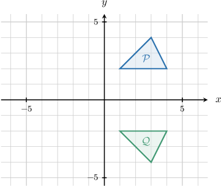
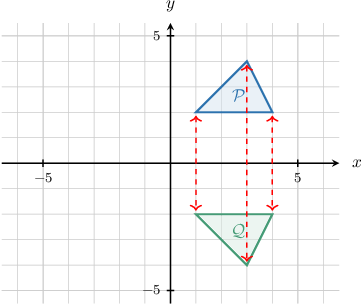
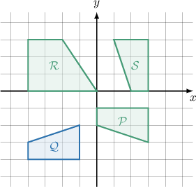
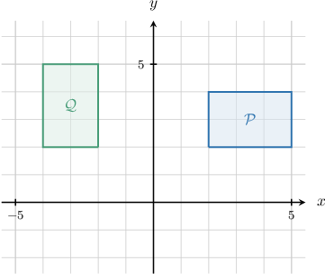
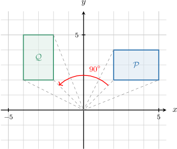
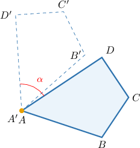

# Rigid Motions and Congruence

Source: https://www.mathacademy.com/topics/2218?courseId=133
Topic ID: 2218

## Prerequisites

- [Combining Geometric Transformations](../../../traditional/lessons/geometry/483-combining-geometric-transformations.md)
- [Congruent Polygons](../../../../middle-school/lessons/grade-7/1515-congruent-polygons.md)

## Lesson

### Introduction

A **rigid motion** is any transformation that does not change the distances and angles between points. Rigid motions are also called **isometries**.

There are *only three* types of rigid motions:

- Translations

- Rotations

- Reflections

**Watch out!** The following types of transformations are *not* rigid motions:

- Dilations

- Stretches

### Properties of Rigid Motions

So, remember, there are *only three* types of rigid motions:

- Translations

- Rotations

- Reflections

There are two properties of rigid motions we need to know:

- *A rigid motion maps every polygon to a congruent polygon.*

- *For any pair of congruent polygons, there exists a rigid motion that maps one polygon onto another.*

Consider the diagram below. Let's use the concept of rigid motions to explain why $\mathcal{P}$ and $\mathcal{Q}$ are congruent.

Notice that $\mathcal{Q}$ is the image of $\mathcal{P}$ under the action of reflection in the $x$-axis.

Since $\mathcal P$ is mapped to $\mathcal Q$ under a rigid motion (reflection), $\mathcal{P}$ and $\mathcal{Q}$ must be congruent.

### Example: Identifying Polygons That Map to Each Other Under Rigid Motions

#### Question

Which of the polygons $\mathcal{P},$ $\mathcal{R},$ $\mathcal{S}$ shown below can be obtained from the polygon $\mathcal{Q}$ with rigid motions?

#### Explanation

By transforming $\mathcal{Q}$ using only rigid motions, we can get only polygons congruent to $\mathcal{Q}.$

Similarly, any polygon congruent to $\mathcal{Q}$ can be obtained from $\mathcal{Q}$ using a combination of rigid motions.

Since $\mathcal{R}$ is not congruent to $\mathcal{Q},$ it can't be obtained from $\mathcal{Q}$ using rigid motions.

The polygons $\mathcal{P}$ and $\mathcal{S}$ are congruent to $\mathcal{Q}.$ Therefore, we can obtain them by applying a combination of rigid motions to $\mathcal{Q}.$

### Example: Identifying Why Polygons Are Congruent Using Rigid Motions

#### Question

In terms of rigid motions, why are the polygons $\mathcal{P}$ and $\mathcal{Q}$ congruent?

#### Explanation

The polygons $\mathcal{P}$ and $\mathcal{Q}$ are congruent because $\mathcal{Q}$ is the image of $\mathcal{P}$ under the action of rotation by $90^\circ$ counterclockwise around the origin.

### Example: Identifying Maps Presented in Function Notation That Are Rigid Motions

#### Question

Which of the following transformations map every polygon to a congruent polygon?

1. $(x,y) \mapsto (x-3, y-4)$

2. $(x,y) \mapsto (2x, 2y)$

3. $(x,y) \mapsto (y, x)$

#### Explanation

A rigid motion is a transformation that preserves distances. There are three types of rigid motions:

- Translations

- Rotations

- Reflections

Also, two polygons are congruent if and only if one can be mapped to another using a combination of rigid motions.

With that in mind, let's examine each of the transformations in turn.

- Transformation I is a translation of $3$ units to the left and $4$ units down. This is a rigid motion. So, it maps every polygon to a congruent polygon.

- Transformation II is a dilation of scale factor $2.$ This is ** a rigid motion. So, it does not map every polygon to a congruent polygon.

- Transformation III is a reflection in the line $y=x$. This is a rigid motion. So, it maps every polygon to a congruent polygon.

Therefore, the correct answer is "I and III only."

### Further Properties of Rigid Motions

As we mentioned earlier, rigid motions are **distance-preserving**.

For example, if a rigid motion maps $\triangle ABC$ to $\triangle A'B'C',$ then the corresponding sides of the triangles must be congruent:

$$

AB = A'B', \qquad AC = A'C', \qquad BC = B'C'

$$

In addition, rigid motions are **angle-preserving**, which means that the corresponding angles of the triangles must be congruent as well:

$$

m\angle A = m\angle A', \qquad m\angle B = m\angle B', \qquad m\angle C = m\angle C'

$$

Since all of the corresponding sides and angles are congruent, the triangles are congruent, and we write

$$

\triangle ABC \cong \triangle A'B'C'.

$$

### Example: Identifying True Statements About Rigid Motions

#### Question

The quadrilateral $ABCD$ is rotated by an angle $\alpha$ counterclockwise about the point $A.$ The resulting polygon is $A'B'C'D'.$ Which of the following statements are true?

1. $A$ coincides with $A'$

2. $\angle ACB \cong \angle A'C'B'$

3. $AB = A'B'$

#### Explanation

The given transformation is a rotation of $\alpha$ counterclockwise about the point $A,$ which is a rigid motion. Rigid motions preserve the distances between all points and all angle measures.

With that in mind, let's check each statement.

- Statement I is true. Under the action of the transformation, the point $A$ is left unchanged. Therefore, $A=A'.$

- Statement II is true. Under the action of the transformation, the measures of all corresponding angles are preserved. Therefore, $\angle{ACB}\cong \angle{A'C'B'}.$

- Statement III is true. Under the action of the transformation, the distance between all corresponding points is preserved. Therefore, $AB = A'B'.$

Therefore, the correct answer is "I, II, and III."
