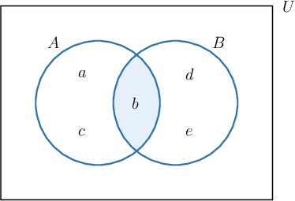
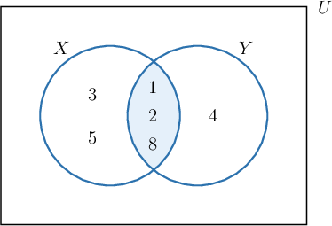

# The Intersection of Sets

Source: https://www.mathacademy.com/topics/2827?courseId=133
Topic ID: 2827

## Prerequisites

- [Sets](../../../traditional/lessons/geometry/45-sets.md)
- [Intersections of Intervals](../../../traditional/lessons/algebra-i/347-intersections-of-intervals.md)

## Lesson

### Introduction

The **intersection** of two sets $A$ and $B,$ denoted by $A \cap B,$ is the set of all elements belonging to both $A$ and $B.$

For example, consider the sets $A = \{a,b,c \}$ and $B = \{b, d, e \}.$ We can represent these sets using a Venn diagram, as follows:

The intersection $A \cap B$ consists of all the elements that are in both $A$ and $B.$ To represent $A \cap B,$ we will shade in all the area that is contained within both $A$ and $B.$

The only element that is contained in both $A$ and $B$ is $b.$ Therefore,

$$

A \cap B = \{ b \}.

$$

### Example: Finding an Intersection of Sets Using a Venn Diagram

#### Question

Given the sets $X = \{1, 2, 3, 5, 8 \}$ and $Y = \{1, 2, 4, 8 \}$ shown above, find $X \cap Y.$

#### Explanation

The intersection $X \cap Y$ consists of all the elements that are in both $X$ and $Y.$ To represent $X \cap Y,$ we will shade in all the area that is contained in both $X$ and $Y.$

The elements $1,$ $2,$ and $8$ are in both $X$ and $Y.$ Therefore, the intersection of $X$ and $Y$ is

$$

X \cap Y = \{ 1,2,8 \}.

$$

### Intersections Without Venn Diagrams

Although Venn diagrams can be useful to visualize intersections, we do not have to draw a Venn diagram every time we wish to compute an intersection.

For example, let's again consider the sets $A = \{a,b,c \}$ and $B = \{b, d, e \}.$ This time, we will compute the intersection $A \cap B$ without using a Venn diagram. We just need to find all the elements that are in both $A$ and $B.$

So, we will go through the elements of $A$ and check if each element is also in $B.$

- For the element $a \in A,$ we have $a \not\in B. \quad \color{red}\times$

- For the element $b \in A,$ we have $b \in B. \quad \color{green}\checkmark$

- For the element $c \in A,$ we have $c \not\in B. \quad \color{red}\times$

The only element in $A$ that is also in $B$ is $b.$

Therefore, the intersection of $A$ and $B$ is

$$

A \cap B = \{ b \}.

$$

### Example: Finding an Intersection of Sets Without a Venn Diagram

#### Question

Given the sets $X = \{2, 5, 7, 8 \},$ $Y = \{1, 3, 5 \},$ and $Z = \{2, 4, 6, 8 \},$ find $X \cap Y,$ $Y \cap Z,$ and $Z \cap X.$

#### Explanation

The intersection $X \cap Y$ is the set of all elements belonging to both $X$ and $Y.$ Since $X$ and $Y$ have only the element $5$ in common, we get

$$

\begin{aligned}𝑋∩𝑌 & ={2,5,7,8}∩{1,3,5} \\ & ={5}.\end{aligned}

$$

The intersection $Y \cap Z$ is the set of all elements belonging to both $Y$ and $Z.$ Since $Y$ and $Z$ have no elements in common, we obtain

$$

\begin{aligned}𝑌∩𝑍 & ={1,3,5}∩{2,4,6,8} \\ & ={} \\ & =∅.\end{aligned}

$$

The intersection $Z \cap X$ is the set of all elements belonging to both $Z$ and $X.$ Since $Z$ and $X$ have only the elements $2$ and $8$ in common, we get

$$

\begin{aligned}𝑍∩𝑋 & ={2,4,6,8}∩{2,5,7,8} \\ & ={2,8}.\end{aligned}

$$

### Example: Finding Intersections of Sets Given Verbally

#### Question

Let $A$ and $B$ be the set of all multiples of $4$ that are greater than $0$ and the set of all multiples of $6$ that are greater than $0,$ respectively. What is $A \cap B?$

#### Explanation

The multiples of $4$ that are greater than $0$ are

$$

A = \{ 4,8,12,16,20,24,28,32, 36 \ldots \}.

$$

Likewise, multiples of $6$ that are greater than $0$ are

$$

B = \{ 6,12,18,24,30,36,\ldots \}.

$$

Now, $A \cap B$ is the ** of $A$ and $B,$ which means that we want to find the elements that are in ** $A$ and $B.$

Therefore, we have

$$

\begin{aligned}𝐴∩𝐵 & ={4,8,12,16,20,24,28,32,36,…}∩{6,12,18,24,30,36,…} \\ & ={12,24,36,…}.\end{aligned}

$$
