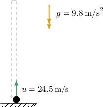

# Vertical Motion

Source: https://www.mathacademy.com/topics/3732?courseId=133
Topic ID: 3732

## Prerequisites

- [Modeling Upwards Vertical Motion](../../../traditional/lessons/algebra-i/1534-modeling-upwards-vertical-motion.md)

## Lesson

### Introduction

Suppose we toss a ball from the ground vertically upward with an initial velocity of $u = 24.5\,\text{m/s}.$ How long will it take for the ball to hit the ground?

The displacement of an object after being projected vertically upward can be modeled using the equation

$$

s=ut + \dfrac{1}{2}gt^2.

$$

Let's recall what each variable represents:

- $s$ is the displacement from the starting position, measured in meters.

- $u$ in the initial velocity, measured in meters per second.

- $t$ is time, measured in seconds.

- $g=-9.8\,\text{m/s}^2$ is the acceleration due to gravity.

We take the constant $g$ to be *negative* because the initial motion of the ball moves *against* gravity. Also, note that we can use this value of $g$ even though the ball falls back to earth after reaching its maximum height.

When the ball returns to the starting position, its displacement is $s=0 \, \text{m}.$ Substituting this along with the initial velocity $u = 24.5 \, \text{m/s}$ into the equation for $s,$ we get

$$

\begin{aligned}𝑠 & =𝑢𝑡+\frac{1}{2}𝑔𝑡^{2} \\ (0) & =(24.5)𝑡+\frac{1}{2}(−9.8)𝑡^{2} \\ 0 & =24.5𝑡−4.9𝑡^{2}\end{aligned}

$$

which can be written as

$$

4.9t^2 - 24.5t = 0.

$$

Solving this equation for $t,$ we get

$$

\begin{aligned}4.9𝑡^{2}−5(4.9)𝑡 & =0 \\ 4.9𝑡^{2}−5(4.9)𝑡 & =0 \\ 𝑡^{2}−5𝑡 & =0 \\ 𝑡(𝑡−5) & =0.\end{aligned}

$$

We have two solutions, $t=0$ and $t=5$ seconds:

- The solution $t=0$ tells us what we already knew: that the ball was at the starting position $s=0\,\text{m}$ when $t=0\,\text{s}.$

- The solution $t=5$ tells us that the ball hits the ground after $5\,\text{s}.$

### Example: Finding the Time Taken for an Object To Reach a Particular Height

#### Question

At $t=0,$ an object is projected vertically upward with a velocity of $34.3 \, \text{m/s}.$ Find the values of $t$ where the object is at a height of $49\, \text{m}$ above its initial position.

**

#### Explanation

To solve this problem, we use the formula

$$

s=ut+\dfrac{1}{2}gt^2,

$$

where $s$ is the displacement, measured from the starting position in the direction of the initial motion, $u$ is the initial velocity, $t$ is the time since the beginning of the motion, and $g$ is the acceleration due to gravity.

Let's summarize the information we have:

- The displacement of the object is $s = 49 \, \text{m}.$

- The initial velocity of the object is $u=34.3 \, \text{m/s}.$

- The acceleration due to gravity is $g=-9.8\,\text{m/s}^2.$ Notice that $g$ is ** since the initial motion of the object acts ** gravity.

Substituting these values into the formula and solving for $t,$ we obtain the following:

$$

\begin{aligned}(49) & =(34.3)𝑡+\frac{1}{2}(−9.8)𝑡^{2} \\ 10(4.9) & =7(4.9)𝑡−(4.9)𝑡^{2} \\ 10\,\,\,\,(4.9)\,\,\,\, & =7\,\,\,\,(4.9)\,\,\,\,𝑡−\,\,\,\,(4.9)\,\,\,\,𝑡^{2} \\ 10 & =7𝑡−𝑡^{2} \\ 𝑡^{2}−7𝑡+10 & =0 \\ (𝑡−2)(𝑡−5) & =0 \\ 𝑡 & =2,\,5\end{aligned}

$$

Notice that both solutions are positive. Therefore, the object is at the height of $49 \, \text{m}$ when

- $t = 2 \, \text{s}$ (on its way up), and

- $t = 5 \, \text{s}$ (on its way down).

### Example: Calculating an Initial Velocity

#### Question

A dart is fired vertically upward with an initial velocity of $63 \, \text{m/s}.$ Then, after $2$ seconds, a second dart is fired in the same direction. After $4$ seconds of its motion, the second dart catches up with the first one. What was the initial velocity of the second dart?

**

#### Explanation

To solve this problem, we use the formula

$$

s=ut+\dfrac{1}{2}gt^2,

$$

where $s$ is the displacement, measured from the starting position in the direction of the initial motion, $u$ is the initial velocity, $t$ is the time since the beginning of the motion, and $g$ is the acceleration due to gravity.

- Let's summarize the information for the first dart: The initial velocity of the first dart is $u_1=63\,\text{m/s}.$ The first dart is in motion for $t_1 = 2 +4 = 6 \, \text{s}.$ The acceleration due to gravity is $g=-9.8\,\text{m/s}^2.$ Notice that $g$ is ** since the initial motion of the first dart acts ** gravity. Substituting these values into the formula, we can find the displacement of the first dart:

- Let's now summarize the information for the second dart: The second dart is in motion for $t_2=4\,\text{s}.$ The second dart covers a distance of $s_2=s_1=201.6 \, \text{m},$ the same as the first one. The acceleration due to gravity is $g=-9.8\,\text{m/s}^2.$ Notice that $g$ is ** since the initial motion of the second dart acts ** gravity. Substituting these values into the formula and solving for $u_2$ (the initial velocity of the second dart), we obtain the following:

Therefore, the initial velocity of the second dart was $70 \, \text{m/s}.$

### Example: Calculating a Distance

#### Question

Matt drops a stone from the top of a cliff. Two seconds later, he throws a ball vertically downward with an initial velocity of $23.52 \, \textrm {m/s}.$ If both objects hit the ground simultaneously, what is the cliff's height?

**

#### Explanation

To solve this problem, we use the formula

$$

s=ut+\dfrac{1}{2}gt^2,

$$

where $s$ is the displacement, measured from the starting position in the direction of the initial motion, $u$ is the initial velocity, $t$ is the time since the beginning of the motion, and $g$ is the acceleration due to gravity.

We need to find the height $s$ of the cliff.

- Let's summarize the information for the stone: The initial velocity of the stone is $u_1 = 0\,\text{m/s}.$ The acceleration due to gravity is $g = 9.8\,\text{m/s}^2.$ Let $t_1$ denote the time it took for the stone to reach the ground. Substituting these values into the formula, we can express the distance covered by the stone (i.e., the height of the cliff) as

- Let's now summarize the information for the ball: The initial velocity of the ball is $u_2 = 23.52 \, \text{m/s}.$ The acceleration due to gravity is $g = 9.8\,\text{m/s}^2.$ Let $t_2$ denote the time it took for the ball to reach the ground.

Substituting these values into the formula, we can express the distance covered by the ball as

$$

\begin{aligned}𝑠 & =𝑢_{2}𝑡_{2}+\frac{1}{2}𝑔𝑡_{2}\,^{2} \\ & =(23.52)𝑡_{2}+\frac{1}{2}(9.8)𝑡_{2}\,^{2} \\ & =4.9𝑡_{2}\,^{2}+23.52𝑡_{2}.\end{aligned}

$$

Next, notice that $t_1 = t_2 + 2$ since the stone is in motion $2$ seconds more than the ball, and both objects hit the ground simultaneously.

Therefore, equating our two expressions for $s,$ we obtain the following:

$$

\begin{aligned}4.9𝑡_{1}\,^{2} & =4.9𝑡_{2}\,^{2}+23.52𝑡_{2} \\ 4.9(𝑡_{2}+2)^{2} & =4.9𝑡_{2}\,^{2}+23.52𝑡_{2} \\ 4.9(𝑡_{2}\,^{2}+4𝑡_{2}+4) & =4.9𝑡_{2}\,^{2}+23.52𝑡_{2} \\ 4.9𝑡_{2}\,^{2}+19.6𝑡_{2}+19.6 & =4.9𝑡_{2}\,^{2}+23.52𝑡_{2} \\ 19.6𝑡_{2}+19.6 & =23.52𝑡_{2} \\ 19.6 & =3.92𝑡_{2} \\ 𝑡_{2} & =5\end{aligned}

$$

As a result, $t_1 = 5 + 2 = 7 \, \text{s}.$

Finally, by substituting $t_1=7\,\text{s}$ into the first equation for $s,$ we find that the height of the cliff is

$$

s = 4.9(7)^2 = 240.1 \, \text{m}.

$$
