# Computing Probabilities of Events Containing Complements Using Venn Diagrams

Source: https://www.mathacademy.com/topics/4361?courseId=133
Topic ID: 4361

## Prerequisites

- [Computing Probabilities for Compound Events Using Venn Diagrams](../../../traditional/lessons/geometry/794-computing-probabilities-for-compound-events-using-venn-diagrams.md)

## Lesson

### Introduction

In a previous lesson, we saw how Venn diagrams can be used to calculate probabilities such as $P(A\cup B)$ (the union of two events) and $P(A\cap B)$ (the intersection of two events) for events $A$ and $B.$

In this lesson, we'll extend our understanding to include event complements.

For example, consider the event $A \cap B'.$ How might we depict this event on a Venn diagram?

The idea is to sketch $A$ and $B'$ separately and then find their intersection, as follows:

- The event $A$ is represented by the shaded region below.

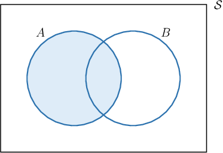

- The event $B'$ is represented by the shaded region below. It encompasses everything in the sample space $\mathcal S$ that is **not** in $B.$

- Finally, to find $A \cap B',$ we take the intersection (or common overlap) of the two shaded regions shown above. This gives the following:

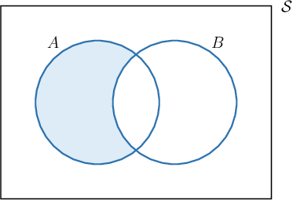

Let's follow a similar process to depict a union of events on a Venn diagram.

### Example: Identifying Regions on Venn Diagrams Corresponding to Complements

#### Question

Let $A$ and $B$ be events. Sketch a Venn diagram that shows a shaded region representing the event $A' \cup B'.$

#### Explanation

Let's first consider the shaded region representing $A'$ and $B'$ separately.

- The event $A'$ is represented by the shaded region below.

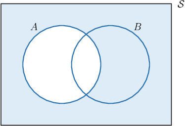

- The event $B'$ is represented by the shaded region below.

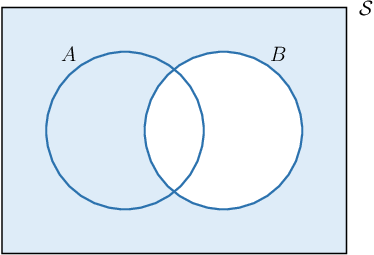

Finally, $A' \cup B'$ is the union of the two shaded regions shown above:

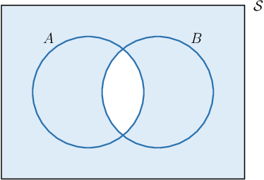

### Example: Computing a Complement Using a Venn Diagram

#### Question

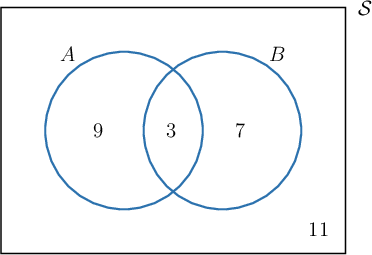

The Venn diagram shown above represents two events $A$ and $B$ and the number of outcomes in each region of the sample space.

Given that every outcome is equally likely, find $P\left(A'\cap B\right).$

#### Explanation

To calculate the probability of an event using a Venn diagram, we count the number of outcomes in the region that represents the event, and divide by the total number of outcomes of the sample space $\mathcal S.$

In the Venn diagram, $A'\cap B$ is represented by the area inside the circle $B$ without the intersection between the circles (see the illustration below).

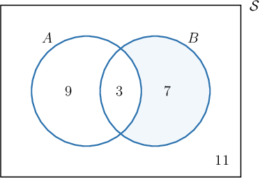

We count up the outcomes:

- The number of outcomes in $A'\cap B$ is $7.$

- The total number of outcomes in $\mathcal S$ is

So, we have

$$

P\left(A'\cap B\right)=\dfrac{7}{30}.

$$

### Example: Computing a Probability Given a Description of a Sample Space

#### Question

At an audition for the school band, there are $35$ volunteer students in total. Of the volunteers, $20$ students volunteer to play percussion, $15$ students volunteer to play a wind instrument, and $3$ students volunteer for both percussion and wind instruments.

Represent the corresponding sample space using a Venn diagram. If we randomly select a student among the $35$ students, what is the probability that they volunteered for neither percussion nor wind instruments? Give your answers to $2$ decimal places.

#### Explanation

Let us call $A$ the event "The student volunteers to play percussion" and $B$ the event "The student volunteers to play a wind instrument."

Note that there are $3$ students who volunteer for both percussion and wind instruments. We draw two overlapping circles representing the events $A$ and $B$ and write the number $3$ where the circles overlap.

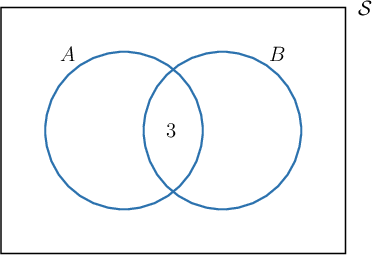

- The number of students who volunteer for percussion ** is so we write the number $17$ in the part of circle $A$ that does not overlap with circle $B.$

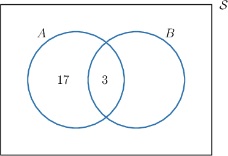

- The number of students who volunteer for wind instruments ** is so we write the number $12$ in the part of the circle $B$ that does not overlap with circle $A.$

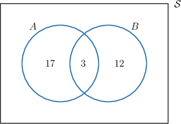

The total number of students who volunteered for percussion or wind instruments is

$$

3 + 17 + 12 = 32,

$$

and there are $35$ students in total, so the number of remaining students is

$$

35 - 32 = 3.

$$

To represent these $3$ students who did not volunteer for wind instruments or percussion, we write the number $3$ outside of the circles $A$ and $B.$

Therefore, our final Venn diagram looks as shown below:

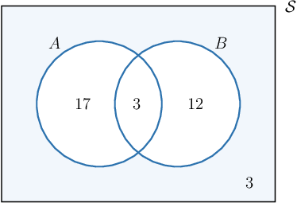

The shaded part of the Venn diagram corresponds to students who volunteered neither for percussion nor wind instruments. The probability that a randomly selected student is from this group is given by

$$

P(A'\cap B')=\dfrac{3}{35} \approx 0.09,

$$

rounded to $2$ decimal places.
