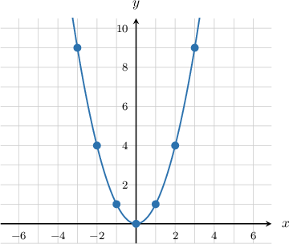
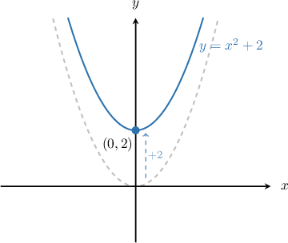
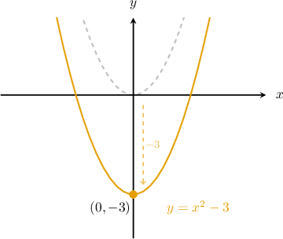
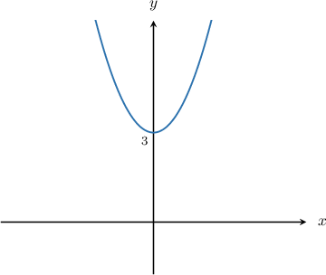
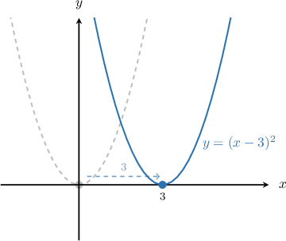
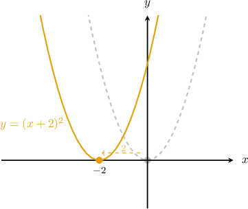
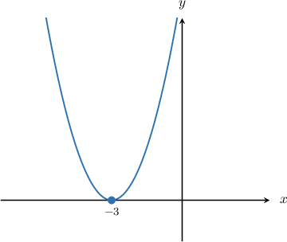
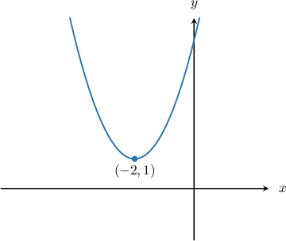

# Graphing Elementary Quadratic Functions

Source: https://www.mathacademy.com/topics/453?courseId=133
Topic ID: 453

## Prerequisites

- [Global Extrema of Functions](../../../traditional/lessons/algebra-i/1888-global-extrema-of-functions.md)

## Lesson

### Introduction

Suppose that we want to plot the curve $y=x^2.$ We start by making a table of values.

We can now plot the graph using the $(x,y)$ values in our table.

This curve's shape is known as a **parabola**, and the **minimum point** at $(0,0)$ is known as the **vertex** of the parabola.

### Vertical Translations of a Parabola

Adding a value to will **translate** (shift) the parabola up or down the -axis. For instance, adding to will move each point on the parabola units up.

On the other hand, subtracting will move each point of the parabola units down.

In general, the graph of looks like the standard parabola but translated units up. The vertex of is located at

### Example: Graphing a Vertical Translation of a Parabola

#### Question

Identify the equation that generated the graph below.

#### Explanation

Remember that in general, the graph of $y=x^2+k$ looks like the standard parabola $y=x^2$ but translated $k$ units up. The vertex of $y=x^2+k$ is located at $(0,k).$

Here, the curve shown is the parabola $y=x^2$ after being translated $3$ units upward. The vertex is located at $(0,3).$

Therefore, $k=3,$ and the equation of the parabola is $y = x^2 +3.$

### Horizontal Translations of a Parabola

The graph of looks like the standard parabola, but shifted units to the *right* along the -axis.

Similarly, the graph of looks like the standard parabola after it's been shifted units to the *left*:

In general, the graph of looks like the standard parabola but translated units right. The vertex of is located at

**Watch Out!** It's easy to confuse the translations.

- For, we subtract from inside the parentheses, and the parabola moves to the right, *not* to the left (even though it seems like it should be the other way around).

- Likewise, for, we add to inside the parentheses, and the parabola moves to the left, *not* to the right.

### Example: Graphing a Horizontal Translation of a Parabola

#### Question

Sketch the graph of the function $y=(x+3)^2.$ What are the coordinates of the minimum point?

#### Explanation

In general, the graph of $y=(x-h)^2$ looks like the standard parabola $y=x^2$ but translated $h$ units right. The vertex of $y=(x-h)^2$ is located at $(h,0).$

In the given function $y=(x+3)^2,$ we have $h=-3.$ To see this clearly, we can write the curve as follows:

$$

\begin{aligned}𝑦 & =(𝑥+3)^{2} \\ 𝑦 & =(𝑥−(−3))^{2}\end{aligned}

$$

Therefore, the given curve is the parabola $y=x^2$ after being translated $3$ units **.

The vertex is located at $(-3,0),$ and these are the coordinates of the minimum point.

### Combinations of Horizontal and Vertical Translations

Horizontal and vertical translations can be combined. It does not matter which we do first.

In general, the graph of $y=(x-h)^2+k$ is a translation of the standard parabola $y=x^2$ by

- $h$ units right, and

- $k$ units up.

The vertex of $y=(x-h)^2+k$ is located at $(h,k).$

### Example: Graphing a Combination of Horizontal and Vertical Translations

#### Question

Identify the equation of the graph shown below.

#### Explanation

Remember that the graph of $y=(x-h)^2+k$ is a translation of the standard parabola $y=x^2$ by

- $h$ units right, and

- $k$ units up.

The vertex of $y=(x-h)^2+k$ is located at $(h,k).$

Here, the parabola is translated $2$ units **, so we have $h=-2.$ The parabola is also translated $1$ unit up, so we have $k=1.$ We can also see that the vertex is at $(-2,1),$ so again we must have $h=-2$ and $k=1.$

Therefore, the equation of the graph is:

$$

\begin{aligned}𝑦 & =(𝑥−(−2))^{2}+1 \\ 𝑦 & =(𝑥+2)^{2}+1\end{aligned}

$$
