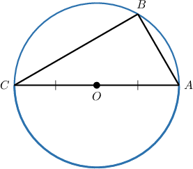
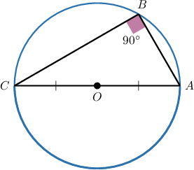
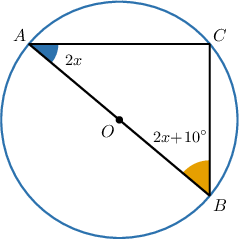
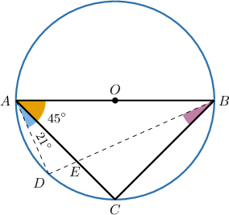

# Angles in Inscribed Right Triangles

Source: https://www.mathacademy.com/topics/505?courseId=133
Topic ID: 505

## Prerequisites

- [Thales' Theorem](../../../traditional/lessons/geometry/517-thales-theorem.md)

## Lesson

### Introduction

We can use Thales' theorem to calculate missing angles in inscribed triangles. For example, consider the figure below. We have a triangle inscribed in a circle, and $AC$ is a diameter.

Because $\triangle ABC$ is an inscribed triangle and its side $AC$ is a diameter of the circle, Thales' theorem tells us that $\triangle ABC$ must be a right triangle.

### Example: Finding Measures of Angles in Inscribed Right Triangles

#### Question

Find the value of $x.$

#### Explanation

Notice that $\triangle{ABC}$ is inscribed in the circle, where the side $\overline{AB}$ is a diameter. Therefore, by Thales' theorem, we have

$$

m\angle{ACB}=90^\circ.

$$

Now, using the fact that $\triangle{ABC}$ is a right triangle, we obtain

$$

\begin{aligned}𝑚∠𝐵𝐴𝐶+𝑚∠𝐴𝐵𝐶 & =90^{∘} \\ (2𝑥)+(2𝑥+10^{∘}) & =90^{∘} \\ 4𝑥+10^{∘} & =90^{∘} \\ 4𝑥 & =80^{∘} \\ 𝑥 & =20^{∘}.\end{aligned}

$$

### Example: Finding the Measure of an Angle Inside a Circle

#### Question

Find the measure of $\angle{EBC}.$

#### Explanation

First, we compute

$$

\begin{aligned}𝑚∠𝐷𝐴𝐵 & =𝑚∠𝐷𝐴𝐸+𝑚∠𝐸𝐴𝐵 \\ & =21^{∘}+45^{∘} \\ & =66^{∘}.\end{aligned}

$$

Notice that $\triangle{ADB}$ and $\triangle{ACB}$ are inscribed in the circle, where the side $\overline{AB}$ is a diameter. Therefore,

$$

m\angle{ADB}=m\angle{ACB}=90^\circ.

$$

- For $\triangle{ADB}$, we obtain

- For $\triangle{ACB}$, we have

Finally,

$$

\begin{aligned}𝑚∠𝐸𝐵𝐶 & =𝑚∠𝐴𝐵𝐶−𝑚∠𝐴𝐵𝐷 \\ & =45^{∘}−24^{∘} \\ & =21^{∘}.\end{aligned}

$$
