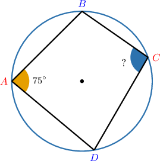
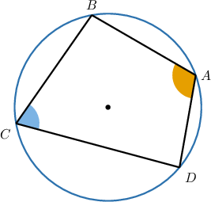
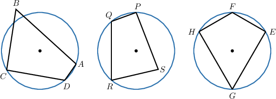
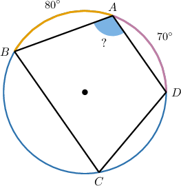
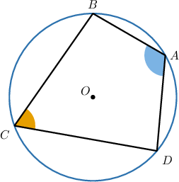
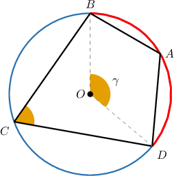
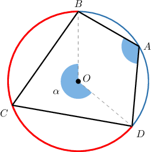
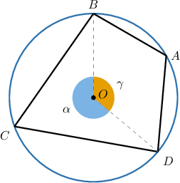

# Inscribed Quadrilaterals

Source: https://www.mathacademy.com/topics/506?courseId=133
Topic ID: 506

## Prerequisites

- [Inscribed Angles](../../../traditional/lessons/geometry/497-inscribed-angles.md)

## Lesson

### Introduction

Consider the quadrilateral $ABCD$ that's inscribed in the circle below.

For any quadrilateral inscribed in a circle, we have the following theorem:

*A quadrilateral can be inscribed in a circle if and only if both pairs of opposite angles are supplementary*.

In this case, we have

$$

\begin{aligned}𝑚∠𝐴+𝑚∠𝐶 & =𝑚∠𝐵+𝑚∠𝐷=180^{∘}.\end{aligned}

$$

Therefore,

$$

\begin{aligned}75^{∘}+𝑚∠𝐶 & =180^{∘} \\ 𝑚∠𝐶 & =180^{∘}−75^{∘} \\ 𝑚∠𝐶 & =105^{∘}.\end{aligned}

$$

### Example: Calculating Angles of Inscribed Quadrilaterals

#### Question

In the diagram below, $m\angle BAD=2x+10^{\circ}$ and $m\angle BCD=2x-30^{\circ}.$ What is the value of $x?$

#### Explanation

Notice that $ABCD$ is a quadrilateral inscribed in a circle. So, its opposite angles are supplementary.

Therefore, we have

$$

\begin{aligned}𝑚∠𝐵𝐴𝐷+𝑚∠𝐵𝐶𝐷 & =180^{∘} \\ (2𝑥+10^{∘})+(2𝑥−30^{∘}) & =180^{∘} \\ 4𝑥−20^{∘} & =180^{∘} \\ 4𝑥 & =200^{∘} \\ 𝑥 & =50^{∘}.\end{aligned}

$$

### Example: Identifying True Statements About Inscribed Quadrilaterals

#### Question

Consider the diagram above. Which of the following statements are true?

1. $ABCD$ is an inscribed quadrilateral

2. $m\angle{P}+m\angle{R} = m\angle{Q}+m\angle{S}=180^\circ$

3. Both pairs of opposite angles in $EFHG$ are supplementary

#### Explanation

Let's examine the statements in turn.

- Statement I is false. $ABCD$ is not an inscribed quadrilateral since the vertex $B$ does not lie on the circle.

- Statement II is false. If we assume that then $PQRS$ must be an inscribed quadrilateral, which is not true since $S$ does not lie on the circle.

- Statement III is true. Indeed, $EFHG$ is an inscribed quadrilateral since all its vertices lie on the circle. Hence, both pairs of opposite angles must be supplementary.

Therefore, the correct answer is "III only."

### Example: Applying the Inscribed Angle Theorem

#### Question

In the diagram below, $m\overset{\frown}{AB}=80^\circ$ and $m\overset{\frown}{DA}=70^\circ.$ Find $m\angle{BAD}.$

#### Explanation

From the picture,

$$

\begin{aligned}𝑚\overset{𝐷𝐴𝐵}{⌢} & =𝑚\overset{𝐷𝐴}{⌢}+𝑚\overset{𝐴𝐵}{⌢} \\ & =70^{∘}+80^{∘} \\ & =150^{∘}.\end{aligned}

$$

Since $\angle{BCD}$ is an inscribed angle that intercepts the arc $\overset{\frown}{DAB}$, we obtain

$$

\begin{aligned}𝑚∠𝐵𝐶𝐷 & =\frac{1}{2}𝑚\overset{𝐷𝐴𝐵}{⌢} \\ & =\frac{1}{2}⋅150^{∘} \\ & =75^{∘}.\end{aligned}

$$

Now, notice that $ABCD$ is a quadrilateral inscribed in a circle. So, its opposite angles are supplementary.

Therefore, we have

$$

\begin{aligned}𝑚∠𝐵𝐴𝐷+𝑚∠𝐵𝐶𝐷 & =180^{∘} \\ 𝑚∠𝐵𝐴𝐷+75^{∘} & =180^{∘} \\ 𝑚∠𝐵𝐴𝐷 & =105^{∘}.\end{aligned}

$$

### Proving That Opposite Angles in an Inscribed Quadrilateral Are Supplementary

Let's now prove that opposite angles in an inscribed quadrilateral are supplementary. Consider the following diagram.

By the definition of supplementary angles, we must prove the relation

$$

m\angle A + m\angle C = 180^\circ.

$$

Let's draw the radii $\overline{OD}$ and $\overline{OB}.$ We call $\gamma$ the measure of the angle $\angle DOB,$ as shown in the diagram. Notice that $\angle DOB$ is a central angle of the intercepted arc $\overset{\frown}{DB}$ (the arc in red). Moreover, $\angle C$ is an inscribed angle on the same arc.

Now, we call $\alpha$ the measure of the reflex angle $\angle DOB.$

Notice that the angle $\angle DOB$ and the reflex $\angle DOB$ make a full turn.

Finally, we substitute the relations $\gamma = 2m\angle C$ and $\alpha = 2m\angle A$ into the above, and simplify:

$$

\begin{aligned}𝛼+𝛾 & =360^{∘} \\ 2𝑚∠𝐴+2𝑚∠𝐶 & =360^{∘} \\ 2(𝑚∠𝐴+𝑚∠𝐶) & =360^{∘} \\ 𝑚∠𝐴+𝑚∠𝐶 & =180^{∘}\end{aligned}

$$
