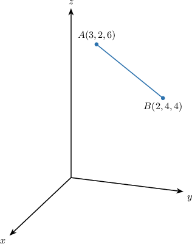

# The Distance Formula in Three Dimensions

Source: https://www.mathacademy.com/topics/512?courseId=133
Topic ID: 512

## Prerequisites

- [The Distance Formula](../../../traditional/lessons/geometry/459-the-distance-formula.md)

## Lesson

### Introduction

The formula for the distance between two points in three-dimensional Cartesian space is similar to the one we know for the two-dimensional Cartesian plane, only now we have three coordinates instead of two.

So, the distance $d$ between two points $A(x_1,y_1,z_1)$ and $B(x_2,y_2,z_2)$ is given by

$$

d = \sqrt{(x_2-x_1)^2 + (y_2-y_1)^2 + (z_2-z_1)^2}.

$$

Let's consider, for example, the points $A(2, 1, 3)$ and $B(5, 0, -7).$ Then, $A$ and $B$ have coordinates

$$

\underbrace{({\color{blue}2},{\color{red}1},3)}_{\!({\color{blue}x_1},{\color{red}y_1},z_1)}, \qquad \underbrace{({\color{blue}5},{\color{red}0},-7)}_{\!({\color{blue}x_2},{\color{red}y_2},z_2)},

$$

respectively. Therefore, we have

$$

\begin{aligned}𝑑 & =\sqrt{√(5\,−\,2)^{2}+(0\,−\,1)^{2}+(−7−3)^{2}} \\ & =\sqrt{√3^{2}+(−1)^{2}+(−10)^{2}} \\ & =\sqrt{√9+1+100} \\ & =\sqrt{√110}.\end{aligned}

$$

### Example: Determining the Length of a Line Segment

#### Question

What is the length of $\overline{AB}?$

#### Explanation

The distance $d$ between the points $A(x_1,y_1,z_1)$ and $B(x_2,y_2,z_2)$ is given by

$$

d= \sqrt{(x_2-x_1)^2 + (y_2-y_1)^2 + (z_2-z_1)^2}.

$$

Finding the length of $\overline{AB}$ is equivalent to finding the distance between $A$ and $B.$

Since $A$ and $B$ have coordinates $𝑥_{1}$ and $𝑥_{2}$ respectively, we have

$$

\begin{aligned}𝐴𝐵 & =\sqrt{√(2−3)^{2}+(4−2)^{2}+(4−6)^{2}} \\ & =\sqrt{√(−1)^{2}+2^{2}+(−2)^{2}} \\ & =\sqrt{√9} \\ & =3.\end{aligned}

$$

### Example: Calculating the Distance Between Two Points in Three Dimensions

#### Question

What is the distance between the points $A(2,5,3)$ and $B(-2,1,7)?$

#### Explanation

The distance $d$ between the points $A(x_1,y_1,z_1)$ and $B(x_2,y_2,z_2)$ is given by

$$

d = \sqrt{(x_2-x_1)^2 + (y_2-y_1)^2 + (z_2-z_1)^2}.

$$

In this case, we have $A\underbrace{(2,5,3)}_{(x_1,y_1,z_1)}$ and $B\underbrace{(-2,1,7)}_{(x_2,y_2,z_2)}.$ Therefore,

$$

\begin{aligned}𝑑 & =\sqrt{√(−2−2)^{2}+(1−5)^{2}+(7−3)^{2}} \\ & =\sqrt{√(−4)^{2}+(−4)^{2}+4^{2}} \\ & =\sqrt{√16+16+16} \\ & =\sqrt{√48} \\ & =4\sqrt{√3}.\end{aligned}

$$

### Example: Calculating the Distance Between Two Points With Variable Coordinates

#### Question

Consider the points $A(p, 3p, p)$ and $B(3p, p, 0).$ Given that the distance between $A$ and $B$ is $6,$ find the possible values of $p.$

#### Explanation

The distance $d$ between the points $A(x_1,y_1,z_1)$ and $B(x_2,y_2,z_2)$ is given by

$$

d= \sqrt{(x_2-x_1)^2 + (y_2-y_1)^2 + (z_2-z_1)^2}.

$$

Using the distance formula for $A\underbrace{(p, 3p, p)}_{(x_1,y_1,z_1)}$ and $B\underbrace{(3p, p, 0)}_{(x_2,y_2,z_2)},$ we get

$$

\begin{aligned}𝑑 & =\sqrt{√(3𝑝−𝑝)^{2}+(𝑝−3𝑝)^{2}+(0−𝑝)^{2}} \\ & =\sqrt{√(2𝑝)^{2}+(−2𝑝)^{2}+(−𝑝)^{2}} \\ & =\sqrt{√4𝑝^{2}+4𝑝^{2}+𝑝^{2}} \\ & =\sqrt{√9𝑝^{2}} \\ & =3|𝑝|\end{aligned}

$$

Now, since $d= 6,$ we have

$$

\begin{aligned}3|𝑝| & =6 \\ |𝑝| & =2 \\ 𝑝 & =±2.\end{aligned}

$$
