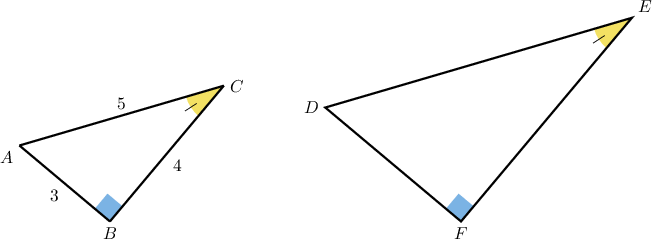
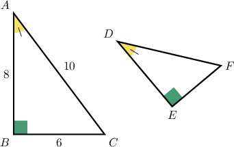
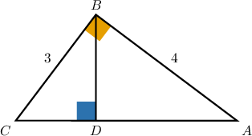
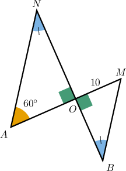
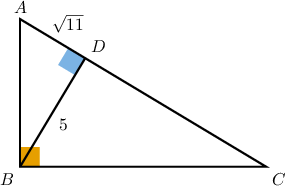

# Trigonometric Ratios in Similar Right Triangles

Source: https://www.mathacademy.com/topics/513?courseId=133
Topic ID: 513

## Prerequisites

- [The Reciprocal Trigonometric Ratios](../../../traditional/lessons/geometry/611-the-reciprocal-trigonometric-ratios.md)
- [Calculating Side Lengths of Right Triangles Using Trigonometry](../../../traditional/lessons/geometry/629-calculating-side-lengths-of-right-triangles-using-trigonometry.md)
- [The AA Similarity Criterion](../../../traditional/lessons/geometry/1365-the-aa-similarity-criterion.md)

## Lesson

### Introduction

Whenever two right triangles are similar, their trigonometric ratios are equal for corresponding angles. This provides a convenient tool for solving problems involving lengths and angles in similar right triangles.

To demonstrate, consider the two triangles shown below.

Suppose we wish to compute the following trigonometric ratio:

$$

\tan D

$$

At first glance, it may seem that we don't have enough information to find $\tan D$ since both the opposite side, $EF,$ and the adjacent side, $DF,$ are unknown.

However, we can compute $\tan D$ by showing that the two triangles are similar and then finding the tangent of the angle corresponding to $D.$

Notice we have two congruent angles:

$$

\angle B\cong \angle F, \qquad \angle C \cong \angle E

$$

Therefore, the two triangles are similar by the AA (Angle-Angle) criterion:

$$

\triangle ABC \sim \triangle DFE

$$

Consequently,

$$

\angle A\cong\angle D.

$$

Notice that we have enough information to find $\tan A{:}$

$$

\begin{aligned}tan⁡𝐴=\frac{𝐵𝐶}{𝐴𝐵}=\frac{4}{3}\end{aligned}

$$

Therefore, since $A$ and $D$ have equal measure, we conclude that

$$

\tan D = \dfrac43.

$$

### Example: Evaluating a Trigonometric Ratio Given Two Similar Right Triangles

#### Question

Calculate the value of $\sec{F}.$

#### Explanation

In the right triangles $\triangle ABC$ and $\triangle DEF,$ we have two pairs of congruent angles:

- $\angle B \cong \angle E,$ since they are both right angles, and

- $\angle A\cong \angle D.$

Therefore, $\triangle ABC \sim \triangle DEF$ by AA, and consequently, $\angle F\cong\angle C.$

So we have

$$

\cos{F} = \cos{C} = \dfrac{BC}{AC} = \dfrac{6}{10}=\dfrac{3}{5},

$$

and finally,

$$

\sec{F} = \dfrac{1}{\cos{F}} = \dfrac{5}{3}.

$$

### Example: Evaluating a Trigonometric Ratio Given Combined Right Triangles

#### Question

Calculate the value of $\tan{\angle CBD}.$

#### Explanation

In the triangles $\triangle BDC$ and $\triangle ABC,$ there are two pairs of congruent angles:

- $\angle BDC \cong \angle ABC$ since they are both right angles, and

- $\angle C$ is common to both triangles.

Therefore, $\triangle BDC \sim \triangle ABC$ by AA, and consequently, $\angle CBD \cong \angle A.$

So, we have

$$

\begin{aligned}tan⁡(∠𝐶𝐵𝐷) & =tan⁡𝐴=\frac{𝐵𝐶}{𝐴𝐵}=\frac{3}{4}.\end{aligned}

$$

### Example: Determining the Length of a Line Segment

#### Question

Find the value of $BM.$

#### Explanation

In the right triangles $\triangle AON$ and $\triangle MOB,$ we have two pairs of congruent angles:

- $\angle AON \cong \angle BOM$ since they are both right angles, and

- $\angle B\cong \angle N.$

Therefore, $\triangle AON \sim \triangle MOB$ by AA, and consequently $\angle M \cong \angle A.$

So we have

$$

\begin{aligned}cos⁡𝑀 & =cos⁡𝐴 \\ \frac{𝑂𝑀}{𝐵𝑀} & =cos⁡60^{∘} \\ \frac{10}{𝐵𝑀} & =0.5 \\ 𝐵𝑀 & =\frac{10}{0.5} \\ 𝐵𝑀 & =20.\end{aligned}

$$

### Example: Finding a Trigonometric Ratio Using the Pythagorean Theorem

#### Question

Find the value of $\cos C.$

#### Explanation

In the triangles $\triangle ADB$ and $\triangle ABC,$ there are two pairs of congruent angles:

- $\angle ABC \cong \angle BDA$ since they are both right angles, and

- $\angle A$ is common to both triangles.

Therefore, $\triangle ADB \sim \triangle ABC$ by AA. As a result, we have $\angle C\cong\angle ABD,$ and consequently

$$

\cos C= \cos (\angle ABD) =\dfrac{BD}{AB}=\dfrac{5}{AB}.

$$

The value of $AB$ is not given, but we can calculate it using the Pythagorean theorem on $\triangle ADB$ as follows:

$$

\begin{aligned}𝐴𝐵 & =\sqrt{√𝐴𝐷^{2}+𝐵𝐷^{2}} \\ & =\sqrt{√(\sqrt{√11})^{2}+5^{2}} \\ & =\sqrt{√11+25} \\ & =\sqrt{√36} \\ & =6\end{aligned}

$$

Finally, we get

$$

\cos C=\dfrac{5}{AB}=\dfrac{5}{6}.

$$
