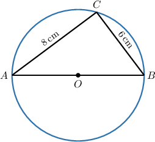
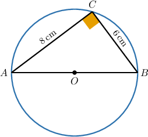
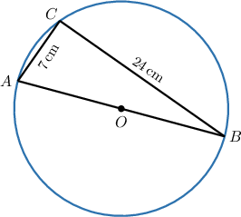
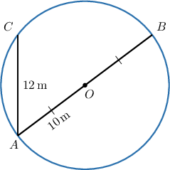
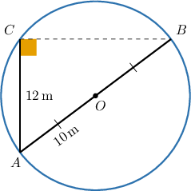

# Thales' Theorem

Source: https://www.mathacademy.com/topics/517?courseId=133
Topic ID: 517

## Prerequisites

- [The Pythagorean Theorem](../../../traditional/lessons/geometry/433-the-pythagorean-theorem.md)
- [Circles](../../../traditional/lessons/geometry/1404-circles.md)

## Lesson

### Introduction

In the diagram below, $\triangle ABC$ is **inscribed** in a circle with center $O.$ This means that all three of the triangle's vertices lie on the circle's circumference.

From the diagram, we can see that $\overline{AB}$ passes through the point $O.$ So, $\overline{AB}$ is a diameter of the circle.

Based on this information, **Thales' theorem** tells us that the triangle $\triangle ABC$ *must* be a right triangle. More precisely:

*If $A, B,$ and $C$ are distinct points on a circle where $\overline{AB}$ is a diameter, then $m\angle C = 90^\circ.$*

Now that we know $\triangle ABC$ is a right triangle, we can apply the Pythagorean theorem to find the length of the hypotenuse:

$$

\begin{aligned}𝐴𝐵 & =\sqrt{𝐴𝐶^{2}+𝐵𝐶^{2}} \\ & =\sqrt{8^{2}+6^{2}} \\ & =\sqrt{64+36} \\ & =\sqrt{100} \\ & =10\,cm\end{aligned}

$$

### Example: Finding the Radius of a Circle Given an Inscribed Right Triangle

#### Question

Consider the figure below, where $AC=7\,\text{cm}$ and $BC=24\,\text{cm}.$ What is the radius of the circle?

#### Explanation

Notice that $\triangle{ABC}$ is inscribed in the circle, where the side $\overline{AB}$ is a diameter. Therefore, $m\angle{ACB}=90^\circ.$

So, by the Pythagorean theorem, we have

$$

\begin{aligned}𝐴𝐵 & =\sqrt{𝐴𝐶^{2}+𝐵𝐶^{2}} \\ & =\sqrt{7^{2}+24^{2}} \\ & =\sqrt{625} \\ & =25\,cm.\end{aligned}

$$

Finally, the radius of the circle is

$$

OA = \dfrac{AB}{2} = \dfrac{25}{2} = 12.5 \,\text{cm}.

$$

### Example: Finding the Length of a Leg in an Inscribed Right Triangle

#### Question

The radius of the above circle is $10\,\text{m}$ and $AC=12\,\text{m}.$ What is the length of the chord $\overline{BC}?$

#### Explanation

Notice that $\triangle{ACB}$ is inscribed in the circle, where $\overline{AB}$ is a diameter. Therefore, by Thales' theorem, we have that $m\angle{C}=90^\circ,$ as shown below.

Now, $AB=2AO=2 \cdot 10 = 20 \, \text{m}.$

Finally, by the Pythagorean theorem,

$$

\begin{aligned}𝐵𝐶^{2} & =𝐴𝐵^{2}−𝐴𝐶^{2} \\ & =20^{2}−12^{2} \\ & =400−144 \\ & =256.\end{aligned}

$$

So, $BC = \sqrt{256} = 16\,\text{cm}.$
