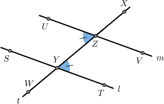
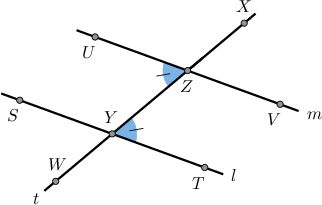
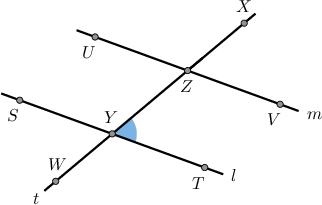
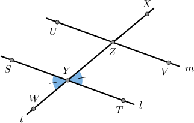
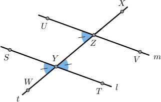
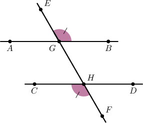
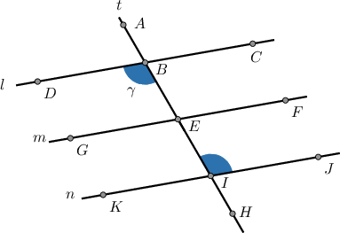

# Further Proving Alternate Angle Theorems

Source: https://www.mathacademy.com/topics/5271?courseId=133
Topic ID: 5271

## Prerequisites

- [Solving Systems of Equations by Substitution](../../../../middle-school/lessons/grade-7/487-solving-systems-of-equations-by-substitution.md)
- [Proving Alternate Angle Theorems](../../../traditional/lessons/geometry/5488-proving-alternate-angle-theorems.md)

## Lesson

### Introduction

In this lesson, we'll learn how to prove the converse alternate angle theorems and consolidate our knowledge of proving all alternate angle theorems and their converses.

Consider the diagram below, where the lines $l$ and $m$ are crossed by a transversal $t,$ and $\angle TYZ \cong \angle UZY.$

Suppose we wish to prove the following statement:

*$l$ and $m$ are parallel.*

In other words, we want to prove the converse alternate interior angles theorem!

To prove this theorem, we start with $\angle TYZ \cong \angle UZY$ and construct a sequence of statements to show that the lines $l$ and $m$ must be parallel. To do this, we'll need the *converse corresponding angles postulate*, which we restate here:

*If a transversal cuts two lines and the corresponding angles are congruent, then the lines are parallel.*

We now proceed to proving that $l$ and $m$ are parallel.

### Proving the Converse Alternate Angle Theorems

We wish to prove the following statement:

*$l$ and $m$ are parallel.*

We start by considering the angle $\angle TYZ.$

Our strategy is to construct a sequence of congruent angles, two of which are corresponding angles, and then use the corresponding angles postulate to conclude that the lines must be parallel.

We complete the proof as follows:

- **Step 1**: By the *vertical angles theorem*, $\angle TYZ$ and $\angle WYS$ are congruent. Let's add this to our diagram.

- **Step 2**: In step 1, we showed that We are also given that Therefore, by the *transitive property of congruence*, we have as shown.

- **Step 3**: In step 2, we showed that the corresponding angles $\angle WYS$ and $\angle UZY$ are congruent. Therefore, by the *converse corresponding angles postulate,* $l$ and $m$ must be parallel, as required.

### Stating the Full Proof Using the Two-Column Format

The table below shows our proof of the converse alternate interior angles theorem in a two-column format.

Let's now look at a proof of the converse alternate *exterior* angles theorem.

### Example: Proving the Converse Alternate Angles Theorems

#### Question

In the diagram above, the lines $\overleftrightarrow{AB}$ and $\overleftrightarrow{CD}$ are crossed by the transversal $\overleftrightarrow{EF}$ and $\angle EGB \cong \angle CHF.$

Consider the following statement:

**

The table below gives the proof of the statement. Fill in the missing entries in the table and thus complete the proof.

#### Explanation

The correct proof is shown below.

Let's examine the rows of the table with missing parts in turn.

- Consider row 1. Notice from the diagram that $\angle CHF$ and $\angle FHD$ form a linear pair. The linear pair postulate states that such angles must be supplementary. Therefore, $\angle CHF$ and $\angle FHD$ are supplementary angles.

- Consider row 3. From row 2, we have $m\angle CHF + m\angle FHD = 180^\circ.$ By the addition principle, we can subtract $m\angle FHD$ from both sides

- Consider row 7. From row 3, we have that $m\angle CHF = 180^\circ - m\angle FHD,$ and from row 6, we have that $\angle EGB \cong \angle CHF.$ Therefore, by the definition of congruent angles, these angles have equal measure:

- Consider row 11. From row 10, we have that $\angle BGH\cong \angle FHD.$ By the converse corresponding angles postulate, if two lines and a transversal form corresponding angles that are congruent, then the lines are parallel. Notice that $\angle BGH$ and $\angle FHD$ are corresponding angles formed by the lines $\overleftrightarrow{AB}$ and $\overleftrightarrow{CD}$ with the transversal $\overleftrightarrow{EF}.$ Therefore, $\overleftrightarrow{AB}$ and $\overleftrightarrow{CD}$ are parallel.

### Example: Constructing Complete Proofs of the Alternate Angle Theorems

#### Question

In the diagram above, the parallel lines $l,m,$ and $n$ are crossed by the transversal $t.$

Consider the following statement:

$m\angle AIJ = \gamma$

The table below provides proof of the statement. Fill in the missing reasons to complete the proof.

#### Explanation

The correct proof is shown below.

Let's examine each row in turn.

1. Notice from the diagram that $\angle ABC$ and $\angle DBE$ are vertical angles. The vertical angles theorem states that such angles must be congruent:

2. Notice from the diagram that $\angle AIJ$ and $\angle ABC$ are corresponding angles. The corresponding angles postulate states that such angles must be congruent:

3. From rows 1 and 2, we have Therefore, by the transitive property of congruence, we have

4. From row 3, we have that $\angle AIJ \cong \angle DBE.$ Therefore, by the definition of congruent angles, these angles have equal measure: Finally, since $m\angle DBE = \gamma,$ we have
