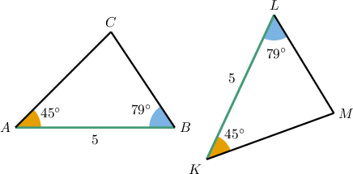
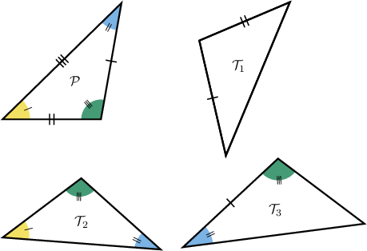
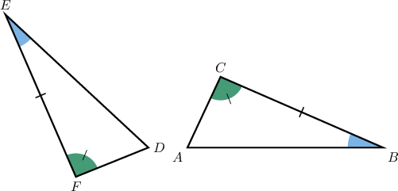
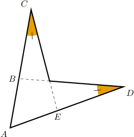
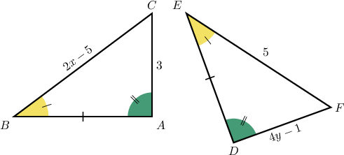

# The ASA Congruence Criterion

Source: https://www.mathacademy.com/topics/532?courseId=133
Topic ID: 532

## Prerequisites

- [Congruent Polygons](../../../../middle-school/lessons/grade-7/1515-congruent-polygons.md)

## Lesson

### Introduction

The **angle-side-angle (ASA) congruence criterion** can be used as a shortcut to prove that two triangles are congruent. It states the following:

Two triangles are congruent if and only if two angles *and the included side* of one triangle are congruent to two angles and the included side of the other triangle.

To demonstrate, consider the triangles below.

We can see that two pairs of angles are congruent:

$$

\angle{A}\cong \angle{K}, \quad \angle{B}\cong \angle{L} \quad

$$

Also, we see that the included sides are congruent:

$$

\overline{AB}\cong \overline{KL}

$$

Therefore, the ASA congruence criterion guarantees that these two triangles are congruent, and we can write

$$

\triangle ABC \cong \triangle KLM.

$$

### Example: Identifying Congruent Triangles Using the ASA Criterion

#### Question

According to the ASA criterion only, which of the following triangles are congruent to $\mathcal{P}?$

#### Explanation

The ASA (angle-side-angle) congruence criterion states the following:

Two triangles are congruent if and only if two angles and the included side of one triangle are congruent to two angles and the included side of the other triangle.

With that in mind, let's examine each of the given triangles.

- $\mathcal{P}$ is ** congruent to $\mathcal{T}_1$ by ASA since they don't have congruent angles.

- $\mathcal{P}$ is ** congruent to $\mathcal{T}_2$ by ASA since they don't have congruent sides.

- $\mathcal{P} \cong \mathcal{T}_3$ by ASA since two angles and the included side of one triangle are congruent to two angles and the included side of the other triangle.

Therefore, only $\mathcal{T}_3$ is congruent to $\mathcal{P}$ by the ASA criterion.

### Example: Finding the Measure of an Angle Using the ASA Criterion

#### Question

In the diagram above, $m \angle D = 65^\circ$ and $m \angle A = 3x + 2^\circ.$ Find the value of $x.$

#### Explanation

Notice that $\triangle ABC$ and $\triangle DEF$ are congruent by ASA since we have the following pairs of congruent angles and included sides:

- $\overline{BC} \cong \overline{EF}$

- $\angle{B} \cong \angle{E}$

- $\angle{C} \cong \angle{F}$

Therefore, all the corresponding angles of the triangles must be congruent. In particular, $\angle A \cong \angle D.$ So, we have

$$

\begin{aligned}𝑚∠𝐴 & =𝑚∠𝐷 \\ 3𝑥+2^{∘} & =65^{∘} \\ 3𝑥 & =63^{∘} \\ 𝑥 & =21^{∘}.\end{aligned}

$$

### Example: Calculating the Length of a Line Segment Using the ASA Criterion

#### Question

In the figure below, $AC=12 \,,$ $AE=5\,,$ $ED= 7\,,$ $BD=10 \,,$ and $CE = 3x-2.$ What is the value of $x?$

#### Explanation

First, notice that $\overline{AC} \cong \overline{AD}$ since

$$

\begin{aligned}𝐴𝐷 & =𝐴𝐸+𝐸𝐷 \\ & =5+7 \\ & =12 \\ & =𝐴𝐶.\end{aligned}

$$

Now, $\triangle CAE$ and $\triangle DAB$ are congruent by ASA since we have the following pairs of congruent angles and included sides:

- $\overline{AC} \cong \overline{AD}$

- $\angle A$ is their common angle

- $\angle{C} \cong \angle{D}$

Therefore, all the corresponding sides of the triangles must be congruent. In particular, $\overline{CE} \cong \overline{BD}.$ Therefore,

$$

\begin{aligned}𝐶𝐸 & =𝐵𝐷 \\ 3𝑥−2 & =10 \\ 3𝑥 & =12 \\ 𝑥 & =4.\end{aligned}

$$

### Example: Identifying True Statements Using the ASA Criterion

#### Question

From the diagram below, which of the following statements is true?

1. $\triangle ABC \cong \triangle DEF$ by ASA

2. $x = 1$

3. $y = 1$

#### Explanation

Let's examine each of the given statements in turn.

- Statement I is true. $\triangle ABC$ and $\triangle DEF$ are congruent by ASA since we have the following pairs of congruent angles and included sides: $\overline{AB} \cong \overline{DE}$ $\angle A \cong \angle D$ $\angle B \cong \angle E$

- Statement II is false. Since the triangles are congruent, all the corresponding sides must be congruent. In particular,

- Statement III is true. Since the triangles are congruent, all the corresponding sides must be congruent. In particular,

Therefore, only statements I and III are true.
