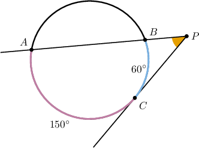
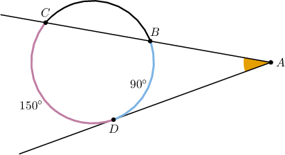
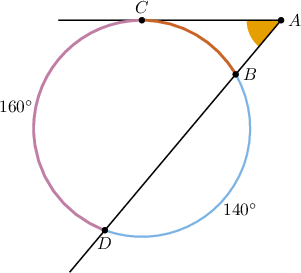
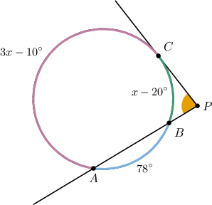

# Secant-Tangent Angles to Circles

Source: https://www.mathacademy.com/topics/580?courseId=133
Topic ID: 580

## Prerequisites

- [Tangent Lines to Circles](../../../traditional/lessons/geometry/578-tangent-lines-to-circles.md)
- [Secant-Secant Angles to Circles](../../../traditional/lessons/geometry/579-secant-secant-angles-to-circles.md)

## Lesson

### Introduction

In this lesson, we'll extend our knowledge of the secant-secant angle theorem to secant-tangent angles.

Consider the following diagram.

The points $A, B,$ and $C$ lie on the circle, $\overleftrightarrow{CP}$ is tangent to the circle at $C,$ where $P$ is the intersection of $\overleftrightarrow{AB}$ and $\overleftrightarrow{CP}.$ We're also given that

$$

m\overset{\frown}{AC} = 150^\circ, \qquad m\overset{\frown}{BC}=60^\circ.

$$

Similar to the case with secant-secant angles, the measure of the **secant-tangent angle** $\angle P$ equals half the difference between the measures of the larger and smaller intercepted arcs:

$$

m\angle P = \dfrac{m\overset{\frown}{AC} - m\overset{\frown}{BC}}{2}

$$

Substituting the given measures, we get

$$

\begin{aligned}𝑚∠𝑃 & =\frac{𝑚\overset{𝐴𝐶}{⌢}−𝑚\overset{𝐵𝐶}{⌢}}{2} \\ & =\frac{150^{∘}−60^{∘}}{2} \\ & =45^{∘}\,.\end{aligned}

$$

### Example: Applying the Secant-Tangent Angle Theorem

#### Question

In the diagram above, $\overset{\longleftrightarrow}{AD}$ is a tangent line to the circle at the point $D.$ Find $m\angle{A}.$

#### Explanation

Notice that $\angle A$ is a secant-tangent angle to the given circle. Thus, its measure is one-half the difference between the measures of the intercepted arcs.

Therefore, we have

$$

\begin{aligned}𝑚∠𝐴 & =\frac{𝑚\overset{𝐶𝐷}{⌢}−𝑚\overset{𝐵𝐷}{⌢}}{2} \\ & =\frac{150^{∘}−90^{∘}}{2} \\ & =30^{∘}.\end{aligned}

$$

### Example: Solving Problems Involving the Lateral Arc

#### Question

In the diagram above, $\overset{\longleftrightarrow}{AC}$ is a tangent line to the circle at the point $C.$ Find $m\angle A.$

#### Explanation

We know that

$$

m\overset{\frown}{BC} + m\overset{\frown}{CD} + m\overset{\frown}{BD} = 360^\circ.

$$

Substituting the given values and solving for $m\overset{\frown}{BC},$ we get the following:

$$

\begin{aligned}𝑚\overset{𝐵𝐶}{⌢}+160^{∘}+140^{∘} & =360^{∘} \\ 𝑚\overset{𝐵𝐶}{⌢}+300^{∘} & =360^{∘} \\ 𝑚\overset{𝐵𝐶}{⌢} & =60^{∘}\end{aligned}

$$

Notice that $\angle A$ is a secant-tangent angle to the given circle. Thus, its measure is one-half the difference between the measures of the intercepted arcs.

$$

m\angle A = \dfrac{m\overset{\frown}{CD}-m\overset{\frown}{BC}}{2}

$$

Substituting the given values, we get

$$

\begin{aligned}𝑚∠𝐴 & =\frac{160^{∘}−60^{∘}}{2} \\ & =\frac{100^{∘}}{2} \\ & =50^{∘}.\end{aligned}

$$

### Example: Solving for a Variable

#### Question

In the diagram above, $\overset{\longleftrightarrow}{CP}$ is a tangent line to the circle at the point $C.$ Find $m\angle{P}.$

#### Explanation

We know that

$$

m\overset{\frown}{AB} + m\overset{\frown}{BC} + m\overset{\frown}{AC} = 360^\circ.

$$

Substituting the given expressions and solving for $x,$ we get the following:

$$

\begin{aligned}78^{∘}+(𝑥−20^{∘})+(3𝑥−10^{∘}) & =360^{∘} \\ 4𝑥+48^{∘} & =360^{∘} \\ 4𝑥 & =312^{∘} \\ 𝑥 & =78^{∘}\end{aligned}

$$

Notice that $\angle{P}$ is a secant-tangent angle to the given circle. Thus, its measure is one-half the difference between the measures of the intercepted arcs. Therefore, we have

$$

\begin{aligned}𝑚∠𝑃 & =\frac{𝑚\overset{𝐴𝐶}{⌢}−𝑚\overset{𝐵𝐶}{⌢}}{2} \\ & =\frac{(3𝑥−10^{∘})−(𝑥−20^{∘})}{2} \\ & =\frac{2𝑥+10^{∘}}{2} \\ & =𝑥+5^{∘} \\ & =78^{∘}+5^{∘} \\ & =83^{∘}.\end{aligned}

$$
