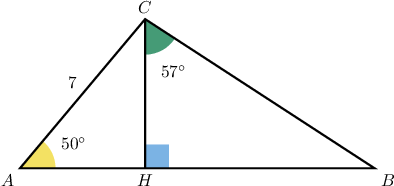
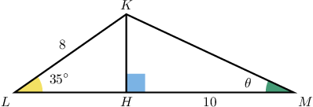
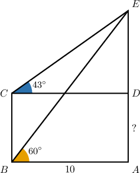
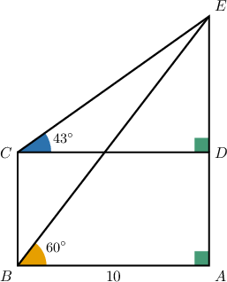
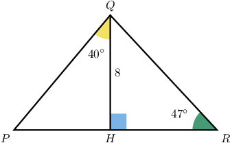

# Solving Multiple Right Triangles Using Trigonometry

Source: https://www.mathacademy.com/topics/647?courseId=133
Topic ID: 647

## Prerequisites

- [Trigonometric Ratios in Similar Right Triangles](../../../traditional/lessons/geometry/513-trigonometric-ratios-in-similar-right-triangles.md)
- [Calculating Angles in Right Triangles Using Trigonometry](../../../traditional/lessons/geometry/610-calculating-angles-in-right-triangles-using-trigonometry.md)
- [Calculating Areas of Right Triangles Using Trigonometry](../../../traditional/lessons/geometry/1608-calculating-areas-of-right-triangles-using-trigonometry.md)
- [The Segment Addition Postulate](../../../../middle-school/lessons/grade-7/2278-the-segment-addition-postulate.md)

## Lesson

### Introduction

Suppose that we are given a non-right triangle, like the one in the figure below. How do we calculate

We start by noting that the height divides the triangle into two right triangles with a common side. To solve the triangle on the right, we can use information about the triangle on the left.

First, we find the height The sine ratio for the left triangle gives

We write the intermediate steps in the calculation to decimal places, to avoid rounding error.

Now, we can calculate by applying the tangent ratio to the triangle on the right:

### Example: Finding the Measure of a Angle in a Triangle by Splitting into Two Right Triangles

#### Question

Find the value of $\theta$ rounded to the nearest tenth.

#### Explanation

First, consider the triangle $\triangle LKH.$ Using the sine ratio, we get

$$

\begin{aligned}\frac{𝐾𝐻}{𝐾𝐿} & =sin⁡𝐿 \\ \frac{𝐾𝐻}{8} & =sin⁡35^{∘} \\ 𝐾𝐻 & =8⋅sin⁡35^{∘} \\ 𝐾𝐻 & =4.588 6,\end{aligned}

$$

rounded to four decimal places.

Now, we consider $\triangle KMH.$ We have

$$

\begin{aligned}tan⁡𝜃 & =\frac{𝐾𝐻}{𝐻𝑀} \\ tan⁡𝜃 & =\frac{4.588 6}{10} \\ tan⁡𝜃 & =0.458 9 \\ 𝜃 & =arctan⁡(0.458 9) \\ 𝜃 & =24.650 4^{∘}.\end{aligned}

$$

Therefore, $\theta\approx 24.7^\circ$ rounded to the nearest tenth.

### Example: Determining the Length of a Line Segment Using Trigonometry

#### Question

Given that $ABCD$ is a rectangle, what is the measure of $\overline{AD}$ to the nearest integer?

#### Explanation

Since $ABCD$ is the rectangle, $BA=CD=10$ and $m\angle CDE=m\angle BAE=90^\circ.$

First, consider the triangle $\triangle ABE.$ Using the tangent ratio, we get

$$

\begin{aligned}\frac{𝐴𝐸}{𝐵𝐴} & =tan⁡𝐵 \\ \frac{𝐴𝐸}{10} & =tan⁡60^{∘} \\ 𝐴𝐸 & =10tan⁡60^{∘} \\ 𝐴𝐸 & =17.321,\end{aligned}

$$

rounded to three decimal places.

Considering $\triangle CDE,$ we get

$$

\begin{aligned}\frac{𝐸𝐷}{𝐶𝐷} & =tan⁡𝐶 \\ \frac{𝐸𝐷}{10} & =tan⁡43^{∘} \\ 𝐸𝐷 & =10tan⁡43^{∘} \\ 𝐸𝐷 & =9.325,\end{aligned}

$$

rounded to three decimal places.

Finally.

$$

\begin{aligned}𝐴𝐷 & =𝐴𝐸−𝐸𝐷 \\ & =17.321−9.325 \\ & =7.996.\end{aligned}

$$

Hence, $AD \approx 8,$ rounded to the nearest integer.

### Example: Finding the Area of a Triangle by Splitting it into Two Right Triangles

#### Question

Find the area of the triangle $\triangle PQR.$ Round the answer to the nearest integer.

#### Explanation

First, consider the triangle $\triangle PQH.$ Using the tangent ratio, we get

$$

\begin{aligned}\frac{𝑃𝐻}{𝑄𝐻} & =tan⁡∠𝑄 \\ \frac{𝑃𝐻}{8} & =tan⁡(40^{∘}) \\ 𝑃𝐻 & =8tan⁡(40^{∘}) \\ 𝑃𝐻 & ≈6.713,\end{aligned}

$$

rounded to three decimal places.

Now, consider $\triangle QHR.$ We have

$$

\begin{aligned}tan⁡𝑅 & =\frac{𝑄𝐻}{𝐻𝑅} \\ tan⁡(47^{∘}) & =\frac{8}{𝐻𝑅} \\ tan⁡(47^{∘})⋅𝐻𝑅 & =8 \\ 𝐻𝑅 & =\frac{8}{tan⁡(47^{∘})} \\ 𝐻𝑅 & ≈7.460,\end{aligned}

$$

rounded to three decimal places.

Finally,

$$

\begin{aligned}𝑃𝑅 & =𝑃𝐻+𝐻𝑅 \\ & ≈6.713+7.460 \\ & =14.173.\end{aligned}

$$

We now know the base ($PR$) and height ($QH$) of the triangle $\triangle{PRQ}.$ Hence, the area of $\triangle{PRQ}$ is

$$

\begin{aligned}A & =\frac{𝑃𝑅⋅𝑄𝐻}{2} \\ & ≈\frac{14.173⋅8}{2} \\ & ≈56.692.\end{aligned}

$$

Therefore, $\mathcal A \approx 57,$ rounded to the nearest integer.
