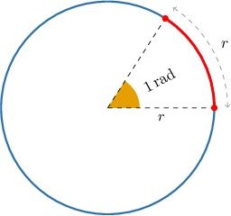

# Introduction to Radians

Source: https://www.mathacademy.com/topics/764?courseId=133
Topic ID: 764

## Prerequisites

- [The Circumference of a Circle](../../../traditional/lessons/geometry/460-the-circumference-of-a-circle.md)
- [Measuring Angles Using a Protractor](../../../../elementary-school/lessons/grade-4/3980-measuring-angles-using-a-protractor.md)

## Lesson

### Introduction

We're used to measuring angles in degrees. However, angles can also be measured in **radians** (sometimes written as "$\text{rad}$"). One **radian** is the angle formed at the center of a circle by an arc whose length is equal to the radius of the circle.

To find the number of radians in a circle, we divide the circumference of the circle by the length of a radius. We always get the same result:

$$

\dfrac{C}{r} = \dfrac{2 \pi r}{r} = 2\pi

$$

So, we have that

- $360^\circ$ is equivalent to $2\pi$ radians, and

- $180^\circ$ is equivalent to $\pi$ radians.

As a consequence,

- to convert degrees to radians, we must multiply by $\dfrac{\pi}{180^\circ},$ and

- to convert radians to degrees, multiply by $\dfrac{180^\circ}{\pi}.$

### Example: Converting From Degrees to Radians

#### Question

An angle of $150^\circ$ is equal to how many radians?

#### Explanation

To convert the measure of an angle in degrees to an equivalent measure in radians, we multiply the measure in degrees by $\dfrac{\pi}{180^\circ}.$ This gives

$$

\begin{aligned}150^{∘}⋅(\frac{𝜋}{180^{∘}}) & =\frac{150^{∘}}{1}⋅(\frac{𝜋}{180^{∘}}) \\ & =\frac{150^{∘}}{180^{∘}}⋅(\frac{𝜋}{1}) \\ & =\frac{150}{180}⋅(\frac{𝜋}{1}) \\ & =\frac{15}{18}⋅(\frac{𝜋}{1}) \\ & =\frac{5}{6}⋅(\frac{𝜋}{1}) \\ & =\frac{5𝜋}{6}.\end{aligned}

$$

Therefore, $150^\circ$ is equivalent to $\dfrac {5\pi} {6}$ radians.

Notice that when we divide $150^\circ$ by $180^\circ,$ we can drop the degree $(\phantom{.}^\circ)$ symbol.

### Example: Converting From Radians to Degrees

#### Question

What is the angle of $\dfrac{2 \pi} 3$ radians in degrees?

#### Explanation

To convert the measure of an angle in radians to an equivalent measure in degrees, we multiply the measure in radians by $\dfrac{180^\circ}{\pi}.$ This gives

$$

\begin{aligned}(\frac{2𝜋}{3})⋅(\frac{180^{∘}}{𝜋}) & =\frac{2⋅180^{∘}⋅𝜋}{3⋅𝜋} \\ & =\frac{360^{∘}𝜋}{3𝜋} \\ & =\frac{360^{∘}𝜋}{3𝜋} \\ & =\frac{360^{∘}}{3} \\ & =120^{∘}.\end{aligned}

$$

Therefore, $\dfrac{2 \pi} 3$ is equivalent to $120^\circ.$

### Example: Converting From Radians to Degrees Using Technology

#### Question

What is $0.78$ radians in degrees to the nearest degree?

#### Explanation

To convert the measure of an angle in radians to an equivalent measure in degrees, we multiply the measure in radians by $\dfrac{180^\circ}{\pi}.$

Evaluating this **, we get

$$

0.78 \cdot \dfrac{180^\circ}{\pi} \approx 44.691^\circ,

$$

rounded to $3$ decimal places. Therefore, $0.78$ radians is equal to $45^\circ$ to the nearest degree.

### Example: Converting From Degrees to Radians Using Technology

#### Question

Rounding to one decimal place, what is $30.2^\circ$ measured in radians?

#### Explanation

To convert the measure of an angle in degrees to an equivalent measure in radians, we multiply the measure in degrees by $\dfrac{\pi}{180}.$

Evaluating this **, we get

$$

30.2^\circ \cdot \dfrac{\pi}{180^\circ} \approx 0.527,

$$

rounded to $3$ decimal places.

Therefore, the angle $30.2^\circ$ is equal to $0.5$ radians rounded to one decimal place.

### Some Special Angles in Degrees and Radians

The table below summarizes the values of some *special* angles in degrees and radians.

.equal-width td {width: 10px; text-align: center;}

Radians might seem a weird way of measuring angles now, but as you learn about trigonometry, you'll come to realize that they can be very useful and convenient.
