# Vertical Translations of Exponential Growth Functions

Source: https://www.mathacademy.com/topics/817?courseId=133
Topic ID: 817

## Prerequisites

- [Graphing Exponential Growth Functions](../../../traditional/lessons/algebra-i/1530-graphing-exponential-growth-functions.md)

## Lesson

### Introduction

Adding a value to $y=2^x$ will **translate** (shift) the exponential function up or down the $y$-axis.

For instance, adding $3$ to $y=2^x$ will move each point on the exponential function $3$ units up.

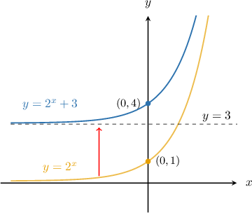

Note the following points:

1. The $y$-intercept $(0,1)$ has moved up $3$ units to the point $(0,4).$

2. The horizontal asymptote $y=0$ has moved up $3$ units to $y=3.$

As a second example, let's consider the function $y=2^x-3.$ In this case, the graph of $y=2^x$ is shifted *down* by $3$ units.

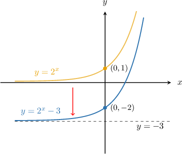

### Example: Identifying a Vertically Shifted Exponential Growth Curve

#### Question

Plot the graph of $y=4^{x}-1.$

#### Explanation

First, we plot the graph of $y=4^{x}{:}$

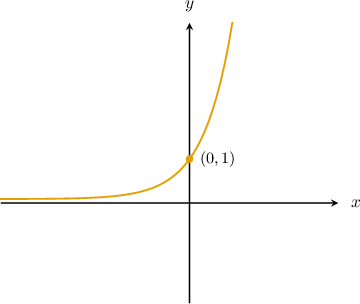

To sketch the graph of $y=4^x-1,$ we take the graph of $y=4^x$ and shift it $1$ unit down. The $y$-intercept moves from $(0,1)$ to $(0,0),$ and the horizontal asymptote moves from $y=0$ to $y=-1.$

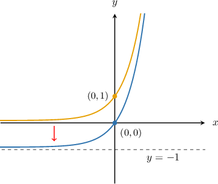

### Example: Identifying the Shift Applied to an Exponential Growth Curve

#### Question

The graph below shows the curve $y=3^{x}+c$. What is the value of $c?$

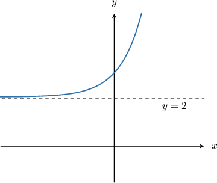

#### Explanation

The horizontal asymptote of $y=3^x$ is $y=0.$ The vertical translation $y=3^x+c$ shifts the asymptote to $y=c.$

In the graph above, the horizontal asymptote is $y=2.$ Therefore, $c=2.$

### Combining Vertical Shift and Vertical Stretch

When an exponential growth function is vertically shifted *and* stretched, we apply the stretch first and the shift second.

For example, to plot the function $y=2(4^x)+3,$ we start by plotting the graph of $y=2(4^x).$ Stretching $y=4^x$ by a factor of $2$ moves the $y$-intercept from $(0,1)$ to $(0,2),$ but the horizontal asymptote stays at $y=0.$

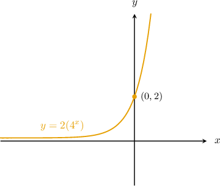

Then, to plot the graph of $y=2(4^x)+3,$ we take the graph of $y=2(4^x)$ and shift it $3$ units up. The $y$-intercept moves from $(0,2)$ to $(0,5),$ and the horizontal asymptote moves from $y=0$ to $y=3.$

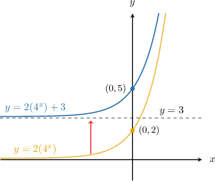

### Example: Identifying a Vertically Shifted and Stretched Exponential Growth Curve

#### Question

Plot the graph of $y=5(3^x)-3.$

#### Explanation

First, we plot the graph of $y=3^{x}\mathbin{:}$

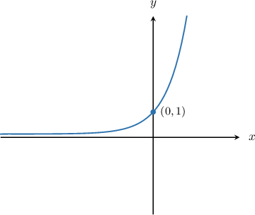

Next, we plot the graph of $y=5(3^x).$ To do this, we scale the graph above by a factor of $5.$ The $y$-intercept moves from $(0,1)$ to $(0,5),$ but the horizontal asymptote stays at $y=0.$

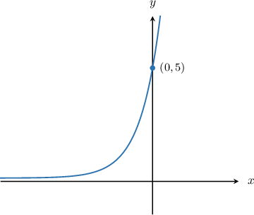

Finally, we plot the graph of $y=5(3^x)-3.$ To do this, we shift the above graph $3$ units down. The $y$-intercept moves from $(0,5)$ to $(0,2),$ and the horizontal asymptote moves from $y=0$ to $y=-3.$

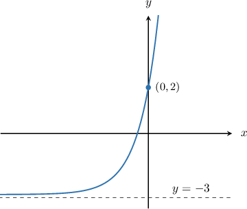

### Example: Identifying the Shift and Stretch Applied to an Exponential Growth Curve

#### Question

The graph below shows $y=k(6^{x})+c.$ Determine the values of $k$ and $c$ and find the equation of the curve.

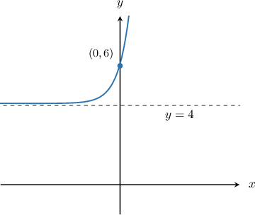

#### Explanation

The horizontal asymptote of the curve $y=k(6^{x})+c$ is $y=c.$ In the graph above, the horizontal asymptote is $y=4$, so $c=4.$

Therefore, our function takes the form

$$

y=k(6^{x})+4.

$$

We can solve for $k$ by finding a point on the graph and substituting for $x$ and $y.$ The labeled point on the graph is $(0,6),$ so we substitute $x=0$ and $y=6$ into the function and solve for $k\mathbin{:}$

$$

\begin{aligned}𝑦 & =𝑘(6^{𝑥})+4 \\ 6 & =𝑘(6^{0})+4 \\ 6 & =𝑘(1)+4 \\ 6 & =𝑘+4 \\ 2 & =𝑘\end{aligned}

$$

Therefore, the curve is $y=2(6^{x})+4.$
