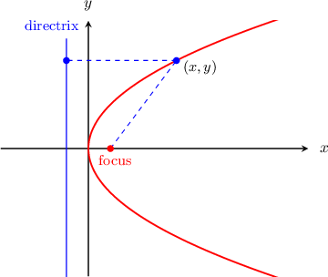
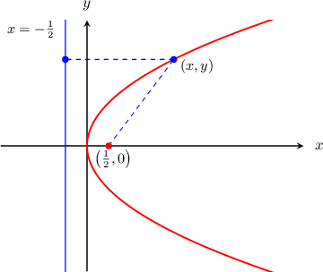
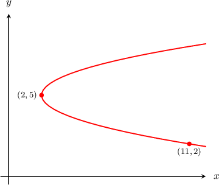
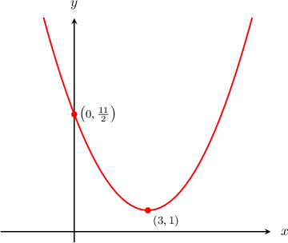

# Calculating the Focus of a Parabola

Source: https://www.mathacademy.com/topics/1129?courseId=134
Topic ID: 1129

## Prerequisites

- [The Focus-Directrix Property of a Parabola](../../../traditional/lessons/algebra-ii/1155-the-focus-directrix-property-of-a-parabola.md)

## Lesson

### Introduction

Recall that a parabola can be defined as a set of points $(x,y)$ equidistant from a line called the **directrix** and a point called the **focus**.

In this lesson, we will practice finding the coordinates of the focus of a parabola if we're given the equation of the parabola.

The first step is to write the parabola equation in its general form. For a horizontal parabola (like the one shown above), the general form is

$$

(y-k)^2 = 4p(x-h).

$$

From the general form, we can determine the coordinates of the vertex $(h,k)$ and the value of the parameter $p,$ and we can apply the following rule:

*The focus is located at a distance of $|p|$ units away from the vertex, in the direction that the parabola opens.*

That is to say:

- For a horizontal parabola, the focus has coordinates $(h + p, k).$

- For a vertical parabola, the focus has coordinates $(h, k + p).$

### A Worked Example

Let's use the procedure described earlier to find the focus of the parabola

$$

y^2 = 2x.

$$

Note that this is a right-opening parabola, and the vertex is $(h,k) = (0,0).$

To determine $p,$ we rewrite the equation of the parabola in the general form $(y-k)^2 = 4p(x-h)\mathbin{:}$

$$

\begin{aligned}𝑦^{2} & =4⋅\frac{1}{2}⋅𝑥\end{aligned}

$$

Therefore, $p = \dfrac 1 2.$

Finally, because the parabola opens to the right, the focus lies at a distance of $|p|=\dfrac{1}{2}$ to the *right* of the vertex $(0,0).$ This means the focus has coordinates

$$

\left(0 + \dfrac 1 2 , 0\right) = \left(\dfrac12,0\right).

$$

This parabola, along with its focus and directrix, is shown below.

### Example: Calculating the Focus Given the Graph of a Horizontal Parabola

#### Question

Calculate the coordinates of the focus of the parabola shown below.

#### Explanation

The general equation of a ** parabola with vertex at $(h,k)$ is given by

$$

(y - k)^2 = 4p(x-h),

$$

and the coordinates of the focus are $(h+p, k).$

From the diagram, we see that the vertex $(h,k) = (2,5).$ Substituting this into the above, we get

$$

(y-5)^2=4p(x-2).

$$

The diagram shows that the parabola passes through the point $\left(11, 2\right).$ Substituting $x= 11$ and $y=2$ into the above equation and solving for $p,$ we get

$$

\begin{aligned}(2−5)^{2} & =4𝑝(11−2) \\ 9 & =4𝑝(9) \\ 𝑝 & =\frac{1}{4}.\end{aligned}

$$

Therefore, the coordinates of the focus are $\left(2+\dfrac{1}{4},5\right) = \left(\dfrac{9}{4},5\right).$

### Example: Calculating the Focus Given the Graph of a Vertical Parabola

#### Question

Calculate the coordinates of the focus of the parabola shown above.

#### Explanation

The general equation of a ** parabola with vertex at $(h,k)$ is given by

$$

(x - h)^2 = 4p(y-k),

$$

and the coordinates of the focus are $(h, k + p).$

From the diagram, we see that the vertex $(h,k) = (3,1).$ Substituting this into the above, we get

$$

(x - 3)^2 = 4p(y-1).

$$

The diagram shows that the parabola passes through the point $\left(0, \dfrac{11}{2}\right).$ Substituting $x= 0$ and $y=\dfrac{11}{2}$ into the above equation and solving for $p,$ we get

$$

\begin{aligned}(0−3)^{2} & =4𝑝(\frac{11}{2}−1) \\ (−3)^{2} & =4𝑝(\frac{9}{2}) \\ 9 & =18𝑝 \\ 𝑝 & =\frac{9}{18} \\ 𝑝 & =\frac{1}{2}.\end{aligned}

$$

Therefore, the coordinates of the focus are $\left(3, 1 + \dfrac{1}{2} \right) = \left(3, \dfrac{3}{2}\right).$

### Example: Calculating the Focus Given the Equation of a Horizontal Parabola

#### Question

Calculate the coordinates of the focus of the parabola $y^2 -12x - 14 y +49 = 0.$

#### Explanation

The general equation of a ** parabola with vertex at $(h,k)$ is given by

$$

(y - k)^2 = 4p(x - h)

$$

and the coordinates of the focus are $(h + p, k).$

To rewrite the equation of the parabola in standard form, we need to group $y$-terms on the left-hand side of the equation and complete the square, as follows:

$$

\begin{aligned}𝑦^{2}−12𝑥−14𝑦+49 & =0 \\ 𝑦^{2}−14𝑦 & =12𝑥−49 \\ (𝑦−7)^{2}−49 & =12𝑥−49 \\ (𝑦−7)^{2} & =12𝑥 \\ (𝑦−7)^{2} & =4(3)(𝑥−0)\end{aligned}

$$

Therefore, $p = 3$ and $(h, k) = \left(0, 7\right).$

Finally, the coordinates of the focus are

$$

\begin{aligned}(ℎ+𝑝,𝑘) & =(0+3,7)=(3,7).\end{aligned}

$$

### Example: Calculating the Focus Given the Equation of a Vertical Parabola

#### Question

Calculate the coordinates of the focus of the parabola $x^2 - 10x +y + 26 = 0$.

#### Explanation

The general equation of a vertical parabola with vertex at $(h,k)$ is given by

$$

(x-h)^2=4p(y-k)

$$

and the coordinates of the focus are $(h,k+p).$

To rewrite the equation of the parabola in standard form, we need to group $x$-terms on the lefthand side of the equation and compete the square, as follows:

$$

\begin{aligned}𝑥^{2}−10𝑥+𝑦+26 & =0 \\ 𝑥^{2}−10𝑥 & =−𝑦−26 \\ (𝑥−5)^{2}−25 & =−𝑦−26 \\ (𝑥−5)^{2} & =−𝑦−1 \\ (𝑥−5)^{2} & =−(𝑦+1) \\ (𝑥−5)^{2} & =4(−\frac{1}{4})(𝑦+1)\end{aligned}

$$

Therefore, $p=-\dfrac 1 4$ and $(h,k) = \left(5,-1\right).$

Finally, the coordinates of the focus are

$$

\begin{aligned}(ℎ,𝑘+𝑝) & =(5,−1−\frac{1}{4})=(5,−\frac{5}{4}).\end{aligned}

$$
