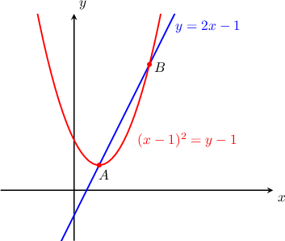

# Intersections of Parabolas With Lines

Source: https://www.mathacademy.com/topics/1134?courseId=134
Topic ID: 1134

## Prerequisites

- [Left and Right Opening Parabolas](../../../traditional/lessons/algebra-ii/1124-left-and-right-opening-parabolas.md)
- [Finding Intersections of Lines and Quadratic Functions](../../../traditional/lessons/algebra-i/6341-finding-intersections-of-lines-and-quadratic-functions.md)

## Lesson

### Introduction

A line may intersect a parabola at one or two points. It is also possible that there is no point of intersection.

In the figure below, we see that the parabola $(x-1)^2 =y-1$ intersects the line $y = 2x - 1$ at two places, $A$ and $B.$ Let's compute the coordinates of these points.

To find $x$-coordinates of the intersection points, we substitute $y = 2x - 1$ into the equation of the parabola and solve the resulting equation for $x,$ as follows:

$$

\begin{aligned}(𝑥−1)^{2} & =𝑦−1 \\ (𝑥−1)^{2} & =(2𝑥−1)−1 \\ 𝑥^{2}−2𝑥+1 & =2𝑥−2 \\ 𝑥^{2}−4𝑥+3 & =0 \\ (𝑥−1)(𝑥−3) & =0 \\ 𝑥 & =1,3\end{aligned}

$$

To find the $y$-coordinates of the intersection, we substitute each of these values of $x$ into the equation of the line.

- For $x=1,$ we have So, the coordinates of the first point of intersection are $(1,1).$

- Now, for $x=3,$ we have So, the coordinates of the second point of intersection are $(3,5).$

Therefore, the parabola $(x-1)^2 =y-1$ intersects the line $y=2x-1$ at the points $(1,1)$ and $(3,5).$

### Example: Finding the Points of Intersection of a Vertical Parabola and a Line: Two Points of Intersection

#### Question

Find the $x$-coordinates of the points where the parabola $(x+4)^2 = 4\left(y+\dfrac{3}{4}\right)$ intersects the line $y=\dfrac{1}{2}x+5.$

#### Explanation

To find the $x$-coordinates of the intersection points, we need to substitute $y=\dfrac{1}{2}x+5$ into the equation of the parabola and solve for $x,$ as follows:

$$

\begin{aligned}(𝑥+4)^{2} & =4(𝑦+\frac{3}{4}) \\ (𝑥+4)^{2} & =4((\frac{1}{2}𝑥+5)+\frac{3}{4}) \\ (𝑥+4)^{2} & =4(\frac{1}{2}𝑥+\frac{23}{4}) \\ 𝑥^{2}+8𝑥+16 & =2𝑥+23 \\ 𝑥^{2}+6𝑥−7 & =0 \\ (𝑥+7)(𝑥−1) & =0 \\ 𝑥 & =−7,1\end{aligned}

$$

Therefore, we conclude that the parabola and the line intersect at the points where $x=-7$ and $x=1.$

### Example: Finding the Points of Intersection of a Vertical Parabola and a Line: One or No Points of Intersection

#### Question

Find the $x$-coordinates of the points where the parabola $(x-2)^2=8(y-4)$ intersects the line $y=x-1.$

#### Explanation

To find the $x$-coordinates of the intersection points, we need to substitute $y=x-1$ into the equation of the parabola and solve for $x,$ as follows:

$$

\begin{aligned}(𝑥−2)^{2} & =8(𝑦−4) \\ (𝑥−2)^{2} & =8(𝑥−1−4) \\ (𝑥−2)^{2} & =8(𝑥−5) \\ 𝑥^{2}−4𝑥+4 & =8𝑥−40 \\ 𝑥^{2}−4𝑥+4−8𝑥+40 & =0 \\ 𝑥^{2}−12𝑥+44 & =0 \\ (𝑥^{2}−2⋅6𝑥+6^{2})−6^{2}+44 & =0 \\ (𝑥−6)^{2}+8 & =0 \\ (𝑥−6)^{2} & =−8\end{aligned}

$$

The left-hand side of the equation is nonnegative, whereas the right-hand side is negative. This means that the equation has no (real) solutions.

Therefore, we conclude that the parabola and the line do not intersect.

### Example: Finding the Points of Intersection of a Horizontal Parabola and a Line: Two Points of Intersection

#### Question

Find the $x$-coordinates of the points where the parabola $y^2 = -4(x+1)$ intersects the line $y=-x-16.$

#### Explanation

To find the $x$-coordinates of the intersection points, we substitute $y=-x-16$ into the equation of the parabola and solve for $x,$ as follows:

$$

\begin{aligned}𝑦^{2} & =−4(𝑥+1) \\ (−𝑥−16)^{2} & =−4(𝑥+1) \\ 𝑥^{2}+32𝑥+256 & =−4𝑥−4 \\ 𝑥^{2}+36𝑥+260 & =0 \\ (𝑥^{2}+2⋅18𝑥+18^{2})−18^{2}+260 & =0 \\ (𝑥+18)^{2}−18^{2}+260 & =0 \\ (𝑥+18)^{2}−64 & =0 \\ (𝑥+18)^{2} & =64 \\ \sqrt{√(𝑥+18)^{2}} & =\sqrt{√64} \\ |𝑥+18| & =8 \\ 𝑥+18 & =±8 \\ 𝑥 & =−10,−26\end{aligned}

$$

Therefore, we conclude that the parabola and the line intersect at the points where $x=-10$ and $x=-26.$

### Example: Finding the Points of Intersection of a Horizontal Parabola and a Line: One or No Points of Intersection

#### Question

Find the $x$-coordinates of the points where the parabola $(y-1)^2 = -12(x+3)$ intersects the line $y=x+1.$

#### Explanation

To find the $x$-coordinates of the intersection points, we need to substitute $y=x+1$ into the equation of the parabola and solve the resulting equation for $x,$ as follows:

$$

\begin{aligned}(𝑦−1)^{2} & =−12(𝑥+3) \\ ((𝑥+1)−1)^{2} & =−12(𝑥+3) \\ 𝑥^{2} & =−12𝑥−36 \\ 𝑥^{2}+12𝑥+36 & =0 \\ (𝑥+6)^{2} & =0 \\ 𝑥 & =−6\end{aligned}

$$

Therefore, the parabola intersects the line at the point where $x=-6$ only.
