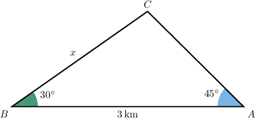
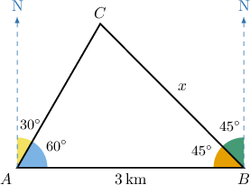
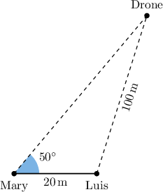
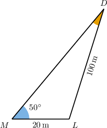

# Modeling Using the Law of Sines

Source: https://www.mathacademy.com/topics/1219?courseId=134
Topic ID: 1219

## Prerequisites

- [The Law of Sines](../../../traditional/lessons/algebra-ii/168-the-law-of-sines.md)
- [Modeling With Trigonometry](../../../traditional/lessons/geometry/641-modeling-with-trigonometry.md)

## Lesson

### Introduction

General triangles often appear in real-world scenarios. Let's take a look at how to apply our knowledge of triangles to these situations.

For example, suppose that Anna and Bill are located $3$ kilometers apart. They both spot a helicopter in the sky. If the angle of elevation from Anna to the helicopter is $45^\circ,$ while the angle of elevation from Bill to the helicopter is $30^\circ,$ then what is the distance between Bill and the helicopter?

The first step in solving this problem is to draw a diagram. Let's denote Anna's position $A,$ Bill's position $B,$ and the position of the helicopter $C.$ Also, let's call $x$ the distance between Bill and the helicopter.

We have a triangle! Notice that the angle corresponding to the corner at $C$ is equal to

$$

180^\circ- (30+45)^\circ=105^\circ.

$$

Using the law of sines, we have

$$

\dfrac{3}{\sin{105^\circ}} = \dfrac{x}{\sin 45^\circ},

$$

which gives

$$

\begin{aligned}𝑥 & =3⋅\frac{sin⁡45^{∘}}{sin⁡105^{∘}}=2.20\,km\end{aligned}

$$

rounded to $2$ decimal places.

So, the distance between Bill and the helicopter is about $2.2\,\textrm{km}.$

### Example: Finding the Length of a Side of a Triangle Using the Law of Sines: Word Problem

#### Question

Fire tower $B$ is located $3$ kilometers due East of fire tower $A.$ The rangers at fire tower $A$ spot a fire at an angle of $30^\circ$ clockwise from north, and rangers at tower $B$ spot the same fire at an angle of $45^\circ$ anticlockwise from the north. In kilometers to one decimal place, how far from tower $B$ is the fire?

#### Explanation

Let's consider the position of the fire at the point $C,$ and let's denote the required distance by $x.$ We summarize the given information in the diagram below.

Solving for $\angle C,$ we have

$$

\begin{aligned}𝑚∠𝐶 & =180^{∘}−(𝑚∠𝐶𝐴𝐵+𝑚∠𝐶𝐵𝐴) \\ & =180^{∘}−(45^{∘}+60^{∘}) \\ & =180^{∘}−105^{∘} \\ & =75^{∘}.\end{aligned}

$$

Now, according to the law of sines, we have

$$

\begin{aligned}\frac{𝑥}{sin⁡𝐴} & =\frac{3}{sin⁡𝐶} \\ \frac{𝑥}{sin⁡60^{∘}} & =\frac{3}{sin⁡75^{∘}} \\ 𝑥 & =\frac{3sin⁡60^{∘}}{sin⁡75^{∘}} \\ 𝑥 & ≈2.7\end{aligned}

$$

to one decimal place. So, the fire is $2.7$ kilometers from tower $B.$

### Example: Finding the Measure of an Angle Using the Law of Sines: Word Problem

#### Question

Two friends, Mary and Luis, are located $20$ meters apart. Mary is flying a quadcopter drone. The angle of elevation between Mary and the quadcopter is $50^\circ,$ and the distance from the drone to Luis is $100\,\textrm{m},$ as shown below.

What is the measure of the angle formed by the line segments from Luis to Mary and from Luis to the drone? Round your answer to $2$ decimal places.

#### Explanation

Let's denote the position of Mary by $M,$ the position of Luis by $L,$ and the position of the drone by $D.$ We want to find $m\angle{L}.$

According to the law of sines, we have

$$

\dfrac{\sin M}{LD} = \dfrac{\sin D}{ML},

$$

which, in turn, gives

$$

\begin{aligned}\frac{sin⁡50^{∘}}{100} & =\frac{sin⁡𝐷}{20} \\ sin⁡𝐷 & =\frac{20⋅sin⁡50^{∘}}{100} \\ sin⁡𝐷 & ≈0.153 21,\end{aligned}

$$

rounded to $5$ decimal places.

Now, we can find $m\angle D$ using the inverse sine function, and get

$$

\begin{aligned}𝐷 & =arcsin⁡(0.153 21) \\ 𝐷 & ≈8.813 00^{∘},\end{aligned}

$$

rounded to $5$ decimal places.

Finally,

$$

\begin{aligned}𝑚∠𝐿 & =180^{∘}−(𝑚∠𝑀+𝑚∠𝐷) \\ & =180^{∘}−(50^{∘}+8.813 00^{∘}) \\ & ≈121.19^{∘}\end{aligned}

$$

rounded to $2$ decimal places.
