# Vertical Stretches of Trigonometric Functions

Source: https://www.mathacademy.com/topics/1661?courseId=134
Topic ID: 1661

## Prerequisites

- [Vertical Stretches of Functions](../../../traditional/lessons/algebra-ii/1252-vertical-stretches-of-functions.md)
- [Graphing Sine and Cosine](../../../traditional/lessons/algebra-ii/1491-graphing-sine-and-cosine.md)
- [Graphing Tangent and Cotangent](../../../traditional/lessons/algebra-ii/1493-graphing-tangent-and-cotangent.md)
- [Further Solving Linear Inequalities](../../../../middle-school/lessons/grade-7/4034-further-solving-linear-inequalities.md)

## Lesson

### Introduction

Let's recall the graph of the function $y=\sin{x},$ shown below.

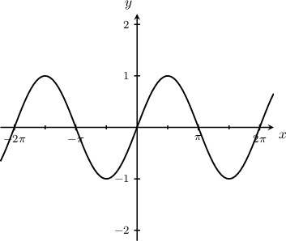

We can stretch the graph of the sine function in the $y$-direction by multiplying the right-hand-side of the function by a number. This type of transformation is a **vertical stretch**.

For instance, the graph $y= {\color{blue}2}\sin x$ stretches the sine curve by a stretch factor of ${\color{blue}2}\mathbin{:}$

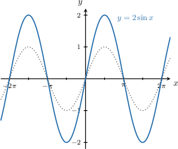

Notice that the minimum and maximum values have changed to $y=-{\color{blue}2}$ and $y={\color{blue}2},$ respectively.

Alternatively, multiplying by a positive number less than $1$ has the effect of shrinking the graph. For instance, the graph $y= {\color{red}\dfrac{1}{2}}\sin x$ shrinks the original sine curve by a stretch factor of ${\color{red}\dfrac{1}{2}}\mathbin{:}$

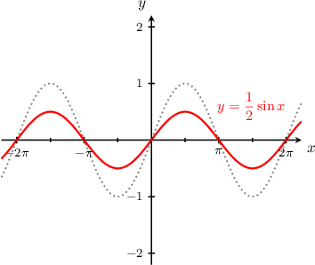

Again, the minimum and maximum values have changed to $y=-{\color{red}\dfrac{1}{2}}$ and $y={\color{red}\dfrac{1}{2}},$ respectively.

### Vertical Stretches of the Cosine Function

Now recall the graph of the function $y=\cos{x},$ shown below.

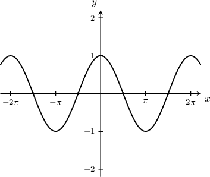

We can apply a vertical stretch to the cosine function in the same way. For example, the graph $y= {\color{blue}2}\cos x$ stretches the cosine curve by a stretch factor of ${\color{blue}2}\mathbin{:}$

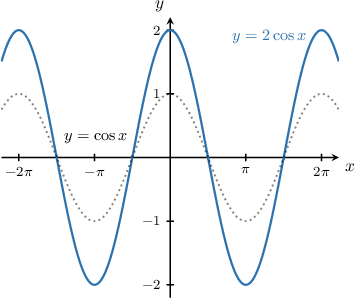

Again, the minimum and maximum values have changed to $y=-{\color{blue}2}$ and ${y={\color{blue}2}},$ respectively.

### Example: Identifying the Equation Given the Graph of a Vertically Stretched Sine or Cosine Function

#### Question

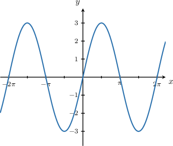

What is the equation of the graph shown above?

#### Explanation

Let's add the graph of $y=\sin x$ to the plot.

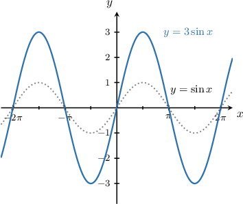

To plot the given curve, we follow these steps:

- Start with the graph of $y=\sin x.$

- Then, stretch it parallel to the $y$-axis by a stretch factor of $3.$

Therefore, the given curve is the graph of $y=3\sin x.$

### Example: Determining the Maximum and Minimum Values of a Vertically Stretched Sine or Cosine Function

#### Question

What is the minimum value of $y=2\sin x?$

#### Explanation

****

To plot the given curve, we follow these steps:

- Start with the graph of $y=\sin x.$

- Then, stretch it parallel to the $y$-axis by a stretch factor of $2.$

The resulting graph is shown below.

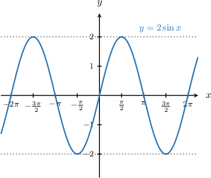

From the graph, we see that the minimum value is $y=-2$

****

We know that that $y = \sin{x}$ has a minimum value of $-1.$

$$

\sin{x} \geq -1

$$

Multiplying both sides of the above inequality by $2$ gives:

$$

\begin{aligned}2⋅sin⁡𝑥 & ≥2⋅(−1) \\ 2sin⁡𝑥 & ≥−2\end{aligned}

$$

Therefore, the minimum value of $2\sin{x}$ is $-2.$

### The Amplitude of Trigonometric Functions

The **amplitude** of a sine function or cosine function represents half the distance between the maximum and minimum values of the function.

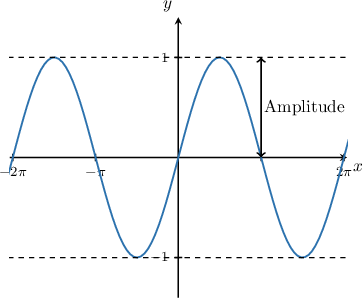

We can calculate the amplitude using the minimum and maximum values $y_\min$ and $y_\max\mathbin{:}$

$$

\textrm{Amplitude } =\dfrac{y_\max - y_\min}2

$$

For example, the amplitude of the function $y=\sin x$ shown above, where $y_\min =-1$ and $y_\max =1$, is

$$

\begin{aligned}Amplitude & =\frac{1−(−1)}{2} \\ & =\frac{1+1}{2} \\ & =\frac{2}{2} \\ & =1.\end{aligned}

$$

### Example: Determining the Amplitude Given the Equation of a Vertically Stretched Sine or Cosine Function

#### Question

What is the amplitude of $f(x)=2\cos{x}?$

#### Explanation

To plot the given curve, we follow these steps:

- Start with the graph of $y=\cos x.$

- Then, stretch it parallel to the $y$-axis by a stretch factor of $2.$

The resulting graph is shown below.

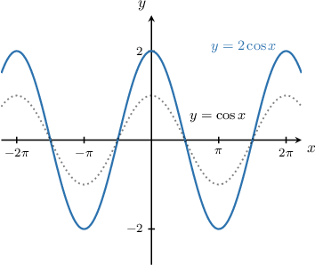

From the graph, we see that the maximum value is $y_\max=2$ and the minimum value is $y_\min=-2.$ Therefore, the amplitude is

$$

\begin{aligned}Amplitude & =\frac{𝑦_{max}−𝑦_{min}}{2} \\ & =\frac{2−(−2)}{2} \\ & =\frac{2+2}{2} \\ & =\frac{4}{2} \\ & =2.\end{aligned}

$$

### Vertical Stretches of the Tangent Function

Now, let's recall the graph of $y=\tan x,$ shown below.

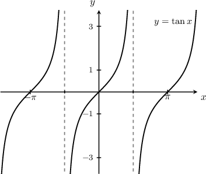

We can also apply vertical stretches to the graph of $y=\tan{x}$ in the same way. The function $y={\color{blue}2}\tan x$ is the result of stretching the tangent by a stretch factor of ${\color{blue}2}\mathbin{:}$

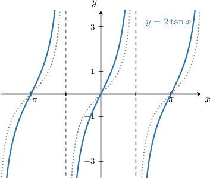

Likewise, the function $y={\color{red}\dfrac{1}{4}}\tan x$ is the result of stretching the tangent by a stretch factor of ${\color{red}\dfrac{1}{4}}\mathbin{:}$

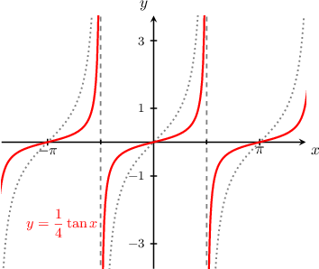

Note that we can't define an amplitude for the tangent function, as it has no minimum or maximum value.

### Example: Graphing a Tangent Function With a Vertical Stretch

#### Question

Given that $f(x) = 2\tan x,$ which of the following shows the curve $y=f(x)?$

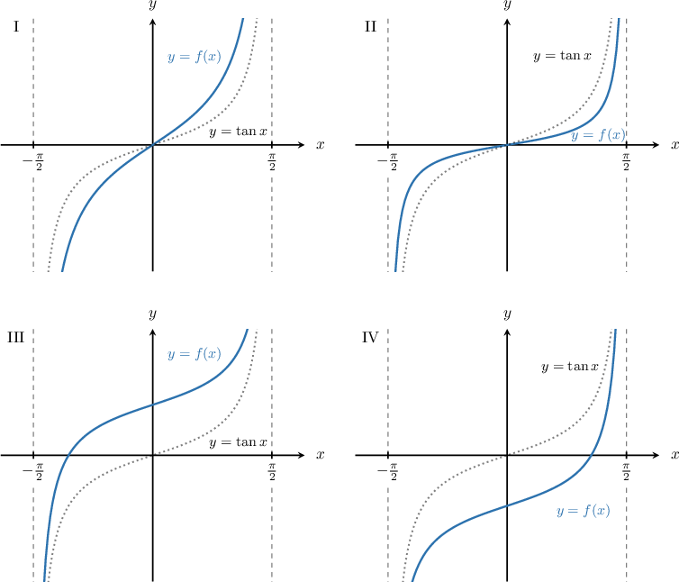

#### Explanation

To plot the given curve, we follow these steps:

- Start with the graph of $y=\tan x.$

- Then, stretch it parallel to the $y$-axis by a stretch factor of $2.$

The resulting graph is shown below.

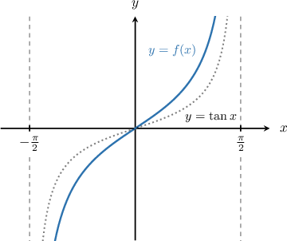

Therefore, the correct answer is I.
