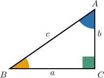
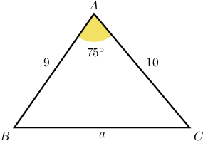
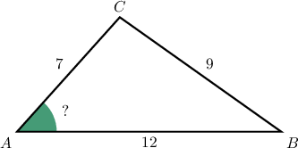
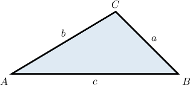
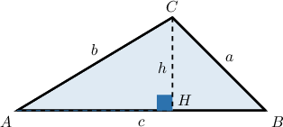

# The Law of Cosines

Source: https://www.mathacademy.com/topics/169?courseId=134
Topic ID: 169

## Prerequisites

- [Calculating Side Lengths of Right Triangles Using Trigonometry](../../../traditional/lessons/geometry/629-calculating-side-lengths-of-right-triangles-using-trigonometry.md)
- [Extending the Trigonometric Ratios Using Angles in Radians](../../../traditional/lessons/algebra-ii/4037-extending-the-trigonometric-ratios-using-angles-in-radians.md)

## Lesson

### Introduction

Suppose we have a general triangle where

- side $a$ is *opposite* angle $\angle A,$

- side $b$ is *opposite* angle $\angle B,$ and

- side $c$ is *opposite* angle $\angle C,$

as follows:

The **law of cosines** states that

$$

\begin{aligned}𝑎^{2} & =𝑏^{2}+𝑐^{2}−2𝑏𝑐cos⁡𝐴 \\ 𝑏^{2} & =𝑎^{2}+𝑐^{2}−2𝑎𝑐cos⁡𝐵 \\ 𝑐^{2} & =𝑎^{2}+𝑏^{2}−2𝑎𝑏cos⁡𝐶.\end{aligned}

$$

We can use this to calculate the length of one side when we know two sides and one angle.

If we look at the law of cosines we see that it's quite similar to the Pythagorean theorem:

$$

a^2+b^2=c^2

$$

But remember that the Pythagorean theorem can *only* be used for a *right-angled triangle*!

The law of cosines is more general and can be used on *any* triangle.

**Note:** To remember the law of cosines, it's helpful to notice that the equations always follow the same pattern:

$$

\begin{aligned}(\begin{aligned}\,side opposite\, \\ \,the angle\,\end{aligned})^{2}\,=\,(\begin{aligned}\,adjacent\, \\ \,side\,\end{aligned})^{2}\,+\,(\begin{aligned}\,adjacent\, \\ \,other side\,\end{aligned})^{2}\,−\,2(\begin{aligned}\,adjacent\, \\ \,side\,\end{aligned})(\begin{aligned}\,adjacent\, \\ \,other side\,\end{aligned})cos⁡(angle).\end{aligned}

$$

We'll show how this formula can be derived at the end of the lesson.

### Example: Calculating the Length of a Triangle's Side Using the Law of Cosines

#### Question

Consider the following triangle:

Calculate the length of the side $a,$ giving your answer to the nearest tenth.

#### Explanation

The Law of Cosines states that

$$

a^2 = b^2+c^2-2bc\cos{A}.

$$

Here, we have

$$

m\angle A = 75^{\circ},\quad b = 10,\quad c=9.

$$

Substituting the numbers into the formula gives

$$

\begin{aligned}𝑎^{2} & =10^{2}+9^{2}−2(10)(9)cos⁡75^{∘} \\ & =100+81−180cos⁡75^{∘} \\ & =181−180⋅0.258 8… \\ & =181−46.587 4… \\ & =134.412 6\end{aligned}

$$

rounded to $4$ decimal places

Taking the square root gives

$$

a = \sqrt{134.4126} = 11.6

$$

to the nearest tenth.

### Using the Law of Cosines to Calculate an Unknown Angle

Let's look at our general triangle again.

When we know the lengths of three sides of a triangle, we rearrange the law of cosines to find an angle:

$$

\begin{aligned}𝑎^{2} & =𝑏^{2}+𝑐^{2}−2𝑏𝑐cos⁡𝐴 \\ 2𝑏𝑐cos⁡𝐴 & =𝑏^{2}+𝑐^{2}−𝑎^{2} \\ cos⁡𝐴 & =\frac{𝑏^{2}+𝑐^{2}−𝑎^{2}}{2𝑏𝑐}.\end{aligned}

$$

So, for all the angles, we have

$$

\begin{aligned}cos⁡𝐴 & =\frac{𝑏^{2}+𝑐^{2}−𝑎^{2}}{2𝑏𝑐}, \\ cos⁡𝐵 & =\frac{𝑎^{2}+𝑐^{2}−𝑏^{2}}{2𝑎𝑐}, \\ cos⁡𝐶 & =\frac{𝑎^{2}+𝑏^{2}−𝑐^{2}}{2𝑎𝑏}.\end{aligned}

$$

It's helpful to notice that the equations always follow the same pattern:

$$

\begin{aligned}cos⁡(angle)=\frac{(\begin{aligned}adjacent \\ side\end{aligned})^{2}+(\begin{aligned}adjacent \\ other side\end{aligned})^{2}−(\begin{aligned}side opposite \\ the angle\end{aligned})^{2}}{2(\begin{aligned}adjacent \\ side\end{aligned})(\begin{aligned}adjacent \\ other side\end{aligned})}\end{aligned}

$$

### Example: Calculating the Measure of an Angle in a Triangle Using the Law of Cosines

#### Question

Consider the following triangle:

Calculate the measure of the angle $\angle A$ to two decimal places.

#### Explanation

We use the Law of Cosines to solve for angle $A\mathbin{:}$

$$

\begin{aligned}cos⁡𝐴=\frac{𝑏^{2}+𝑐^{2}−𝑎^{2}}{2𝑏𝑐}.\end{aligned}

$$

Here, we have

$$

a=9,\quad b=7,\quad c=12.

$$

This gives

$$

\begin{aligned}cos⁡𝐴 & =\frac{7^{2}+12^{2}−9^{2}}{2(7)(12)} \\ & =\frac{49+144−81}{168} \\ & =\frac{112}{168} \\ & =\frac{2}{3}.\end{aligned}

$$

Therefore,

$$

\begin{aligned}𝑚∠𝐴 & =arccos⁡(\frac{2}{3}) \\ & =48.19^{∘}\end{aligned}

$$

to two decimal places.

### Deriving the Law of Cosines

Let's now derive the law of cosines in the following form:

$$

a^2 = b^2 + c^2 - 2bc\cos A

$$

Consider $\triangle ABC$ with sides of lengths $a,b,$ and $c,$ as shown below.

Let's now add the height $\overline{CH}$ and assume it has length $h,$ as shown.

The remainder of this proof consists of two steps:

- **Step 1**: Write down expressions for $\cos A$ and $\sin A.$

- **Step 2**: Apply the Pythagorean theorem to $\triangle BHC,$ and simplify.

Using elementary trigonometry, we have

$$

\cos A = \dfrac{AH}{b}, \qquad \sin A = \dfrac{h}{b},

$$

which can be written as

$$

AH = b\cos A, \qquad h = b\sin A.

$$

Applying the Pythagorean theorem to $\triangle BHC$ and using our expression for $h,$ we have

$$

\begin{aligned}𝑎^{2} & =(𝐵𝐻)^{2}+ℎ^{2} \\ 𝑎^{2} & =(𝐵𝐻)^{2}+𝑏^{2}sin^{2}⁡𝐴.\end{aligned}

$$

Now, consider the length of the side $\overline{AB}.$ Since $\overline{AB}$ consists of two segments, $\overline{AH}$ and $\overline{BH},$ we have

$$

c = AH + BH\quad \Longrightarrow\quad BH = c - AH,

$$

and using our expression for $AH,$ we have

$$

BH = c - b\cos A.

$$

Substituting this into our expression for $a^2,$ we have

$$

\begin{aligned}𝑎^{2} & =(𝐵𝐻)^{2}+𝑏^{2}sin^{2}⁡𝐴 \\ & =(𝑐−𝑏cos⁡𝐴)^{2}+𝑏^{2}sin^{2}⁡𝐴 \\ & =𝑐^{2}−2𝑏𝑐cos⁡𝐴+𝑏^{2}cos^{2}⁡𝐴+𝑏^{2}sin^{2}⁡𝐴 \\ & =𝑏^{2}cos^{2}⁡𝐴+𝑏^{2}sin^{2}⁡𝐴+𝑐^{2}−2𝑏𝑐cos⁡𝐴 \\ & =𝑏^{2}(cos^{2}⁡𝐴+sin^{2}⁡𝐴)+𝑐^{2}−2𝑏𝑐cos⁡𝐴.\end{aligned}

$$

It can be shown that $\cos^2A + \sin^2 A = 1$ for any angle $A$ (this is the Pythagorean theorem in trigonometric form). Therefore, we have

$$

a^2 = b^2 + c^2 - 2bc\cos A

$$

as required.

We can use a similar argument to prove the following results:

$$

\begin{aligned}𝑏^{2}=𝑎^{2}+𝑐^{2}−2𝑎𝑐cos⁡𝐵 \\ 𝑐^{2}=𝑎^{2}+𝑏^{2}−2𝑎𝑏cos⁡𝐶\end{aligned}

$$
